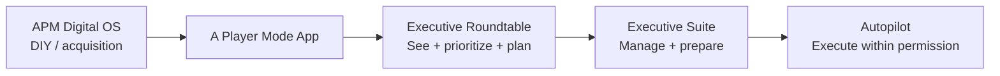
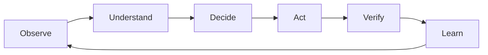
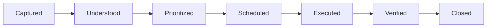

# A Player Mode — Product Constitution

**Status:** LOCKED
**Version:** 1.0
**Date:** 2026-10-06

> Changes to a LOCKED decision require an explicit Architecture Decision Record (ADR) explaining what changed, why, evidence, migration impact, and approval.

## North Star

**A Player Mode is the operating system for your life.**

The user decides who they are becoming. APM continuously helps make sure their actual life moves in that direction.

**Fundamental job:** Nothing important gets dropped.

## Product architecture

One brand. One app. One account. One Life Graph. One APM intelligence engine. Increasing levels of delegated responsibility.

Executive Roundtable, Executive Suite, and Autopilot are capability/service levels inside the same app — not separate apps.

## Product surfaces

**Mobile is the primary daily product.** Mobile = run my day.

**Web is the companion command center.** Web = configure my system / deep planning.

Both use the same backend, account, Life Graph, policies, events, and intelligence.

### Primary mobile navigation

| Surface | Job |
|---|---|
| Today | What should happen today? |
| Radar | What does APM see that I have not dealt with? |
| Goals | Where am I going and am I moving toward it? |
| APM | Conversational control surface that can mutate structured state |

Life Graph, Connections, Permissions, Settings, and Audit/History live behind profile/settings initially.

## The system loop

Open loops move through:

## Canonical domain objects

User, Identity, Role, Pillar, Track, OperatingMode, Goal, Milestone, Project, Commitment, NextAction, Routine, Person, Relationship, Preference, Rule, Policy, Event, RadarItem, Recommendation, Action, Permission, Evidence, Outcome.

## Existing APM methodology becomes software primitives

The current APM methodology is not discarded. Wealth / Body / Spirit / Execution, goals, tracks, operating modes, Run of Show, priority logic, continuity/no-catch-up behavior, minimum viable day/recovery behavior, coaching, and execution scoring are to be encoded as explicit domain rules and services rather than hidden inside one giant prompt.

## Intelligence architecture

**The LLM does not own truth.**

| Layer | Owns |
|---|---|
| Database | Truth |
| Life Graph | Persistent personal state |
| Event system | What happened |
| State engine | What is true now |
| Goal engine | Where the user is going |
| Commitment engine | Who owes what, to whom, by when |
| Priority engine | What matters now |
| Radar | What deserves attention before the user asks |
| Planning engine | What should happen next |
| Policy/permission engine | What APM may do |
| Execution engine/connectors | External action |
| Outcome/evidence engine | Whether it happened |
| LLM layer | Interpretation, semantic reasoning, planning, language, tool selection |

## Autonomy ladder

| Level | Capability | Meaning |
|---:|---|---|
| 0 | Observe | Understand only |
| 1 | Remind | Tell me |
| 2 | Recommend | Tell me what you think I should do |
| 3 | Prepare | Prepare the action |
| 4 | Approve | Ask once, then execute |
| 5 | Autopilot | Execute inside explicit pre-authorized rules |

Autonomy is domain- and action-specific. Consequential actions must be permissioned and auditable.

## Build discipline

We prove the product in this order:

1. Onboarding → structured Life Graph
2. One structured Goal
3. Today
4. One proactive Radar item
5. Completion/evidence
6. Calendar awareness
7. Gmail/commitment awareness
8. Proactive notifications
9. Three-tier product contract: Executive Roundtable / Executive Suite / Autopilot
10. Life-area modules
11. Autopilot standing-authority rules
12. Closed beta across the individual service levels
13. Paid three-tier launch only after each exposed capability passes its runtime/release gates
14. Household interest/waitlist only
15. Household/shared Life Graph only after separate explicit approval
16. Full web command center

We do **not** start with groceries, Amazon, banking, healthcare, household automation, or a collection of autonomous agents.

## Validation metric

**Initial north-star metric: Valuable Proactive Interventions per User per Week.**

A valuable proactive intervention is an APM-detected item the user did not explicitly request that results in useful acknowledgment, action, correction, or an avoided miss.

Later north star: **Verified loops closed by APM per user per week.**

## Anti-drift rule

Implementation convenience, model fashions, or new feature ideas do not silently alter this constitution. Any material deviation requires an ADR and explicit approval.

## ADR-0002 amendment — individual service levels

ADR-0002 supersedes the earlier sequencing rule that deferred Executive Suite and Autopilot source implementation until after an Executive-Roundtable-only launch. The product remains one app and one Life Graph. Executive Roundtable, Executive Suite, and Autopilot are now built as three individual service levels in the same product train. Household remains waitlist-only until separately approved.
