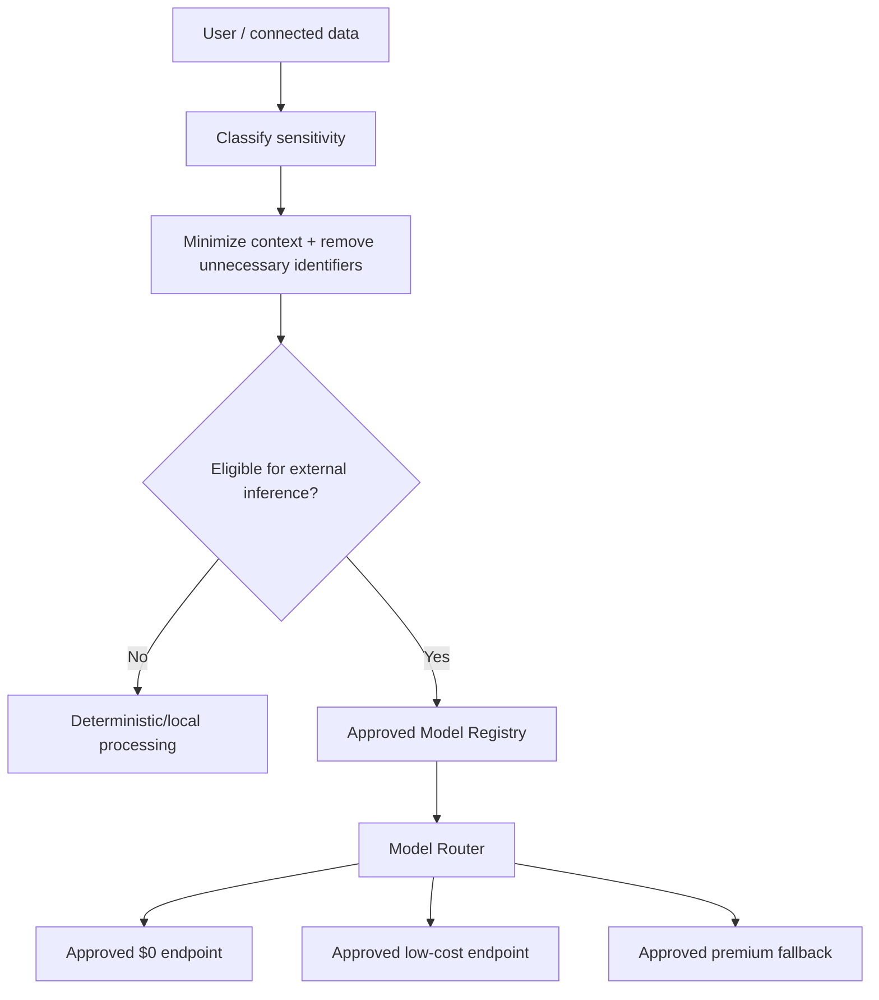
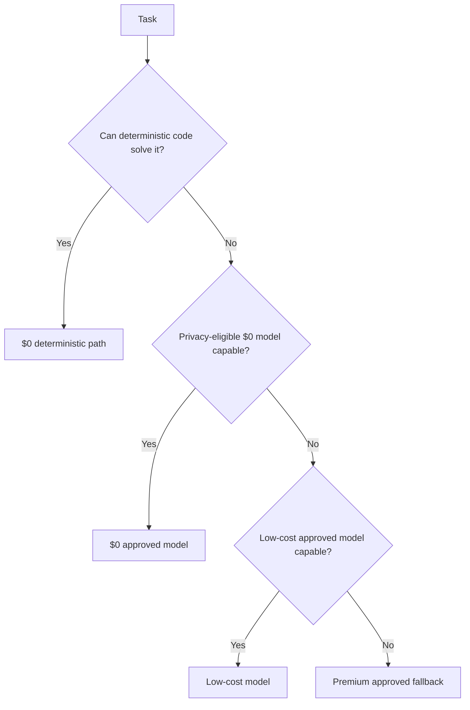

# A Player Mode — Privacy & AI Constitution

**Status:** LOCKED
**Version:** 1.0
**Date:** 2026-10-06

> This is a product/engineering constitution, not final legal language. Privacy Policy, Terms, consent copy, and regulatory obligations require qualified legal review before production launch.

## User promise

> **Your life is yours.** A Player Mode uses information you choose to provide or connect to operate your personal APM. We do not sell your personal data. We do not permit AI inference providers to train public models using your private APM data.

## Locked principles

1. User data belongs to the user.
2. APM does not sell personal data.
3. Private APM data may not be used to train third-party public models.
4. Training-enabled endpoints may not process private APM data.
5. Zero-data-retention (ZDR) inference is preferred for private data.
6. Prompt/output logging at routing providers is disabled by default.
7. Send the minimum necessary context to an LLM.
8. Credentials, OAuth tokens, secrets, and authentication material never enter LLM context.
9. Deterministic computation happens without LLM inference whenever practical.
10. APM personalization lives in the Life Graph; it is not third-party model training.
11. Every model/provider endpoint has an explicit privacy classification before production use.
12. Routing order is **privacy eligibility → capability → reliability → cost → latency**.
13. Consequential actions are attributable and auditable.
14. Users can inspect connected services, permissions, and AI-processing information.
15. Export, deletion, and disconnection are product capabilities, not support-only workflows.
16. Any future use of user content to improve/train APM requires separately defined consent and governance.
17. No inference request may bypass the APM Privacy Gateway.

## Data classes

| Class | Examples | External inference rule |
|---|---|---|
| 0 — Public/synthetic | public facts, generic prompts, synthetic tests | Any approved endpoint |
| 1 — Low-sensitivity personal | de-identified goal/progress context | Approved no-training endpoint; ZDR preferred |
| 2 — Private life | email content, calendar, relationships, work projects, private documents, detailed Life Graph | Approved no-training endpoint; ZDR required by default |
| 3 — Highly sensitive | financial details, health-sensitive records, children's sensitive information, IDs | Explicitly vetted route or no external inference; minimize aggressively |
| Secrets — Never prompt | passwords, OAuth tokens, API keys, auth/session secrets | **Never sent to an LLM** |

## Privacy Gateway

## Model/provider registry — required fields

Every eligible endpoint must record:

- model ID and version
- inference provider
- router/provider chain
- price class
- training policy
- retention policy
- ZDR eligibility
- allowed APM data classes
- capabilities
- structured-output reliability
- latency/reliability score
- quality/evaluation score
- jurisdiction/provider risk notes
- approval date
- next review date
- status: approved / restricted / disabled

Free availability does not imply privacy eligibility.

## Routing policy

**Cost never overrides privacy eligibility.**

## Context minimization

Do not send the entire Life Graph when a small context slice is sufficient. Context assembly is task-specific and uses only the minimum relevant state.

Benefits: lower privacy exposure, lower token cost, lower latency, and better model focus.

## APM learning vs model training

APM is expected to learn the individual user's preferences and patterns. That learning is represented as structured personal state with provenance/confidence inside APM.

Example: repeated behavior can produce `meeting_start_time >= 09:00` as a user preference. This is personalization, not permission to train a public foundation model on the user's history.

**Principle:** APM learns you. The underlying public model doesn't.

## User transparency

Product UI will provide a plain-language Privacy Center covering:

- what APM stores
- connected services and scopes
- what types of data may be sent for AI processing
- current AI subprocessors/providers
- training policy
- retention policy
- permission controls
- export/delete/disconnect controls

Do not promise a permanent named foundation model in onboarding. Models can change; the privacy/capability contract cannot silently weaken.

## Improvement program

Any future program that uses user content for product/model improvement must distinguish product analytics, human review, evaluation datasets, and model training. These are separate purposes and must not be collapsed into vague consent. Training/content-improvement use is opt-in by default under this constitution unless explicitly superseded by a reviewed ADR and legal/product approval.

## Current OpenRouter implementation constraint

OpenRouter is a routing layer, not a single privacy policy for every downstream inference provider. Production code must enforce APM policy at request time and may only route private data to endpoints currently approved in the Model Registry. Provider/model privacy status must be revalidated periodically; it is not assumed permanent.

## Anti-drift rule

A new model may not enter production because it is cheap, popular, or benchmark-leading. It enters only after privacy classification and evaluation. Any weakening of this constitution requires an ADR and explicit approval.