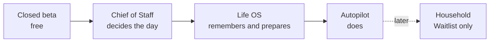

# A Player Mode — Pricing Strategy

**Status:** OWNER-DECIDED / FINAL (ADR-0004, ADR-0005)
**Version:** 2.1
**Date:** 2026-10-07

Pricing is documented separately from the locked Product and Privacy constitutions. The decisions of record are **ADR-0004** (monthly) and **ADR-0005** (annual); the numbers live in code (`packages/policy/src/index.ts`: `PLAN_PRICES`, `CHIEF_OF_STAFF_INTRO_OFFERS`, `BILLING_PRODUCTS`) and this document is pinned to them by `packages/policy/test/pricing.test.mjs`.

## Price list

| Tier | Job | Monthly | Includes |
|---|---|---:|---|
| Closed beta | full Chief of Staff ceiling | $0 | — |
| **Chief of Staff** | **decides the day** | **$24.99** | — |
| **Life OS** | **remembers and prepares** | **$39.99** | everything in Chief of Staff |
| **Autopilot** | **does** | **$79.99** | everything in Life OS |
| Household | future shared coordination | waitlist only | — |

- **Cumulative ladder.** Each tier includes the one below it.
- **Every tier reduces cognitive load; upper tiers reduce more.** Chief of Staff takes the "what do I do today, in what order" decision off the user. Life OS also remembers the wider life (relationships, birthdays, bills, subscriptions, appointments, travel, routines) and prepares what each needs. Autopilot also does approved work inside standing rules the user writes.
- **Monthly or annual.** Annual is "2 months free" (ADR-0005):

| Tier | Monthly | Annual |
|---|---:|---:|
| Chief of Staff | $24.99 | $249.99 |
| Life OS | $39.99 | $399.99 |
| Autopilot | $79.99 | $799.99 |

- **No free trial** on any plan.

## Chief of Staff intro offers

| Offer | Who | Price | For how long |
|---|---|---:|---|
| **Founding 100** | the first 100 subscribers | **$9.99/mo** | locked while continuously subscribed |
| **Intro** | everyone else | **$9.99/mo** | first 3 months, then $24.99/mo |

Intro offers apply to Chief of Staff monthly only. Founding 100 is a separate store product shown only while the server holds a free slot for that user (docs/33); a lapse loses the lock.

## Billing

- **App Store and Google Play in-app subscriptions** through RevenueCat (Phase D, `SOURCE_COMPLETE`; store/RevenueCat configuration is Phase E — docs/33-BILLING-PHASE-D.md).
- Server-side entitlements are written only by the verified RevenueCat webhook (migration 0040). The client never grants a plan.
- **Buying a tier never grants autonomy.** Entitlement AND explicit user permission AND server policy AND kill switches decide authority.

## Market anchors (checked October 2026)

| Product | Price | Read |
|---|---:|---|
| Sunsama Pro | $25/mo; $20/mo annual | premium daily planning sustains about $1 per workday |
| Reclaim Starter / Business | $12 / $18 per seat monthly | automated scheduling alone anchors in the low-to-mid teens |
| Superhuman Pro / Business | $15 / $40 monthly | AI mail suites set the upper band for workflow acceleration |
| Martin Personal (consumer AI assistant) | $25/mo | consumer assistants cluster at $20–35 |
| Howie Basic / Pro (AI EA) | $35 / $145 monthly | the $95–150 band is reserved for products that do the work |
| ChatGPT Plus / Google AI Pro | $20/mo | generic assistant floor the first tier must beat on proactive value |

## Free tier decision

Do **not** begin with a permanent generous free tier. The closed beta is free; launch uses the Chief of Staff intro offers above instead of a crippled free plan. A free diagnostic/A Player Audit can serve top-of-funnel distribution without giving away the ongoing operating system.

## Margin architecture

Price and inference cost are decoupled. APM routes work in this order:

**deterministic code → privacy-eligible $0 model → approved low-cost model → premium fallback**.

- **Store fees are the largest variable cost.** Apple and Google take 15% (Small Business Program, under $1M a year) or 30%; that is larger than inference at every tier and is part of every gross-margin figure.
- OpenRouter's free plan advertises free models but only 50 requests/day and lacks policy-based routing on the free platform plan, so production economics never assume unlimited free capacity. The model registry/policy enforcement treats $0 endpoints as opportunistic eligible capacity, not an SLA.
- Premium fallback is capped per user if p90 variable cost threatens tier margin.

## Metrics to instrument from day one

- intro → standard conversion (month 4 retention of intro subscribers)
- Founding 100 fill rate and lock retention
- tier mix (Chief of Staff / Life OS / Autopilot)
- 4-, 8-, and 12-week retention
- valuable proactive interventions/user/week
- verified loops closed/user/week
- inference cost/user/month
- total variable cost/user/month, including store fee
- gross margin by plan
- paid fallback rate
- $0 eligible inference rate
- action volume by type
- downgrade/cancel reasons

## Pricing governance

Any public price change is a pricing decision record (date, cohort impact, evidence, grandfathering, rollout) plus a change to the price constants in `packages/policy/src/index.ts`, in one PR. The Founding 100 lock is honoured for every subscriber who holds it while they stay continuously subscribed.
