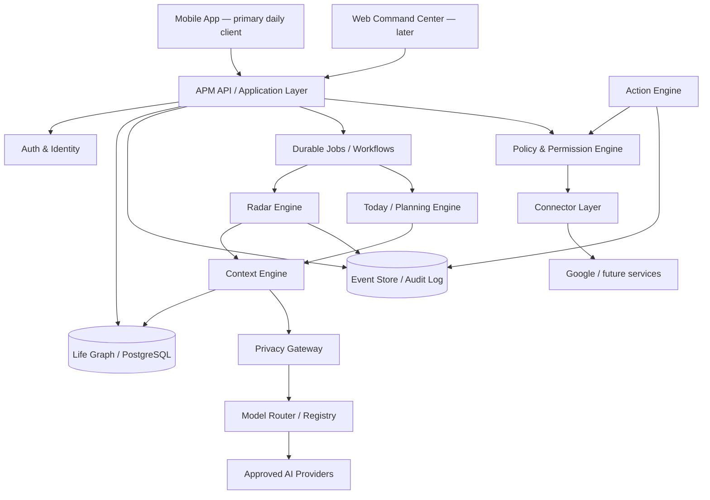
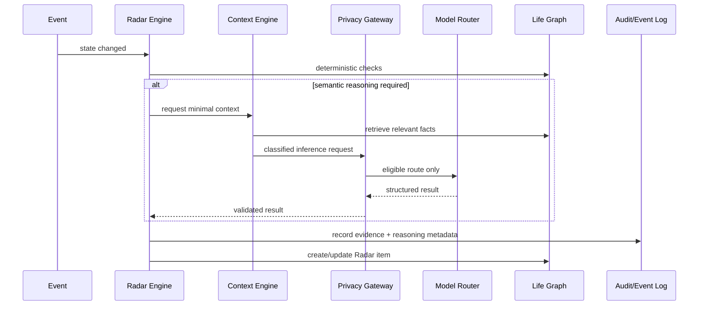

# A Player Mode — Technical Architecture v1

**Status: LOCKED ARCHITECTURE BASELINE**  
**Decision date: 2026-10-06**

## Purpose

APM is a mobile-first personal operating system. The architecture must support Executive Roundtable → Executive Suite → Autopilot without rebuilding the core platform.

## System map



## Non-negotiable boundaries

1. **Database owns truth.** LLM output never becomes truth merely because a model said it.
2. **Life Graph owns persistent user state.**
3. **Events record what happened and provenance.**
4. **Privacy Gateway owns inference eligibility.** No production inference may bypass it.
5. **Policy Engine owns authority.** LLMs may propose actions but cannot grant themselves permission.
6. **Action Engine executes.** Models do not directly hold OAuth credentials.
7. **Connectors isolate external services.** Gmail/Calendar logic does not leak throughout the codebase.
8. **Model Registry owns model/provider eligibility.** Model IDs are configuration/data, not scattered hard-coded strings.
9. **Consequential operations are auditable.**
10. **Mobile and web are clients of the same platform.** No duplicate brains.

## Recommended initial stack

| Layer | Baseline | Why |
|---|---|---|
| Mobile | React Native + Expo + TypeScript | iOS-first delivery with Android path and native device capabilities |
| API | TypeScript service layer | Shared language/contracts and fast iteration |
| Database | PostgreSQL | Relational integrity for Life Graph + flexible JSON where justified |
| Semantic retrieval | pgvector initially | Avoid separate vector infrastructure before scale requires it |
| Jobs | Durable queue/workflow abstraction | Radar scans, syncs, notifications and retries cannot depend on request lifecycle |
| Validation | Runtime schemas + typed contracts | LLM/external API output is untrusted input |
| AI | APM Model Gateway over OpenRouter initially | Provider/model portability and cost routing |
| Observability | Structured logs + traces + error monitoring | Required for proactive/agentic debugging |

Vendor selections may change through ADRs; architectural boundaries may not be bypassed.

## Request path — proactive intelligence



## Inference rule

Before any LLM call:

```text
Can deterministic code solve this?
  YES -> do not call an LLM
  NO  -> classify data -> minimize context -> Privacy Gateway -> approved route
```

## Failure philosophy

Privacy and authority fail **closed**.

If no compliant model endpoint exists, APM must queue/retry/degrade the feature or tell the user it cannot complete the AI operation. It must never silently loosen training, retention, provider, or permission constraints.

## Initial monorepo target

```text
/
├── apps/
│   └── mobile/
├── packages/
│   ├── domain/
│   ├── contracts/
│   ├── privacy/
│   ├── ai/
│   ├── policy/
│   └── ui/
├── services/
│   └── api/
├── docs/
└── .github/
```

Do not split into microservices at MVP. Preserve module boundaries in a modular monolith and extract services only when operational evidence justifies it.

## Security architecture baseline

- OAuth tokens stored server-side in a secrets-capable encrypted store; never exposed to LLM prompts.
- Least-privilege integration scopes.
- Encryption in transit and at rest.
- User-scoped authorization enforced server-side.
- Model outputs treated as untrusted data and schema-validated.
- Tool/action arguments validated independently of model text.
- Prompt injection is assumed possible for externally sourced content.
- External content cannot alter policy/permission rules.
- Audit event for consequential actions.
- Production secrets never shipped in mobile bundle.

## Anti-drift tests

Architecture tests/CI should eventually reject:

- direct OpenRouter/provider calls outside `packages/ai` / Privacy Gateway;
- connector execution without policy authorization;
- storage of OAuth tokens in client-accessible records;
- unsupported action types without audit definitions;
- model routes missing data-class eligibility metadata.
