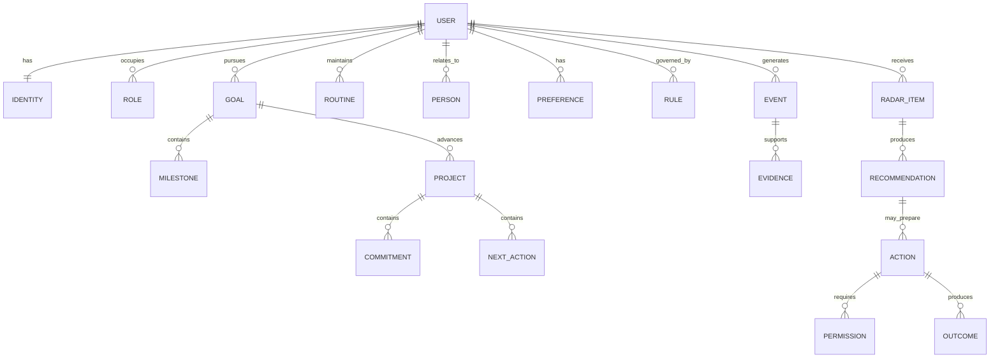
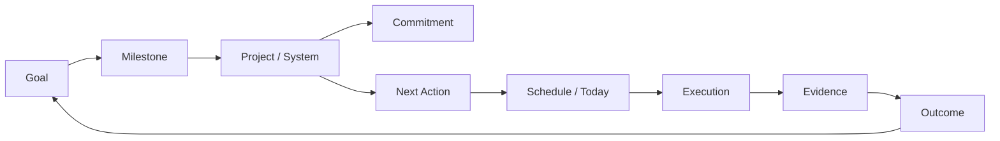
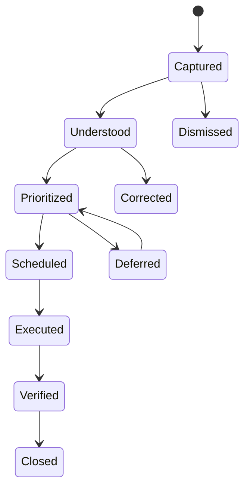
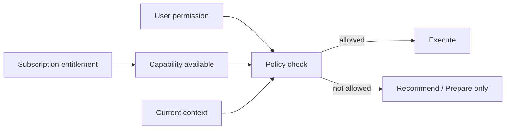

# A Player Mode — Canonical Domain Model v1

**Status: LOCKED DOMAIN BASELINE**  
**Decision date: 2026-10-06**

## Principle

APM methodology becomes structured state and explicit rules—not a giant prompt.

## Life Graph overview



## Canonical entities

| Entity | Purpose | Examples |
|---|---|---|
| User | Account/security boundary | account id, locale, timezone |
| Identity | Who user says they are/becoming | identity statements, current season |
| Role | Durable life role | founder, parent, partner |
| Pillar | Domain architecture | Wealth, Body, Spirit, Execution |
| Track | Background/foreground development lens | Operator Discipline |
| OperatingMode | Changes execution behavior | standard, recovery, high-pressure |
| Goal | Desired outcome | raise fund, run marathon |
| Milestone | Intermediate outcome | first close |
| Project | Bounded body of work | LP outreach campaign |
| Commitment | Obligation by/to someone | send deck by Friday |
| NextAction | Concrete executable step | email David deck |
| Routine | Recurring desired behavior | workout 4x/week |
| Person | Relationship node | David, Mom |
| Preference | Explicit/inferred user preference | no meetings before 9 |
| Rule | User/system operating rule | protect bedtime |
| Event | Immutable-ish record of change | email observed, goal updated |
| Evidence | Source supporting a claim/state | source email, completion event |
| RadarItem | Proactive attention object | promise due today |
| Recommendation | Suggested response | send deck now |
| Action | Executable external/internal operation | draft email, add event |
| Permission | Authority boundary | calendar.prepare |
| Outcome | Verified result | email sent, event created |

## Goal execution graph



## Commitment lifecycle



Every important commitment should retain provenance: user-created, integration-detected, AI-extracted, or inferred.

## Radar item model

Required conceptual fields:

```text
id
user_id
type
headline
summary
status
severity
confidence
importance
urgency
goal_alignment
consequence
source_refs[]
reason_codes[]
related_goal_id?
related_project_id?
related_commitment_id?
recommended_action_ids[]
created_at
first_relevant_at
expires_at?
resolved_at?
resolution
```

Radar ranking is not an unconstrained LLM opinion. It combines deterministic state with semantic interpretation.

## Provenance

Important persistent facts should support:

```text
Fact
├── value
├── source type
├── source reference
├── observed / stated / inferred
├── confidence
├── created_at
├── last_confirmed_at
└── user_corrected_at?
```

User correction outranks model inference.

## APM methodology mapping

| Existing methodology | Software primitive |
|---|---|
| Wealth / Body / Spirit | Pillar |
| Execution | operating pillar + execution policies |
| Tracks | Track records + foreground/background state |
| High-Pressure / Recovery | OperatingMode |
| Run of Show | generated DailyPlan with blocks/actions |
| MVD | DailyPlan policy variant |
| Never Miss Twice | continuity rule |
| No Catch-Up | scheduling rule |
| Morning coaching | interaction/workflow policy |
| Day verdict | execution evaluation/outcome |
| Gratitude / manifestation practice | Routine + generated instruction/content |

## Daily Plan

Although derived from other objects, DailyPlan is a first-class projection for mobile UX.

```text
DailyPlan
├── date
├── mode
├── number_one_move
├── blocks[]
├── routines[]
├── commitments[]
├── approvals[]
├── radar_refs[]
├── completion_state
└── verdict?
```

## Authority model

Permission is separate from subscription entitlement.



A paid Autopilot user can still configure every domain to Observe-only.

## Data ownership rules

- User-scoped data always carries `user_id`/tenant boundary.
- External-source content stores source identifiers and sync metadata.
- AI-derived state stores confidence and provenance.
- Destructive correction should preserve audit history where appropriate.
- Raw external content should not be duplicated indefinitely merely because it was used to derive structured state; lifecycle policy controls retention.

## ADR-0002 / Phase B domain extension

Phase B adds two individual-user Life Graph primitives without creating a Household graph:

| Entity | Purpose | Examples |
|---|---|---|
| LifeRelationship | Structured relationship stewardship layered onto `Person` | birthday, next-contact date, contact cadence |
| LifeAdminItem | One normalized personal-administration open loop | appointment, trip, bill, subscription, meal plan, shopping, health routine, recurring/family obligation |

`LifeRelationship.person_id` and optional `LifeAdminItem.person_id` are constrained to a `Person` owned by the same user.

Recurring LifeAdminItems use deterministic rollover. Completion advances the next occurrence to the first future due point rather than creating catch-up backlog, preserving the No Catch-Up operating rule.

Both entities retain provenance and remain inside the same Life Graph / Today / Radar architecture defined by this document.
