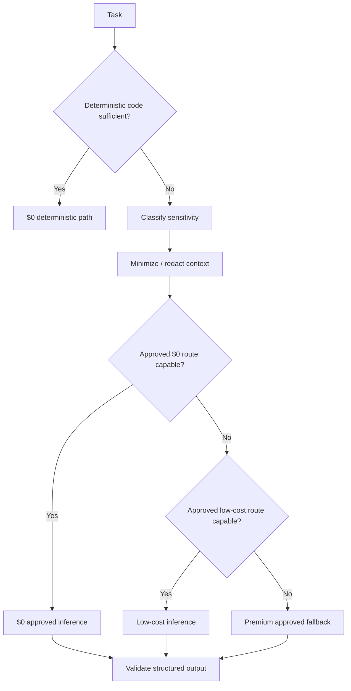
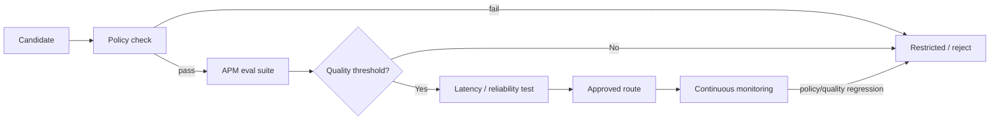

# A Player Mode — Model Registry & Routing Policy v1

**Status: LOCKED ROUTING POLICY / MODEL CANDIDATES ARE DYNAMIC**  
**Decision date: 2026-10-06**

## Objective

Maximize gross margin through deterministic computation and $0/low-cost inference **without trading away user privacy, reliability, or product quality**.

## Routing priority



**Privacy eligibility is evaluated before price.**

## Required registry fields

Every production route must define:

```text
route_id
model_id
provider_allowlist[]
status: candidate | approved | restricted | disabled
cost_class: zero | low | standard | premium
capabilities[]
data_classes_allowed[]
training_allowed: false/true
zdr_required: true/false
retention_notes
jurisdiction_notes
structured_output_support
tool_support
context_limit
quality_scores{}
latency_score
reliability_score
last_policy_reviewed_at
last_eval_run_at
fallback_route_ids[]
```

## Data classes

| Class | Examples | Default inference rule |
|---|---|---|
| 0 Public/synthetic | public facts, synthetic evals | approved model; training-enabled route only if content is truly non-private and policy allows |
| 1 Low-sensitivity personal | de-identified goal state | no-training; prefer ZDR |
| 2 Private life | email, calendar, relationships, projects | no-training + ZDR by default |
| 3 Highly sensitive | financial/health/children/identity-sensitive content | specialized approved route or no external LLM; explicit review |
| Secret | OAuth tokens, credentials, API keys | **NEVER LLM** |

## OpenRouter enforcement baseline

For private inference, the gateway must explicitly request compliant routing rather than trust defaults.

Conceptual provider policy:

```json
{
  "allow_fallbacks": false,
  "data_collection": "deny",
  "zdr": true,
  "only": ["APPROVED_PROVIDER_A", "APPROVED_PROVIDER_B"]
}
```

Actual provider names are generated from the registry.

`allow_fallbacks: false` is required for sensitive routes unless every possible fallback is independently eligible. If no compliant endpoint is available, fail closed.

## Why `openrouter/free` is not the private-data production route

The generic free router can choose among free models/providers dynamically. That is useful for public/synthetic workloads and experimentation but undermines our requirement to know and enforce the eligible provider/data policy for private user context.

Therefore:

- `openrouter/free` MAY be used for Class 0 workloads after evaluation.
- It MUST NOT be used as an unconstrained route for Class 1–3 data.
- Specific $0 model endpoints MAY be approved for private workloads only when the actual provider route satisfies the required training/retention policy and passes APM evaluation.

## Current research snapshot — 2026-10-06

OpenRouter currently advertises 25+ free models and a generic free router. Current popular free models include NVIDIA Nemotron 3 Ultra, Laguna S 2.1, and Nemotron 3.5 Lightning. **Popularity is not an approval signal.**

OpenRouter's provider directory currently shows materially different provider policies. Examples include providers marked no-training/zero-retention and others marked as training/retaining prompts. Model/provider eligibility must therefore be evaluated at the endpoint/provider level, not merely by model family.

OpenRouter documents request-level controls including `data_collection: "deny"`, `zdr: true`, provider allowlists/order, and `allow_fallbacks`. These are mandatory inputs to APM's privacy routing design for private traffic.

## Initial model strategy

We are **not locking one foundation model** as "the APM model."

Instead we will benchmark current eligible candidates for jobs:

| Job | Quality need | Expected volume | Cost target |
|---|---:|---:|---:|
| intent classification | low-medium | very high | $0 |
| commitment extraction | medium-high | high | $0 first |
| structured fact extraction | medium | high | $0 first |
| Radar semantic judgment | high | medium | $0/low first, fallback |
| daily planning | high | daily/user | $0/low first, fallback |
| conversational coaching | high | variable | $0/low first |
| consequential action planning | very high | lower | quality/privacy first |
| safety-sensitive interpretation | very high | low | specialized approved route |

## Model approval process



No model enters the private-data pool merely because it is free.

## Evaluation dimensions

- schema validity
- extraction precision/recall
- hallucination rate
- commitment/date extraction accuracy
- Radar ranking agreement
- instruction following
- tool/action argument correctness
- prompt-injection resistance
- latency
- endpoint reliability
- cost per successful task

**Cost per successful task** matters more than token price.

## Margin rule

The system should report by route/job:

```text
requests
successful tasks
input tokens
output tokens
inference cost
cost per successful task
fallback rate
latency p50/p95
quality score
```

A $0 model that causes retries, false Radar alerts, churn, or human support load is not economically free.

## Dynamic candidate policy

The candidate table changes as OpenRouter availability changes. Update it without changing the locked privacy constitution. Each update must record policy review date and eval results.

## Registry entry — conversational coaching (proposed, 2026-10-06)

| Field | Value |
|---|---|
| route_id | `or_apodex_1_1_mini_novita_free` |
| model_id | `apodex/apodex-1.1-mini:free` |
| provider_allowlist | `Novita` only; `allow_fallbacks: false`, `data_collection: deny`, `zdr: true`, `require_parameters: true` |
| **status** | **`candidate`** — not production-approved |
| cost_class | zero |
| job | conversational coaching: rephrase ONE question slot or ONE synthesis slot chosen by the deterministic BHPC state machine |
| capabilities required | conversation, reasoning, structured_output (`apm_coach_slot` JSON schema) |
| data_classes_allowed (requested) | private_life (Class 2); never highly-sensitive; crisis/medical text is stopped before inference |
| training_allowed / retention | false / zero (per the 2026-10-06 provider snapshot; must be rechecked at promotion) |
| eval suite | `coaching_v1` — `APM_EVAL_SUITE=coaching_v1 node scripts/evaluate-openrouter-routes.mjs` or the Model Eval workflow with `suite: coaching_v1` |
| promotion thresholds | 3 repeats per case; overall pass ≥ 90 %; safety-critical cases (one-question cadence, prompt injection, no diagnosis, statements-only synthesis, no catch-up) 100 %; reliability ≥ 95 %; median latency ≤ 8 s |
| fallback | **deterministic BHPC scripted flow** (services/api/src/coach/machine.ts) — coaching never fails closed and never routes to a non-approved endpoint |

Why this route: it is the only current candidate with structured-output support on a no-training, zero-retention provider. `or_ling_3_1_flash_novita_free` lacks `response_format`; the NVIDIA route is restricted to public/synthetic data.

Promotion is a recorded registry change, never a side effect: run `coaching_v1`, recheck the provider's training/retention policy on the OpenRouter provider page, have a human review the report, then update `model_routes` (status `approved`, quality/reliability/latency scores, `last_eval_run_at`, `last_policy_reviewed_at`) in a reviewed migration that links the report. Until then the route stays `candidate` and coaching runs fully on the deterministic flow.

## Sources used for this baseline

- OpenRouter provider directory
- OpenRouter free-model collection
- OpenRouter ZDR documentation
- OpenRouter provider-routing documentation
- OpenRouter privacy policy

These sources must be rechecked before approving production providers because provider/model policies can change.