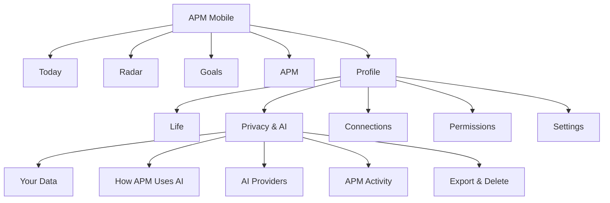
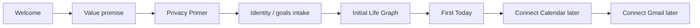

# A Player Mode — Mobile UX Specification v1

**Status: LOCKED INFORMATION ARCHITECTURE BASELINE**  
**Decision date: 2026-10-06**

## Product behavior

APM is not a chatbot with tabs. The app proactively organizes attention around the user's desired life.

**Mobile = run my day.**

## Primary navigation

```text
TODAY      RADAR      GOALS      APM
```

Profile/avatar opens Life, Connections, Privacy & AI, Permissions and Settings.

## Information architecture



## First-run sequence



Do not require Gmail/Calendar before the user sees any value. Integration requests are progressive and contextual.

## Screen 1 — Welcome

**A PLAYER MODE**

> The operating system for your life.

> Tell APM where you're going. It helps make sure your life actually moves in that direction.

CTA: **Build my A Player Mode**

## Screen 2 — Product difference

Three cards:

**KNOWS WHAT MATTERS**  
Your goals, commitments, routines and operating rules become a living system.

**NOTICES BEFORE YOU ASK**  
APM looks for what is slipping, approaching, waiting or being forgotten.

**ACTS ONLY WITH YOUR PERMISSION**  
You decide how much authority APM has in each part of your life.

CTA: **Continue**

## Screen 3 — Privacy Primer

Use exact policy/structure from `11-PRIVACY-UX-AND-TRUST-CENTER.md`.

This is a designed product screen, not a checkbox wall.

## Today

Visual hierarchy:

```text
Good morning, [name]
[one-sentence state]

┌────────────────────────────┐
│ YOUR #1 MOVE               │
│ [highest-value action]     │
│ [Do it] [Why this?]        │
└────────────────────────────┘

APM NOTICED
[1–3 high-value Radar cards]

YOUR RUN OF SHOW
[timeline / blocks]

NEEDS YOUR APPROVAL
[prepared actions, only when present]

COMING UP
[future attention items]
```

Do not flood Today with every Life Graph object.

## Radar

Default sections/filters:

- Needs attention
- Slipping
- Waiting
- Unanswered
- Promised
- Upcoming
- Conflict
- Opportunity
- Recurring

Every card must answer:

```text
WHAT?
WHY NOW?
WHY DOES IT MATTER?
WHAT SHOULD I DO?
WHY DID APM SEE THIS?
```

## Radar detail

Example:

```text
PROMISED · DUE TODAY

Send David the deck

You told David you'd send the deck Friday.
APM hasn't found evidence that it's complete.
This is tied to Fundraise, an active priority.

[Prepare email]
[Mark complete]
[Change date]

Why am I seeing this?
Sources: Gmail · Life Graph
```

## Goals

Goal cards show movement, not motivational wallpaper.

```text
Raise Fund I
ON TRACK / AT RISK / STALLED

Next milestone      First close
Progress            [evidence-based]
This week           3 meaningful actions
APM sees            LP follow-up slipping
```

Goal detail follows:

Goal → milestones → projects/systems → commitments → next actions → evidence → outcomes.

## APM conversation

Chat is stateful control surface.

Examples:

- “Remember I promised Sarah the deck tomorrow.” → creates structured commitment after validation.
- “I'm wiped today.” → may propose Recovery Mode; does not silently alter important goals.
- “What's falling through the cracks?” → queries Radar/state.
- “Move my workout.” → checks permission/calendar and prepares or executes according to policy.

Show state-changing effects visibly:

> ✓ Commitment added · Tomorrow 4 PM

The user should know when conversation changed their Life Graph.

## Life

Human-readable Life Graph browser:

```text
WHO I AM
ROLES
GOALS
PROJECTS
PEOPLE
ROUTINES
PREFERENCES
RULES
RESPONSIBILITIES
```

Important inferred facts expose provenance/correction.

## Privacy & AI

This is a first-class native section, defined in `11-PRIVACY-UX-AND-TRUST-CENTER.md`.

Required visual components:

- trust-promise cards;
- Life Graph → minimum context → approved AI diagram;
- provider policy grid;
- permission ladder;
- integration capability matrix;
- audit timeline;
- export/delete controls.

## Permission interaction

Before a consequential action:

```text
APM wants to:
Move Workout to 4:30 PM

Why:
Your 3 PM meeting was cancelled and this is the only remaining 45-minute opening today.

Permission:
Calendar → Approve each change

[Approve] [Edit] [Not now]
```

Never use vague buttons such as “Allow” without stating the action/domain.

## Notification philosophy

Push is a scarce resource.

Send when:

- consequence is meaningful;
- timing matters;
- APM has high confidence;
- the user has not already handled it;
- the notification provides a useful next action.

Do not send motivational spam.

Example:

> **APM noticed something**  
> You promised the deck today and it still appears open.

## Visual design direction

- premium, calm, executive, human;
- information density lower on mobile than web;
- one dominant decision per card;
- status and hierarchy before decoration;
- avoid “AI neon” visual clichés;
- explain intelligence without exposing chain-of-thought;
- diagrams/grids used for trust and settings education;
- accessibility and dynamic text considered from first component system.

## MVP screen inventory

### Build in first design/code pass

1. Welcome
2. Product difference
3. Privacy Primer
4. How APM Uses AI
5. AI Providers
6. Your Data
7. Connections
8. Permissions & Autonomy
9. APM Activity
10. Export & Delete
11. Onboarding intake shell
12. Today
13. Radar
14. Radar detail / Why APM saw this
15. Goals
16. Goal detail
17. APM conversation
18. Life
19. Profile/settings

These may initially use fixtures/mocked state. The purpose is to validate the complete product and trust architecture before integrations make the data real.

## UX acceptance rule

No feature is complete if the user cannot understand:

- what APM is showing;
- why it matters;
- where important personal information came from;
- what action will occur;
- whether the user or APM has authority;
- how to correct or stop it.
