# A Player Mode — Phased Implementation Roadmap

**Status: LOCKED SEQUENCING BASELINE; ESTIMATES ADAPT WITH EVIDENCE**  
**Decision date: 2026-10-06**

## Build principle

Build trust + core state + one complete proactive loop before breadth.

```mermaid
flowchart LR
  A[Docs / architecture] --> B[Mobile visual shell]
  B --> C[Life Graph]
  C --> D[Today]
  D --> E[Radar]
  E --> F[Calendar]
  F --> G[Gmail / commitments]
  G --> H[Proactive push]
  H --> I[Beta]
  I --> J[Chief of Staff]
  J --> K[Actions]
  K --> L[Life OS]
  L --> M[Autopilot]
```

## Phase 0 — Constitution and architecture

**Current phase.**

Deliverables:

- product constitution;
- privacy/AI constitution;
- pricing hypothesis;
- technical architecture;
- domain model;
- model registry/routing policy;
- mobile UX spec;
- data lifecycle;
- privacy UX/trust center;
- security threat model;
- analytics/evaluation plan.

Exit: contradictions resolved and implementation boundaries explicit.

## Phase 1 — Repository + mobile foundation

- monorepo scaffold;
- Expo/React Native TypeScript app;
- API service;
- shared contracts/domain packages;
- lint/typecheck/test/CI;
- environment configuration;
- navigation/design tokens/component primitives.

Exit: app boots, CI passes, clients call a typed local/dev API.

## Phase 2 — Trust Center visual implementation

Build first with fixtures:

- Welcome / product explanation;
- Privacy Primer;
- How APM Uses AI;
- AI Providers;
- Your Data;
- Connections;
- Permissions & Autonomy;
- APM Activity;
- Export & Delete.

Exit: a test user can understand the entire data/AI/autonomy proposition without reading legal terms.

## Phase 3 — Life Graph + onboarding vertical slice

Implement:

- auth/user boundary;
- identity;
- roles/pillars;
- goals;
- routines/preferences/rules;
- provenance;
- onboarding conversation/forms;
- Life browser.

Exit: onboarding produces inspectable structured state.

## Phase 4 — Today Engine

- DailyPlan projection;
- #1 Move;
- Run of Show;
- routines;
- execution state;
- MVD/recovery-mode policy;
- completion/evidence.

Exit: APM can generate a useful day from structured state without external integrations.

## Phase 5 — Radar v0

Use Life Graph/events only:

- deterministic rules;
- semantic interpretation through Privacy Gateway when needed;
- ranking;
- Radar cards;
- Why APM saw this;
- dismiss/correct/complete feedback.

Exit: one end-to-end proactive intervention can be generated, explained and resolved.

## Phase 6 — Calendar

- Google OAuth with least privilege;
- read/sync events;
- source provenance;
- availability/conflict detection;
- schedule recommendations;
- later prepare/write only after permission/action layer.

Exit: APM understands real schedule constraints.

## Phase 7 — Gmail + Commitment Engine

- least-privilege OAuth;
- incremental sync strategy;
- commitment/request/follow-up extraction;
- source references;
- confidence/correction;
- raw-content minimization;
- prompt-injection defenses.

Exit: APM can find valuable real-world open loops from permitted email context.

## Phase 8 — Proactive mobile

- push infrastructure;
- notification preference model;
- timing/suppression;
- deep links;
- deduplication;
- high-confidence alert thresholds.

Exit: APM can reach the user when something genuinely matters.

## Phase 9 — Closed beta

25–50 users initially.

Measure:

- Valuable Proactive Interventions / user / week;
- Radar acceptance/action rate;
- false positive rate;
- correction rate;
- Today engagement;
- notification disable rate;
- retention;
- inference cost per active user;
- cost per successful AI task;
- trust/privacy comprehension.

Stop adding broad features during validation.

## Phase 10 — Chief of Staff paid launch

Minimum promise:

> Know what I'm committed to and make sure nothing important falls through the cracks.

Founding pricing hypothesis: $24/month, later standard target $29/month subject to evidence.

## Phase 11 — Action Engine

First actions:

- calendar create/change;
- email draft;
- approved send when supported/authorized;
- reminders;
- schedule adjustments.

Lifecycle:

Proposed → Prepared → Approved → Executed → Verified → Closed.

## Phase 12 — Life OS

Add domains only from observed demand:

relationships, birthdays, appointments, travel, household, subscriptions, meals, shopping, health routines, family obligations.

Do not build all at once.

## Phase 13 — Autopilot

- domain-specific standing rules;
- thresholds/limits;
- reversible actions where possible;
- exception handling;
- user-visible audit;
- pause/kill switch.

Exit: repeated approvals can safely become explicit standing authority.

## Phase 14 — Household

Shared graph/roles/responsibilities only after single-user trust model is proven.

## Phase 15 — Web Command Center

Deep planning/configuration/audit/integration management. Mobile remains daily execution surface.

## Phase 16 — Distribution

A Player / Mental Load Audit → personalized result → install → first value → first Radar hit → trial → paid.

## MVP anti-scope list

Do not add before validation unless a blocking reason emerges:

- banking;
- autonomous purchases;
- grocery ordering;
- health-record integrations;
- native Swift + Kotlin duplicate clients;
- family graph;
- marketplace;
- social feed;
- 20 named agents;
- complex enterprise admin;
- full web command center.
