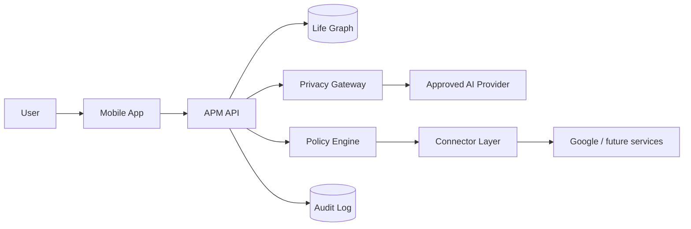
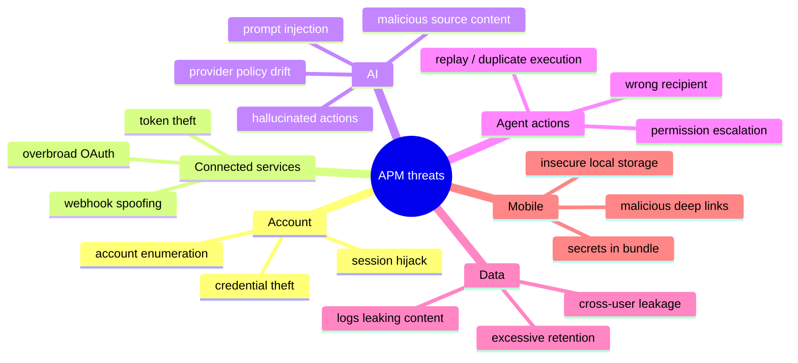
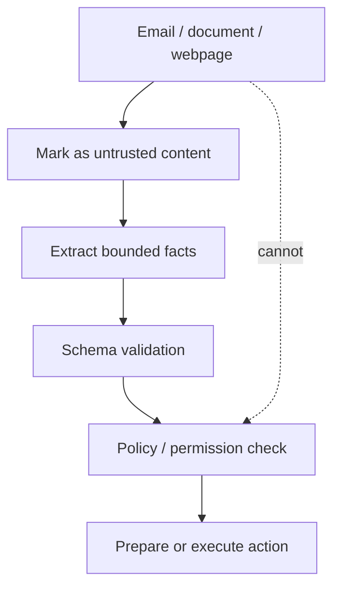

# A Player Mode — Security Threat Model v1

**Status: LOCKED SECURITY BASELINE**  
**Decision date: 2026-10-06**

## Security objective

APM will hold high-value personal context and may eventually act on a user's behalf. Security therefore protects three things at once:

1. **Confidentiality** — private life data does not leak.
2. **Integrity** — APM state cannot be silently poisoned or altered.
3. **Authority** — APM cannot perform actions outside the user's explicit permissions.

## Trust boundaries



Each arrow crosses a trust boundary and must be authenticated, authorized, validated, and observable as appropriate.

## Crown-jewel assets

| Asset | Risk if compromised | Required protection |
|---|---|---|
| OAuth refresh/access tokens | External-account takeover | Server-side encrypted secret storage; never model context/client bundle |
| Life Graph | Intimate profiling / manipulation | User-scoped authorization, encryption, provenance, export/delete |
| Raw email/calendar content | Sensitive disclosure | Minimize retention, least privilege, controlled processing |
| Permission state | Unauthorized autonomous actions | Server-owned policy checks, immutable audit trail |
| Model-routing policy | Privacy-policy bypass | Central registry + fail-closed gateway |
| Audit history | Loss of accountability | Tamper-resistant append-oriented events |
| Push tokens | Privacy/spam/targeting risk | Treat as credentials; user-scoped storage |

## Threat map



## Priority threats and controls

| Threat | Severity | Core controls |
|---|---|---|
| Cross-user Life Graph access | Critical | Every server query scoped by authenticated user/tenant; authorization tests; no client-trusted user IDs |
| OAuth token leakage | Critical | Encrypt server-side; secret-manager/KMS path; redact logs; never send to LLM/mobile |
| AI prompt injection from email/web content | Critical | Treat source text as untrusted data; separate instructions from content; action policy cannot be changed by model/source text |
| Unauthorized action execution | Critical | Policy Engine authorization immediately before execution; action schemas; idempotency; audit |
| Privacy Gateway bypass | Critical | Central inference client; architecture/lint tests; no provider SDK/API calls outside approved module |
| Provider policy drift | High | Registry review dates; health/policy checks; disable route automatically/manual kill switch |
| Hallucinated commitments/facts | High | Provenance + confidence + correction; model output is candidate state, not truth |
| Sensitive prompt logging | High | Prompt-body logging off by default; metadata-first observability |
| Duplicate agent action | High | Idempotency key + action state machine + verification |
| Notification disclosure on lock screen | Medium/High | User-configurable privacy level; avoid sensitive details in default push copy |

## Prompt-injection defense

Connected content is **data, never authority**.



Hard rules:

- External text cannot rewrite system policy, permission level, model routing policy, or user identity.
- A model cannot grant itself tool access.
- Tool/action arguments are independently validated.
- High-consequence actions use deterministic authorization and explicit user authority.
- Suspicious instructions embedded in external content should be recorded as security signals, not obeyed.

## Autonomy security

```text
Model proposes
      ↓
Action schema validates
      ↓
Current user permission fetched server-side
      ↓
Policy/constraints checked
      ↓
Idempotency checked
      ↓
Connector executes
      ↓
Result verified
      ↓
Audit event recorded
```

A subscription tier may unlock an autonomy feature, but it **never creates permission**.

## Authentication baseline

Initial production implementation should support:

- mature authentication provider or equivalent hardened auth;
- secure refresh/session handling;
- server-side authorization on every private resource;
- re-authentication for destructive/security-sensitive operations;
- device/session revocation capability;
- rate limiting and abuse detection.

Do not invent custom password cryptography.

## Mobile security baseline

- No production server secrets in app bundle.
- API keys intended to be private remain server-side.
- Sensitive cached information minimized.
- Platform secure storage for client credentials/tokens that must exist locally.
- Deep-link inputs validated.
- Screenshots/clipboard restrictions evaluated for genuinely sensitive future surfaces rather than applied indiscriminately.

## Logging and observability

Default production logs may contain:

- internal request/correlation IDs;
- user internal ID where access-controlled;
- task/route identifiers;
- error class;
- timings;
- token counts/cost;
- data classification.

Default logs must **not** contain:

- OAuth tokens;
- passwords/secrets;
- full Gmail bodies;
- entire Life Graph dumps;
- raw AI prompts/responses containing private context.

## Security event kill switches

Operations must be able to quickly disable:

- an AI provider/route;
- an external connector;
- action execution globally or by action type;
- autonomous execution while retaining read-only product access;
- a compromised user session/token.

## Security review gates

Before Gmail/Calendar production access:

- OAuth scope review;
- token-storage review;
- webhook/sync security review;
- deletion/disconnection behavior tested.

Before first action execution:

- permission engine tests;
- idempotency tests;
- action audit tests;
- failure/retry/reversal design.

Before Autopilot:

- threat-model refresh;
- abuse-case review;
- kill-switch drills;
- higher-risk action classes reviewed individually.

## Anti-drift merge checklist

Any feature touching personal data, inference, a connector, or action execution must answer:

1. What is the data classification?
2. What trust boundary is crossed?
3. How is the caller authenticated/authorized?
4. What untrusted input exists?
5. Can an LLM influence an action? If yes, what deterministic checks constrain it?
6. What secrets are involved?
7. What gets logged?
8. What is the failure mode?
9. What audit event is created?
10. How can the capability be disabled quickly?
