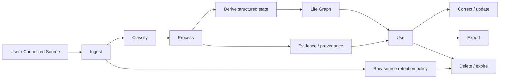
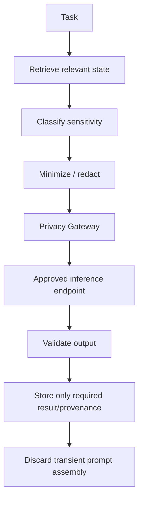
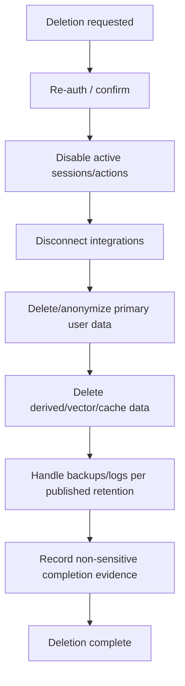

# A Player Mode — Data Lifecycle v1

**Status: LOCKED DATA-LIFECYCLE BASELINE**  
**Decision date: 2026-10-06**

## Principle

Collect what APM needs, derive durable structured intelligence where appropriate, retain raw private source material only as justified, expose provenance, and make deletion/export real system behaviors.

## Lifecycle



## Data categories

| Category | Examples | Persistence intent |
|---|---|---|
| Account | auth identity, subscription | account lifecycle |
| Life Graph | goals, routines, preferences | persistent until changed/deleted |
| Derived intelligence | commitment, inferred preference | persistent with provenance/confidence where useful |
| External source metadata | message/event ids, sync cursor | only while integration/function requires |
| Raw external content | email body, event description | minimize; avoid indefinite duplication by default |
| Audit | permission/action events | retention based on security/product/legal need |
| AI request metadata | route, task, timing, token/cost | retain without private prompt body where possible |
| Credentials | OAuth refresh/access material | encrypted secret storage; never model context |

## Gmail principle

APM's goal is not to become a second permanent copy of the user's mailbox.

Preferred pattern:

```text
Gmail source
  ↓
minimum content needed for processing
  ↓
commitment / person / date / evidence reference
  ↓
Life Graph
```

Where product functionality can work from derived state + source reference, do not retain raw message bodies indefinitely.

## AI processing lifecycle



Do not store full assembled prompts by default merely for debugging. Use synthetic/replayable test fixtures and metadata-first observability.

## User correction

Persistent AI-derived facts must support correction where they materially affect the user.

Correction behavior:

1. preserve appropriate audit evidence;
2. update canonical state;
3. lower/remove superseded inference;
4. prevent the same source from blindly recreating a fact the user has explicitly corrected without new evidence.

## Disconnection

Disconnecting an integration must:

- revoke/disable APM's continuing access;
- stop future sync jobs;
- invalidate connector credentials as supported;
- explain what previously derived APM state remains;
- provide controls to remove retained integration-derived state where product/legal rules permit.

Disconnect is not account deletion.

## Export

Export should ultimately include human- and machine-readable representations of:

- profile/identity;
- goals/projects;
- commitments/tasks;
- routines/preferences/rules;
- people/relationships stored in Life Graph;
- permissions;
- meaningful APM activity/audit history;
- connected-service metadata as appropriate.

## Deletion

Deletion must be implemented as an orchestrated workflow, not a single SQL statement.



Final production retention periods require legal/security review and must match the public policy and actual infrastructure.

## Logging rule

Never use private prompt/response logging as the default observability strategy.

Prefer:

- task type;
- route/model/provider;
- data classification;
- token counts;
- latency;
- schema-validation result;
- error class;
- quality/eval signals;
- hashed/internal correlation identifiers.

Sensitive debugging must use explicit controlled mechanisms with expiration and access restrictions.

## Anti-drift requirement

Every new storage table/object must identify:

- data owner;
- classification;
- source/provenance;
- retention intent;
- export behavior;
- deletion behavior;
- whether it may enter AI context.

## Phase B Life OS storage classes

| Object | Owner / boundary | Classification | Retention intent | Export / deletion | AI-context eligibility |
|---|---|---|---|---|---|
| `life_relationships` | individual user; own-row + Life OS entitlement RLS for reads; no direct client writes (governed RPCs only, migration 0017) | Class 2 private life | persistent until corrected/deleted/account deletion | included in Life Graph export via the owner-only data-rights function (also after downgrade); cascades with account/person deletion | only when a future task requires it and Privacy Gateway permits; **Phase B Radar/Today are deterministic** |
| `life_admin_items` | individual user; own-row + Life OS entitlement RLS for reads; no direct client writes (governed RPCs only, migration 0017) | Class 2 by default; fields containing financial or health-sensitive details can be Class 3 | persistent while useful; completed/cancelled state remains structured history until removed/account deletion | included in Life Graph export via the owner-only data-rights function (also after downgrade); cascades with account deletion | only minimum necessary fields through an eligible route; **no new Phase B inference path** |

Phase B analytics contain event type and coarse domain kind/recurrence state only. Titles, notes, amounts, health details, relationship notes and other raw private Life OS content are not copied into product analytics by default.

Data-rights access is separate from product entitlement, but it is not an RLS bypass for ordinary reads: ordinary SELECT needs own-row AND entitlement, and only the dedicated owner-only `apm_life_os_data_rights_export()` path (used by `/v1/privacy/life-os` and `/v1/privacy/export`) reads retained rows after downgrade. Every Life OS write is a governed RPC that checks ownership, entitlement and lifecycle rules, forces user-stated provenance, and writes its audit event in the same transaction.

Life OS state retains provenance. User-managed edits and completion are canonical state changes; future inferred Life OS facts must preserve the correction rules above.

## Phase C Autopilot storage classes

| Object | Owner / boundary | Classification | Retention intent | Export / deletion | AI-context eligibility |
|---|---|---|---|---|---|
| `autopilot_rules` | individual user; own-row + Autopilot entitlement RLS for reads; no direct client writes (governed RPCs only, migration 0018) | Class 1–2 (schedule windows, caps, recipient domains) | history until account deletion; revocation recorded, not deleted | included in export via `apm_autopilot_data_rights_export()` (also after downgrade); cascades with account deletion | none — Phase C is deterministic |
| `autopilot_executions` | individual user; same as above | Class 1 (structural: times, status, provider reference); content lives on `actions.payload` (Class 2) | history until account deletion | same as above | none |
| `autopilot_settings` | individual user; same as above | Class 1 | until account deletion | same as above | none |
| `autopilot_action_classes` | product catalogue; read-only to authenticated users | public metadata | permanent | not personal data | n/a |

Autopilot audit events and analytics carry the action class, ids and failure codes only — never titles, recipients, subjects or bodies.

