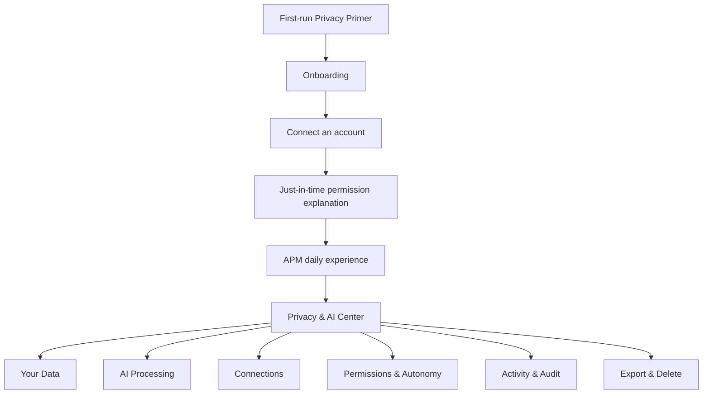
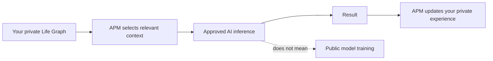
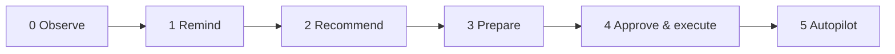

# A Player Mode — Privacy UX & Trust Center

**Status: LOCKED PRODUCT REQUIREMENT**  
**Decision date: 2026-10-06**

> Privacy is a product surface, not merely a legal document.

This document defines the user-facing experiences required to explain how A Player Mode (APM) handles personal data, AI processing, connected accounts, model providers, permissions, retention, export, and deletion.

---

## 1. Product principle

APM may eventually hold deeply personal context. A user must never need to read a legal privacy policy to understand the basic answer to:

1. What does APM know about me?
2. Why does APM know it?
3. Where did that information come from?
4. What AI may process it?
5. Is anyone training a public model on it?
6. What can APM do on my behalf?
7. How do I revoke access?
8. How do I export or delete my information?

These answers must exist inside the product in plain language.

---

## 2. Locked privacy promise

User-facing summary:

> **Your life is yours.**
>
> A Player Mode uses the information you provide and connect to operate your personal APM. We do not sell your personal data. We do not permit approved AI inference providers to train public models using your private APM data. APM learns about you through your private Life Graph—not by training a public foundation model on your life.

Legal/privacy counsel must review final production language, but the underlying product policy may not be weakened silently.

---

## 3. Trust UX architecture



Privacy information appears at the moment it matters and remains inspectable later.

---

## 4. Required app pages

### Page A — Privacy Primer

Shown during first-run onboarding before sensitive integrations are connected.

**Title:** Your life is yours.

**Body:**

A Player Mode works best when it understands what matters to you and what is happening in your life. You choose what to share and which accounts to connect.

**Trust grid:**

| Promise | Plain-language explanation |
|---|---|
| Your data is not for sale | APM does not sell your personal data. |
| Private data is not public-model training material | Approved AI inference providers may not train public models on private APM data. |
| Minimum necessary AI context | APM sends only the context needed for a particular AI task whenever technically practical. |
| You control connections | Connected services can be disconnected. |
| You control autonomy | APM cannot silently graduate itself to higher action permissions. |
| You can inspect APM | Important actions and permissions are visible in the product. |

Primary CTA: **Continue**  
Secondary CTA: **How APM uses AI**

Do not require the user to understand provider/model terminology to proceed.

---

### Page B — How APM Uses AI

**Title:** APM uses AI. Your Life Graph stays yours.

Explain three different concepts visually:



Required copy concepts:

- APM can use multiple approved AI models rather than relying on one permanent model.
- Models are selected according to privacy eligibility, capability, reliability, cost, and latency—in that order.
- Private APM data may only go to providers/endpoints approved for its data classification.
- APM does not permit private APM data to be used to train third-party public models.
- APM personalization primarily lives in APM's Life Graph and rules.

CTA: **See current AI providers**

---

### Page C — AI Providers

This is a live transparency page backed by the production model registry—not hard-coded marketing copy.

Example grid:

| Provider / model route | Used for | Public-model training permitted? | Retention class | Status |
|---|---|---:|---|---|
| Approved route A | classification / extraction | No | ZDR | Approved |
| Approved route B | planning / reasoning | No | ZDR or approved limited retention | Approved |
| Restricted free route | public/synthetic tasks only | Provider-dependent | Provider-dependent | Restricted |

The actual production page must show current information from the registry.

APM may change models without requiring a product release, but a model cannot become eligible for private data without passing privacy policy checks.

---

### Page D — Your Data

Give the user a human-readable view of the Life Graph.

Sections:

- Identity & preferences
- Goals
- Projects
- Commitments
- Routines
- People & relationships
- Operating rules
- Learned preferences
- Connected-source information

For inspectable facts, show provenance where practical:

> **Prefers workouts before noon**  
> Source: You told APM · Sep 14

or

> **Send David the deck**  
> Source: Gmail · detected from your message · due Friday

Users should be able to correct important persistent state.

---

### Page E — Connections

Cards for each external integration.

Example:

**Google Calendar**  
Connected as: user@example.com  
APM can currently: Read calendar events  
APM cannot currently: Modify events  
Last sync: [timestamp]  

Actions: **Manage access** · **Disconnect**

Do not describe permissions more broadly than the OAuth scopes and application behavior actually allow.

---

### Page F — Permissions & Autonomy

This is essential to the Executive Roundtable → Executive Suite → Autopilot model.



The user controls permissions by domain/action type.

Example grid:

| Domain | Current autonomy | Example |
|---|---|---|
| Calendar | Recommend | Suggest a time change but do not make it |
| Routine planning | Prepare | Prepare next week's blocks for approval |
| Work email | Prepare | Draft but do not send |
| Personal email | Recommend | Suggest response/action |
| Purchases | Observe | No purchasing authority |

A higher subscription tier may make higher autonomy levels *available*, but purchasing a tier does not itself grant permission.

**Locked rule:** APM may never infer consent to a higher autonomy level from ordinary usage.

---

### Page G — Why did APM see this?

Every important Radar item should support an explanation affordance.

Example:

**You promised David the deck today.**

Why APM surfaced this:

1. APM detected a commitment in an email you sent.
2. The detected due date is today.
3. APM has not found evidence that the commitment is complete.
4. The commitment is associated with an active priority.

Sources: Gmail + Life Graph

Actions: **Correct this** · **Mark complete** · **Change priority**

This creates inspectable proactive AI rather than mysterious proactive AI.

---

### Page H — APM Activity

A user-facing audit log.

Examples:

- Radar item created
- Goal updated
- Preference learned
- Calendar recommendation prepared
- Email draft prepared
- Approved action executed
- Connected account synchronized

For consequential actions show:

- what happened
- when
- why
- data source
- permission used
- whether AI participated
- outcome/verification state

---

### Page I — Export & Delete

Required controls:

**Export my APM data**  
Explain what the export contains and delivery method.

**Delete my APM account and data**  
Explain scope, expected retention exceptions where legally/security required, and what happens to connected services.

**Disconnect integrations** must not be hidden behind account deletion.

The implementation must eventually support these operations rather than treating them as aspirational policy copy.

---

## 5. Just-in-time connection screens

Never present only a generic OAuth button.

Before connecting Gmail, explain:

**Why APM wants Gmail access**

APM can use permitted email information to identify commitments, follow-ups, deadlines, requests, and other open loops.

Then show a permission matrix based on actual scopes:

| Capability | Current request |
|---|---:|
| Detect commitments | Yes |
| Detect follow-ups | Yes |
| Prepare an email | Only if/when corresponding scope is requested |
| Send an email | No unless separately enabled and authorized |

Equivalent just-in-time screens are required for Calendar and future integrations.

---

## 6. Privacy Center navigation

Recommended Settings structure:

```text
Privacy & AI
├── Your Data
├── How APM Uses AI
├── AI Providers
├── Connections
├── Permissions & Autonomy
├── APM Activity
└── Export & Delete
```

This is a first-class product area, not a webview of the legal privacy policy.

---

## 7. Trust indicators in normal product surfaces

Privacy must also appear contextually:

- Radar items: **Why am I seeing this?**
- Prepared actions: **What will happen?**
- Autonomous actions: permission/rule used
- Learned facts: source/provenance
- Integrations: current access level
- AI-provider page: current processing policy

Avoid constant scary banners. Make transparency available at the point of consequence.

---

## 8. Design requirements

- Plain English first; legal text second.
- Use progressive disclosure.
- Use grids and diagrams for complicated concepts.
- Do not imply that no external processor ever sees data when approved inference requires processing.
- Do not call a provider ZDR unless the production route satisfies the documented requirement.
- Do not promise deletion behavior until the underlying lifecycle supports it.
- Do not conflate personalization with foundation-model training.
- Do not dark-pattern users into higher autonomy.
- Do not hide disconnection/export/deletion.

---

## 9. Acceptance criteria before public launch

A public launch cannot be considered privacy-ready until:

- Privacy Primer exists.
- How APM Uses AI exists.
- Current AI Providers page exists and is registry-backed.
- Connections page accurately reflects access.
- Permissions & Autonomy page exists.
- APM Activity records consequential actions.
- Users can inspect important persistent Life Graph information.
- Radar supports source/reason explanation.
- Integration connection screens explain purpose before OAuth.
- Export and deletion workflows are implemented or accurately scoped for the launch version.
- User-facing claims match actual production model routing and retention behavior.

---

## 10. Anti-drift rule

Any feature that collects a new category of personal data, introduces a new AI processor, adds a new integration scope, or increases APM's ability to act must answer before merge:

1. Which data class is involved?
2. Where is it stored?
3. Which processors may receive it?
4. Is model training prohibited?
5. What retention policy applies?
6. What user permission is required?
7. Where can the user inspect/revoke/correct it?
8. What audit event is created?

If those questions cannot be answered, the feature is not ready to ship.