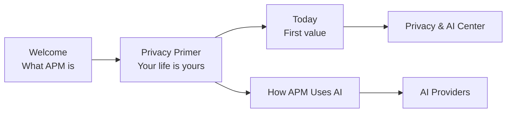
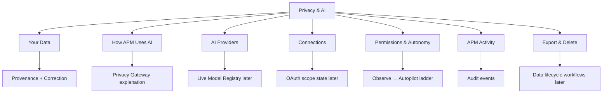
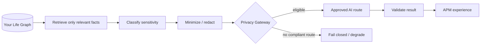
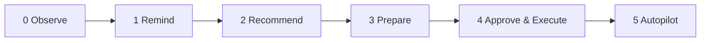
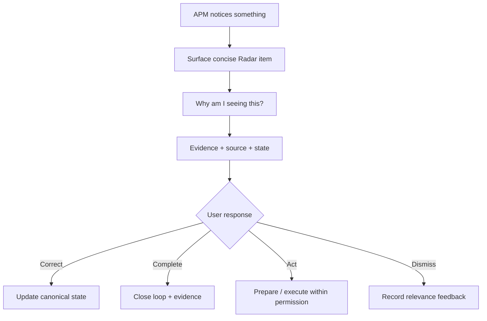

# A Player Mode — Trust Center Screen Map

**Status: IMPLEMENTATION REFERENCE — derived from LOCKED privacy/product requirements**  
**Date: 2026-10-06**

This document gives product/design/engineering a fast visual reference for the first mobile trust experience.

## First-run journey

## Trust Center map

## What question does each page answer?

| Page | User question | Required answer |
|---|---|---|
| Privacy Primer | “What am I agreeing to?” | Core privacy promise in plain language |
| Your Data | “What does APM know?” | Inspectable Life Graph facts + provenance + correction |
| How APM Uses AI | “Where does AI fit?” | Life Graph → minimum context → Privacy Gateway → approved inference |
| AI Providers | “Who processes AI requests?” | Current route/provider policy, training and retention state |
| Connections | “What accounts can APM access?” | Connected status + exact current capabilities |
| Permissions & Autonomy | “What can APM do without me?” | Domain-specific authority and autonomy level |
| APM Activity | “What has APM done?” | Human-readable audit trail |
| Export & Delete | “Can I leave?” | Export, disconnect and deletion controls |

## Core privacy visual

## Autonomy visual

**Important:** higher product tiers can unlock availability of higher levels, but the user still grants authority by domain/action type.

## Radar trust loop

## Current implementation matrix

| Surface | Fixture UI | Real backend | Real integration | Production ready |
|---|---:|---:|---:|---:|
| Welcome | ✅ | n/a | n/a | No |
| Privacy Primer | ✅ | n/a | n/a | No — legal review later |
| Today | ✅ | No | No | No |
| Radar | ✅ | No | No | No |
| Why APM saw this | ✅ | No | No | No |
| Your Data | ✅ | No | No | No |
| How APM Uses AI | ✅ | No | No | No |
| AI Providers | ✅ | No | No | No |
| Connections | ✅ | No | No | No |
| Permissions & Autonomy | ✅ | No | No | No |
| APM Activity | ✅ | No | No | No |
| Export & Delete | ✅ | No | No | No |

## Design acceptance grid

A trust screen is not complete until a normal user can answer:

| Requirement | Pass condition |
|---|---|
| Plain language | Meaning is understandable without legal/AI jargon |
| Source clarity | Important personal facts can show where they came from |
| Permission clarity | User knows what APM can and cannot do |
| AI clarity | User understands inference ≠ public-model training |
| Control | User can find correction/disconnect/permission/export/delete paths |
| No false promise | UI claims match actual production behavior |
| Progressive disclosure | Important summary first; technical detail available but not forced |
