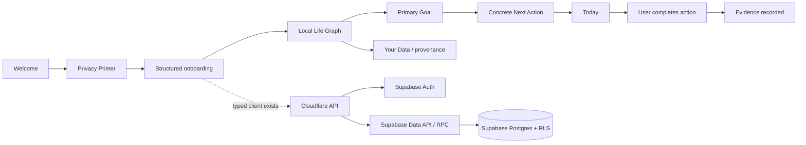
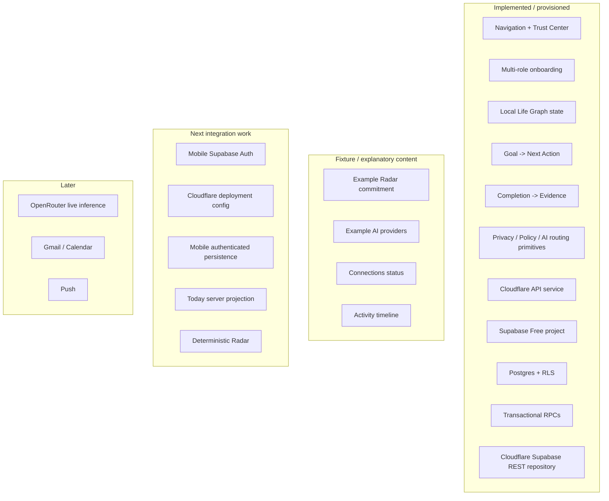
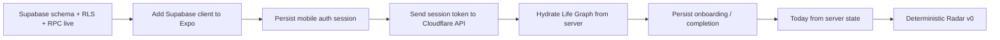

# A Player Mode — Implementation Status

**Status: LIVING EXECUTION RECORD**  
**Updated: 2026-10-06**

This file records what is actually implemented versus documented, mocked, provisioned, or still planned. Locked behavior lives in the canonical documents; this file prevents roadmap drift and false assumptions about what already exists.

## Current product loop

The first mobile vertical slice works locally. The Supabase Free project now exists, the first Life Graph schema/RLS/RPC migrations are applied, and the Cloudflare API source has been refactored to use Supabase Auth + Data API semantics. Mobile authenticated persistence is the next integration step.

## Phase status

| Area | Status | What exists now |
|---|---|---|
| Product Constitution | ✅ Implemented as governance | Locked product thesis and anti-drift rules |
| Privacy & AI Constitution | ✅ Implemented as governance | Data classes, no-training rule, ZDR preference, minimum-context rule |
| Technical architecture | ✅ Documented | Modular-monolith boundaries and Trust/AI/action architecture |
| Security threat model | ✅ Documented | Trust boundaries, crown jewels, prompt-injection/action risks, kill switches |
| Analytics/evaluation | ✅ Documented | Proactive-value metrics, model evaluation, privacy-safe analytics rules |
| Mobile shell | ✅ Implemented | Expo/React Native, Today/Radar/Goals/APM tabs, Settings routes |
| Trust Center | ✅ Fixture implementation | Privacy Primer, AI explanation, providers, data, connections, permissions, activity, export/delete |
| Multi-life positioning | ✅ Implemented baseline | Parent, athlete, entrepreneur, student, professional, creator, caregiver, transition examples + multi-role intake |
| Canonical domain package | ✅ Implemented | Core Life Graph TypeScript types |
| Privacy policy package | ✅ Implemented | Data-class routing eligibility and secret-key guard |
| Policy package | ✅ Implemented | Explicit autonomy/entitlement checks; subscription never grants authority |
| AI registry/router package | ✅ Implemented baseline | Privacy-first route filtering and $0-first cost ordering after eligibility |
| Structured onboarding | ✅ First slice | Name, selected games/roles, 90-day goal, pillar, season, identity direction |
| Local Life Graph state | ✅ First slice | Identity, roles, goal, next action, evidence |
| Today from Life Graph | ✅ First slice | Primary action is generated from structured goal state |
| Evidence loop | ✅ First slice | User completion creates structured evidence |
| Goals from Life Graph | ✅ First slice | Goal screen reflects structured goal state |
| Your Data from Life Graph | ✅ First slice | User can inspect live identity/goal state and provenance |
| Cloudflare API workspace | ✅ Implemented scaffold | Hono Worker, health + authenticated Life Graph routes |
| Supabase project | ✅ Provisioned | `aplayer-mode` project active on Free plan |
| Supabase Auth | ✅ Platform available | Auth service active; mobile sign-in/session UX not wired yet |
| PostgreSQL schema | ✅ Applied | user_profiles, roles, goals, next_actions, evidence |
| Row Level Security | ✅ Applied | authenticated users restricted to their own rows |
| Transactional RPCs | ✅ Applied | onboarding + completion/evidence functions |
| Cloudflare↔Supabase repository | ✅ Refactored | API uses Supabase Auth validation and user-token Data API/RPC path |
| Mobile API client boundary | ✅ Implemented baseline | API contract exists; authenticated session integration is next |
| Supabase Free plan | ✅ Locked for MVP | Upgrade only when concrete need appears |
| Mobile ↔ API live persistence | ⏳ Next | Mobile still uses local React state |
| Mobile Supabase session | ⏳ Next | Supabase client/login/session persistence not wired into app shell |
| Server Today projection | ⏳ Next | Current Today is generated in mobile prototype |
| Radar deterministic engine | ⏳ Next | Example Radar still fixture content |
| Real model calls | ⏳ Later | No production inference endpoint is connected yet |
| Approved model registry data | ⏳ Later | Policy/schema exist; candidate evaluation still required |
| Google Calendar | ⏳ Later | Not connected |
| Gmail | ⏳ Later | Not connected |
| Push notifications | ⏳ Later | Not connected |
| External action execution | ⏳ Later | No connector actions; policy layer exists first |

## What is real vs fixture vs pending

## Current technical caveats

The mobile Life Graph is still held in React state and resets when the app process resets. Supabase durability now exists server-side, but the mobile app has not yet switched its state source to the authenticated API.

The API validates normal sessions through Supabase Auth and forwards the user's own access token to Supabase Data API/RPC so PostgreSQL RLS remains effective. Normal user operations do not require a service-role key.

The API still supports a local-only `AUTH_DEV_BYPASS_USER_ID`; this remains development-only and must not be present in staging/production.

The OpenRouter environment variable is reserved server-side, but **no route currently sends any user content to OpenRouter**.

No Gmail, Calendar, purchase, banking, or external action capability has been granted or implemented.

## Current backend routes

| Method | Route | State |
|---|---|---|
| GET | `/v1/health` | Implemented |
| GET | `/v1/me/life-graph` | Implemented; requires Supabase session |
| PUT | `/v1/onboarding` | Implemented; authenticated + RLS/RPC |
| POST | `/v1/next-actions/:id/complete` | Implemented; authenticated + transactional RPC |

## Next execution block

### Exit criteria for the next block

- mobile signs in through Supabase Auth;
- session persists securely on device;
- mobile calls Cloudflare APM API with Supabase access token;
- Life Graph survives app restarts;
- onboarding writes to the live Supabase project;
- action completion creates durable evidence;
- every private query/mutation is protected by both verified identity and RLS;
- Today can be reconstructed from server state;
- CI covers all workspaces.

Only after that foundation is stable should Calendar become the first real external source.
