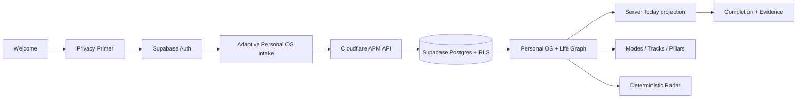
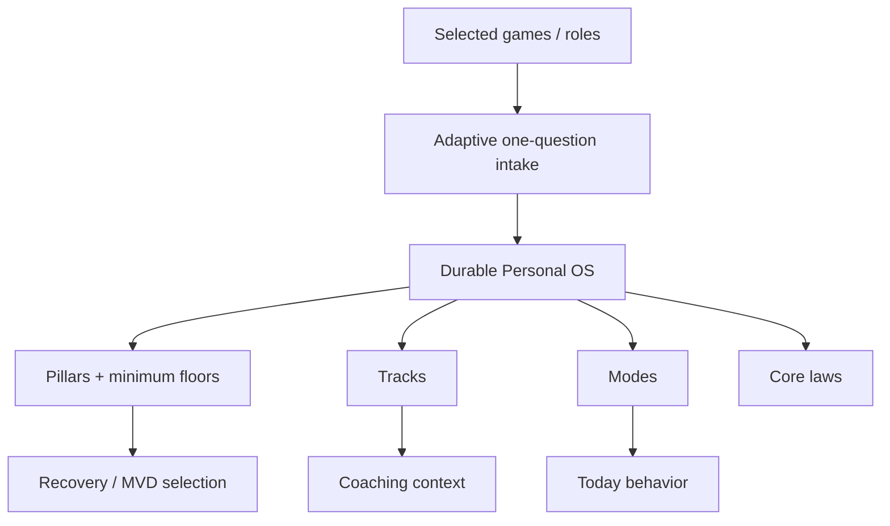

# A Player Mode — Implementation Status

**Status: LIVING EXECUTION RECORD**  
**Updated: 2026-10-06**

This file records what is actually implemented versus documented, provisioned, fixture-only, integrated-but-unproven, or still planned. Locked behavior lives in the canonical documents; this file exists to prevent roadmap drift and false completion claims.

## Current product loop

The authenticated persistence + Today + Radar slice is merged. The runtime-proof harness is merged but its live provider run is still outstanding. Methodology Engine v1 is merged to `main` in commit `6e662c4955a62d15ad06181c6ecc09cc85ba1d78`, and the corresponding Supabase migration is provisioned.

## Capability ledger

| Area | State | What exists now |
|---|---|---|
| Product / Privacy constitutions | `STRUCTURAL` governance | Locked product, privacy, AI and anti-drift rules |
| Multi-life positioning | `STRUCTURAL` | “Whatever game you're in” + multi-role Life Graph model |
| Mobile shell + Trust Center | `STRUCTURAL` | Today/Radar/Goals/APM + privacy/settings surfaces |
| Supabase Free project | `INTEGRATED_UNPROVEN` | Auth/Postgres/RLS project active; live device path still unproven |
| Base Life Graph | `STRUCTURAL + DB_PROVISIONED` | profiles, roles, goals, next actions, evidence |
| Personal OS schema | `STRUCTURAL + DB_PROVISIONED` | personal_os, pillar_settings, tracks, operating_modes |
| Methodology RLS | `DB_PROVISIONED` | own-row RLS on all new methodology tables; security advisor clean |
| Adaptive intake | `STRUCTURAL + CI_PROVEN` | one-question flow; role/game-specific goal wording; explicit final approval |
| Pillars | `STRUCTURAL + DB_PROVISIONED` | Wealth, Body, Spirit, Execution + critical/floor settings |
| Tracks | `STRUCTURAL + DB_PROVISIONED` | Operator Discipline, Strategic Patience, Manifestation Mastery, Billionaire Mindset, Investor + AI Leverage |
| Modes | `STRUCTURAL + DB_PROVISIONED` | Standard, Recovery, High-Pressure, Executive Review |
| Core laws | `STRUCTURAL` | Never Miss Twice, Continuity > Intensity, No Catch-Up, No Mid-Day Negotiation, Zeros Allowed, MVD |
| Recovery / MVD | `STRUCTURAL + CI_PROVEN` | deterministic Recovery mode selects a minimum critical move and suppresses normal-day pressure |
| Arbitration | `STRUCTURAL + CI_PROVEN` | deterministic weighted leverage/urgency/energy/compounding/downside ranking |
| APM Coach surface | `STRUCTURAL + CI_PROVEN` | real mode control + deterministic opening question; no fake live LLM conversation |
| Server Today | `STRUCTURAL + CI_PROVEN` | reads active Personal OS mode and foreground goal |
| Radar v0 | `STRUCTURAL + CI_PROVEN` | deadline, missing-next-action and health rules |
| Runtime proof harness | `STRUCTURAL` | dedicated live verifier + manual workflow; live run not yet recorded |
| Calendar Fabric | `PLANNED` | device + Google + Microsoft + Apple/iCloud paths |
| Email Commitment Engine | `PLANNED` | Gmail + Outlook provider-neutral mail architecture |
| Live OpenRouter inference | `ABSENT` | no production user data sent to OpenRouter yet |
| Push / external actions | `ABSENT` | not connected |

## Methodology Engine v1

### Implemented and merged

- new Personal OS domain primitives;
- adaptive multi-game intake rather than founder-only intake;
- explicit user approval before installation;
- North Star, values, non-negotiables, failure patterns and optional Body/Work/Mind context;
- weekly cadence and coaching firmness;
- critical pillars + hard-day minimum floors;
- durable track selection and role-relevant recommendations;
- durable operating mode selection;
- deterministic methodology functions and tests;
- Today Recovery/MVD behavior;
- real APM mode-control surface.

### Database provisioned

Migration `methodology_engine_v1` is applied to the current Supabase Free project. It adds:

- `personal_os`;
- `pillar_settings`;
- `tracks`;
- `operating_modes`;
- `apm_save_methodology_intake(jsonb)`;
- `apm_set_operating_mode(text)`.

All four new tables have authenticated own-row RLS. Supabase's security advisor returned zero findings after migration.

## Current backend routes

| Method | Route | State |
|---|---|---|
| GET | `/v1/health` | Implemented |
| GET | `/v1/me/life-graph` | Implemented; authenticated |
| GET | `/v1/me/today` | Implemented; Personal OS aware |
| PUT | `/v1/onboarding` | Legacy thin onboarding retained for compatibility |
| PUT | `/v1/methodology/intake` | Implemented; persists Personal OS atomically |
| POST | `/v1/methodology/mode` | Implemented; explicit mode change |
| POST | `/v1/next-actions/:id/complete` | Implemented; completion + evidence |

## Runtime proof still required

Source CI does **not** prove the provider/device journey. These receipts remain outstanding:

- deployed Cloudflare API receipt;
- dedicated Supabase test-user sign-in;
- authenticated Life Graph read;
- methodology intake round-trip through deployed Cloudflare;
- mode-change round-trip;
- cross-user RLS negative-access proof;
- live-device sign-up/sign-in;
- session restoration after app restart;
- durable state visible after restart.

## Explicitly not included yet

- LLM-generated coaching dialogue;
- device calendar access;
- Google Calendar connector;
- Microsoft Outlook/M365 calendar connector;
- Apple/iCloud calendar connector;
- Gmail or Outlook email connector;
- live OpenRouter inference;
- push notifications;
- autonomous/external actions;
- Household OS;
- advanced web command center.

## Phase boundary

Completed product phase: **APM Methodology Engine v1**.

Next required phase: **live runtime proof**, then **Calendar Fabric**, followed by **Email / Commitment Engine**.
