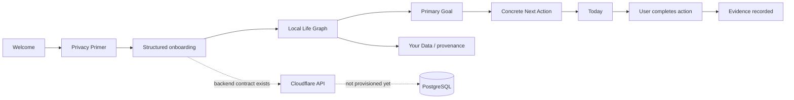
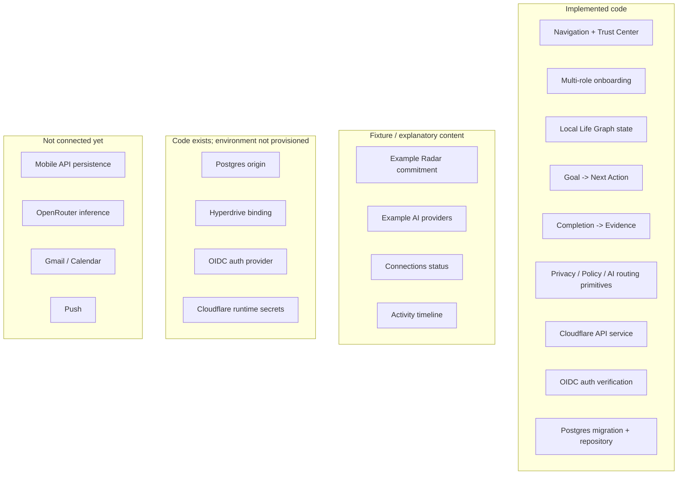
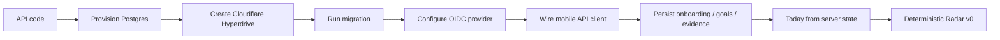

# A Player Mode — Implementation Status

**Status: LIVING EXECUTION RECORD**  
**Updated: 2026-10-06**

This file records what is actually implemented versus documented, mocked, provisioned, or still planned. Locked behavior lives in the canonical documents; this file prevents roadmap drift and false assumptions about what already exists.

## Current product loop

The first mobile vertical slice works locally. The server equivalent now exists in code but is not yet connected to a provisioned database/authentication environment.

## Phase status

| Area | Status | What exists now |
|---|---|---|
| Product Constitution | ✅ Implemented as governance | Locked product thesis and anti-drift rules |
| Privacy & AI Constitution | ✅ Implemented as governance | Data classes, no-training rule, ZDR preference, minimum-context rule |
| Technical architecture | ✅ Documented | Modular-monolith boundaries and Trust/AI/action architecture |
| Security threat model | ✅ Documented | Trust boundaries, crown jewels, prompt-injection/action risks, kill switches |
| Analytics/evaluation | ✅ Documented | Proactive-value metrics, model evaluation, privacy-safe analytics rules |
| Mobile shell | ✅ Implemented | Expo/React Native, Today/Radar/Goals/APM tabs, Settings routes |
| Trust Center | ✅ Fixture implementation | Privacy Primer, AI explanation, providers, data, connections, permissions, activity, export/delete |
| Multi-life positioning | ✅ Implemented baseline | Parent, athlete, entrepreneur, student, professional, creator, caregiver, transition examples + multi-role intake |
| Canonical domain package | ✅ Implemented | Core Life Graph TypeScript types |
| Privacy policy package | ✅ Implemented | Data-class routing eligibility and secret-key guard |
| Policy package | ✅ Implemented | Explicit autonomy/entitlement checks; subscription never grants authority |
| AI registry/router package | ✅ Implemented baseline | Privacy-first route filtering and $0-first cost ordering after eligibility |
| Structured onboarding | ✅ First slice | Name, selected games/roles, 90-day goal, pillar, season, identity direction |
| Local Life Graph state | ✅ First slice | Identity, roles, goal, next action, evidence |
| Today from Life Graph | ✅ First slice | Primary action is generated from structured goal state |
| Evidence loop | ✅ First slice | User completion creates structured evidence |
| Goals from Life Graph | ✅ First slice | Goal screen reflects structured goal state |
| Your Data from Life Graph | ✅ First slice | User can inspect live identity/goal state and provenance |
| Cloudflare API workspace | ✅ Implemented scaffold | Hono Worker, health + authenticated Life Graph routes |
| Authentication boundary | ✅ Implemented scaffold | OIDC/JWKS token verification; verified `sub` owns server-side data scope |
| PostgreSQL schema/migrations | ✅ First migration | Users, profiles, roles, goals, next actions, evidence |
| Durable repository layer | ✅ Implemented scaffold | User-scoped queries/mutations + transactional completion/evidence |
| Production database | ⏳ Provision next | No Postgres origin or Hyperdrive binding configured yet |
| Production authentication provider | ⏳ Provision next | Generic OIDC boundary exists; provider/mobile sign-in not configured yet |
| Mobile ↔ API integration | ⏳ Next | Mobile still uses local React state |
| Server Today projection | ⏳ Next | Current Today is generated in mobile prototype |
| Radar deterministic engine | ⏳ Next | Example Radar still fixture content |
| Real model calls | ⏳ Later | No production inference endpoint is connected yet |
| Approved model registry data | ⏳ Later | Policy/schema exist; candidate evaluation still required |
| Google Calendar | ⏳ Later | Not connected |
| Gmail | ⏳ Later | Not connected |
| Push notifications | ⏳ Later | Not connected |
| External action execution | ⏳ Later | No connector actions; policy layer exists first |

## What is real vs fixture vs provisioned

## Current technical caveats

The mobile Life Graph is still held in React state and resets when the app process resets. This remains intentional until the Cloudflare API is connected to a real database and the mobile authentication/session flow exists.

The new Worker API is real source code, but it cannot provide durable persistence until a PostgreSQL database is provisioned, migration `0001_life_graph.sql` is applied, and Cloudflare Hyperdrive is bound in the deployed environment.

The API supports a local-only `AUTH_DEV_BYPASS_USER_ID`. This is a development bridge, not production authentication. Staging/production must use the OIDC/JWKS path.

The OpenRouter environment variable is reserved server-side, but **no route currently sends any user content to OpenRouter**.

No Gmail, Calendar, purchase, banking, or external action capability has been granted or implemented.

## Current backend routes

| Method | Route | State |
|---|---|---|
| GET | `/v1/health` | Implemented |
| GET | `/v1/me/life-graph` | Implemented; requires auth + DB |
| PUT | `/v1/onboarding` | Implemented; requires auth + DB |
| POST | `/v1/next-actions/:id/complete` | Implemented; requires auth + DB |

## Next execution block

### Exit criteria for the next block

- A real development PostgreSQL database exists.
- Cloudflare Worker reaches it via Hyperdrive in deployed/dev environment.
- The migration is applied.
- A real authentication provider issues JWTs accepted by the API.
- Mobile talks to the typed development API.
- User-scoped Life Graph data survives app restarts.
- Identity, roles, goals, next actions, and evidence have durable storage.
- Every private query/mutation is scoped to an authenticated user boundary.
- Today can be reconstructed from server state.
- CI covers all workspaces.

Only after that foundation is stable should Calendar become the first real external source.
