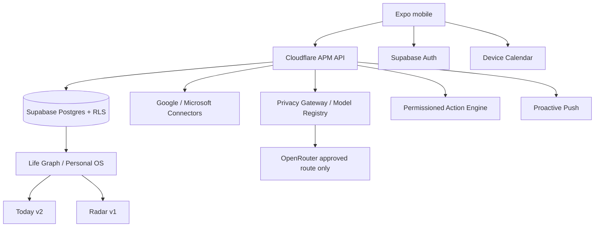
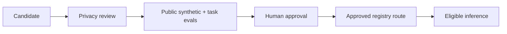

# A Player Mode — Implementation Status

**Status: LIVING EXECUTION RECORD**  
**Updated: 2026-10-06**

This file records what is actually implemented versus source-complete, DB-provisioned, runtime-proven, externally gated, or evidence-deferred. It exists to prevent roadmap drift and false completion claims.

## Current system shape

## Capability ledger

| Area | Current state | What exists |
|---|---|---|
| Product / privacy governance | `LOCKED` | Constitutions, architecture, security, lifecycle and Trust Center contracts |
| Positioning | `LOCKED` | “Whatever game you're in” + simultaneous multi-role Life Graph |
| BHPC v2.1 | `CANONICAL SOURCE` | Full source-of-intent + BHPC → APM mapping in repo |
| Mobile shell | `SOURCE_COMPLETE` | Today · Radar · Goals · APM + Settings / Trust Center |
| Supabase Free | `DB_PROVISIONED` | Auth/Postgres/RLS project; remains Free until evidence requires upgrade |
| Life Graph | `SOURCE_COMPLETE + DB_PROVISIONED` | identity, roles, goals, projects, milestones, commitments, actions, routines, people, preferences, rules, evidence and more |
| Methodology Engine | `SOURCE_COMPLETE + DB_PROVISIONED` | adaptive intake, Personal OS, Pillars/Tracks/Modes, MVD/recovery, arbitration |
| BHPC parity expansion | `SOURCE_COMPLETE + DB_PROVISIONED` | morning sequence, schedule preference, hard boundaries, scoring, review gates, Resilience, Sprint, Deep Work |
| Today v2 | `SOURCE_COMPLETE` | #1 move, morning sequence, calendar blocks, approvals, open-loop counts, day close |
| Radar v1 | `SOURCE_COMPLETE` | goals, commitments, review gates and calendar conflicts |
| Device Calendar | `SOURCE_COMPLETE` | Expo system-calendar read/sync path; real-device proof pending |
| Google Calendar | `SOURCE_COMPLETE` foundation | OAuth/PKCE, token storage/refresh, sync + action connector; live credentials/proof pending |
| Microsoft Calendar | `SOURCE_COMPLETE` foundation | Graph OAuth/sync/action path; live credentials/proof pending |
| iCloud Calendar | `SOURCE_COMPLETE` device lane | iCloud calendars configured on iPhone can enter via device lane; direct server CalDAV is separate/later |
| Gmail | `SOURCE_COMPLETE` foundation | separate OAuth/mail sync + normalized commitment/signals; live provider proof pending |
| Outlook Mail | `SOURCE_COMPLETE` foundation | Microsoft Graph mail signals/actions; live provider proof pending |
| Model Registry | `SOURCE_COMPLETE + DB_PROVISIONED` | candidates/restricted routes, live Trust page, scores/policy fields |
| OpenRouter gateway | `SOURCE_COMPLETE` | fail-closed exact-provider routing; no candidate auto-approved |
| Model evaluation | `SOURCE_COMPLETE` harness | public-synthetic benchmark + manual workflow; requires OpenRouter secret/live run |
| Live APM coaching | `SOURCE_COMPLETE` | mobile chat + sessions + mode-aware BHPC prompts; blocked until approved private-data route exists |
| Push | `SOURCE_COMPLETE` foundation | user permission, Expo token registration, server suppression/dedup; live push receipt pending |
| Trust Center | `SOURCE_COMPLETE` foundation | live model routes, connections, permissions, activity, Life Graph, export/delete request surfaces |
| Data rights | `SOURCE_COMPLETE` foundation | authenticated export + deletion job request; privileged deletion orchestrator pending |
| Action Engine | `SOURCE_COMPLETE` foundation | prepare/approve/execute/verify for calendar and email; global + per-domain kill switches default off |
| Analytics / AI usage | `SOURCE_COMPLETE + DB_PROVISIONED` | product/AI cost-event foundations |
| Entitlements | `SOURCE_COMPLETE + DB_PROVISIONED` | beta / Chief of Staff / Life OS / Autopilot server state; Household enum retained for future compatibility but customer access is disabled |
| Product plan UX | `SOURCE_COMPLETE` | current tier + Chief of Staff / Life OS / Autopilot comparison; no fake local upgrade path |
| Household interest | `SOURCE_COMPLETE + DB_PROVISIONED` | authenticated waitlist/withdraw flow; no Household access granted |
| Household | `DORMANT FOUNDATION` | shared schema remains for future use; Cloudflare customer APIs are blocked and authenticated Supabase Household read/write policies are removed; legacy Household entitlements normalize to Autopilot |
| EAS release | `SOURCE_COMPLETE` foundation | preview/production EAS profiles; store signing/submission external |
| Web Command Center | `CONTRACT ONLY` | same-brain desktop scope documented; advanced web UI not built |
| Billing | `FOUNDATION ONLY` | entitlement model documented; provider/store transactions not selected/proven |

## Database state

Current Supabase project has the baseline migrations plus the expanded platform migrations applied, including:

- platform expansion;
- BHPC intent parity;
- model route candidates;
- coaching/connector integrity;
- private household RLS helper.

All user-owned platform tables are intended to remain behind RLS. The household membership SECURITY DEFINER helper was moved out of the exposed `public` RPC schema. Latest Supabase **security advisor: zero findings**.

Performance-advisor warnings remain a later optimization task; they are not being mislabeled as resolved.

## Model state

Current `$0` routes are deliberately **candidate/restricted**, not production-approved simply because they are free.

If no approved route satisfies a private-data task, APM fails closed and does not infer.

## Provider/runtime receipts still outstanding

Source code and DB provisioning do not prove external runtime behavior. Outstanding receipts include:

- deployed Cloudflare API and real-device authenticated session restoration;
- cross-user RLS negative test through the live path;
- OpenRouter benchmark + explicit model promotion + private-life inference receipt;
- Google Calendar/Gmail real OAuth and sync receipts;
- Microsoft Calendar/Outlook real OAuth and sync receipts;
- iPhone/iCloud device-calendar receipt;
- real push notification receipt;
- action execution receipt with kill switches deliberately enabled;
- privileged deletion completion proof;
- TestFlight/Google Play build and store receipts;
- real billing/entitlement transaction proof;
- qualified legal/privacy review;
- closed-beta evidence.

## Approved next product expansion

ADR-0002 changes the source-build sequence:

- **Life OS modules are the next implementation phase**, including relationships/birthdays, appointments, travel, bills/subscriptions, meals/shopping planning, health routines and recurring life administration.
- **Autopilot standing-rule UX/engine follows Life OS** and still requires permission, policy, kill-switch and runtime proof.
- **Household remains waitlist-only**; polished multi-member Household UX is explicitly deferred.
- advanced Web Command Center remains later;
- broad infrastructure upgrades beyond Supabase Free remain usage-driven.

Building source now does not waive runtime, provider, billing, store, legal or beta evidence gates.

## Current artifact boundary

PR #6 — **Complete remaining APM platform source phases** — was merged to `main` on 2026-10-06 as merge commit `516cc032cb0f24d2eccb0190da53161433918051` after its exact source head passed workspace typecheck and deterministic tests.

The source baseline is merged and runtime-evidence hardening is also merged. **Phase A — the three-tier product contract — is now the active source artifact.** Its database addition (`product_interests`) is provisioned in Supabase with RLS and the latest security advisor is clean. After Phase A merges, the next source artifact is **Phase B — Life OS domain modules**. External runtime receipts remain separately tracked in `27-RUNTIME-EVIDENCE-PACKET.md`.
