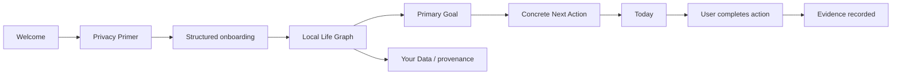
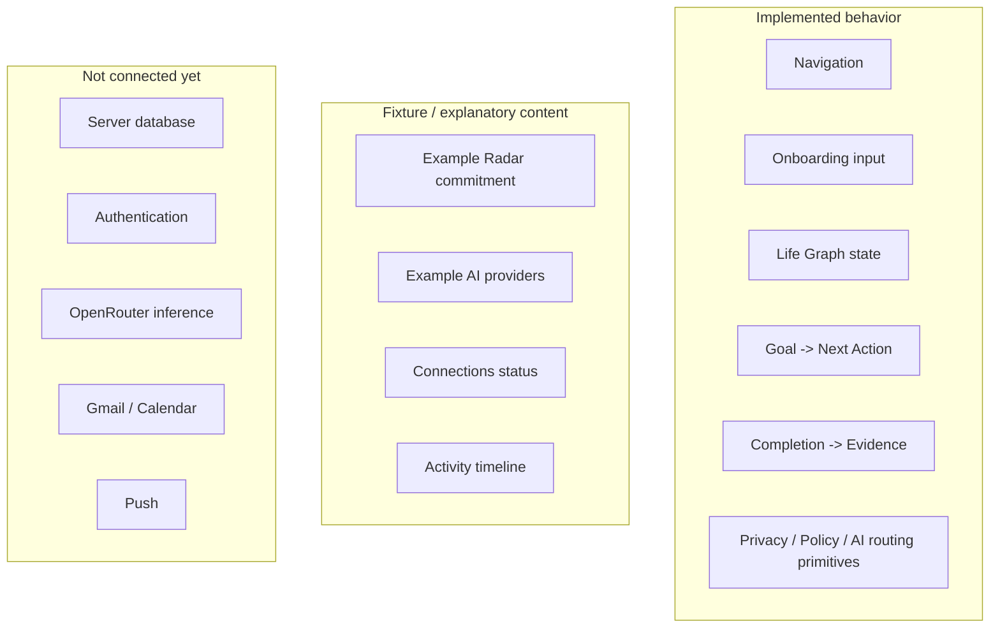
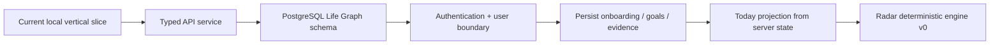

# A Player Mode — Implementation Status

**Status: LIVING EXECUTION RECORD**  
**Updated: 2026-10-06**

This file records what is actually implemented versus documented, mocked, or still planned. It is intentionally not a constitution. Locked behavior lives in the canonical documents; this file prevents roadmap drift and false assumptions about what already exists.

## Current product loop

This is the first real vertical slice: user intent becomes structured state, drives Today, and produces completion evidence.

## Phase status

| Area | Status | What exists now |
|---|---|---|
| Product Constitution | ✅ Implemented as governance | Locked product thesis and anti-drift rules |
| Privacy & AI Constitution | ✅ Implemented as governance | Data classes, no-training rule, ZDR preference, minimum-context rule |
| Technical architecture | ✅ Documented | Modular-monolith boundaries and Trust/AI/action architecture |
| Security threat model | ✅ Documented | Trust boundaries, crown jewels, prompt-injection/action risks, kill switches |
| Analytics/evaluation | ✅ Documented | Proactive-value metrics, model evaluation, privacy-safe analytics rules |
| Mobile shell | ✅ Implemented | Expo/React Native, Today/Radar/Goals/APM tabs, Settings routes |
| Trust Center | ✅ Fixture implementation | Privacy Primer, AI explanation, providers, data, connections, permissions, activity, export/delete |
| Canonical domain package | ✅ Implemented | Core Life Graph TypeScript types |
| Privacy policy package | ✅ Implemented | Data-class routing eligibility and secret-key guard |
| Policy package | ✅ Implemented | Explicit autonomy/entitlement checks; subscription never grants authority |
| AI registry/router package | ✅ Implemented baseline | Privacy-first route filtering and $0-first cost ordering after eligibility |
| Structured onboarding | ✅ First slice | Name, 90-day goal, pillar, season, identity direction |
| Local Life Graph state | ✅ First slice | Identity, goal, next action, evidence |
| Today from Life Graph | ✅ First slice | Primary action is generated from structured goal state |
| Evidence loop | ✅ First slice | User completion creates structured evidence |
| Goals from Life Graph | ✅ First slice | Goal screen reflects structured goal state |
| Your Data from Life Graph | ✅ First slice | User can inspect live identity/goal state and provenance |
| Durable backend/API | ⏳ Next | No server persistence yet |
| Authentication/user tenancy | ⏳ Next | Local demo user only |
| PostgreSQL schema/migrations | ⏳ Next | Domain types exist; durable store not yet implemented |
| Real model calls | ⏳ Later | No production inference endpoint is connected yet |
| Approved model registry data | ⏳ Later | Policy/schema exist; candidate evaluation still required |
| Google Calendar | ⏳ Later | Not connected |
| Gmail | ⏳ Later | Not connected |
| Push notifications | ⏳ Later | Not connected |
| External action execution | ⏳ Later | No connector actions; policy layer exists first |

## What is real vs fixture

## Current technical caveats

The present Life Graph is held in React state for the mobile prototype. It resets when the app process resets. This is intentional for the current vertical slice and **must not be mistaken for production persistence**.

The Trust Center AI-provider screen is currently explanatory/fixture UI. Before production model traffic exists, it must be backed by the actual Model Registry and show only current approved routes.

No Gmail, Calendar, purchase, banking, or external action capability has been granted or implemented.

No third-party model currently receives private APM user context from this prototype.

## Next execution block

### Exit criteria for the next block

- Mobile talks to a typed development API.
- User-scoped Life Graph data persists across app restarts.
- Identity, goals, next actions, and evidence have durable storage.
- Every query/mutation is scoped to an authenticated user boundary.
- Today can be reconstructed from server state.
- CI covers all workspaces.

Only after that foundation is stable should Calendar become the first real external source.
