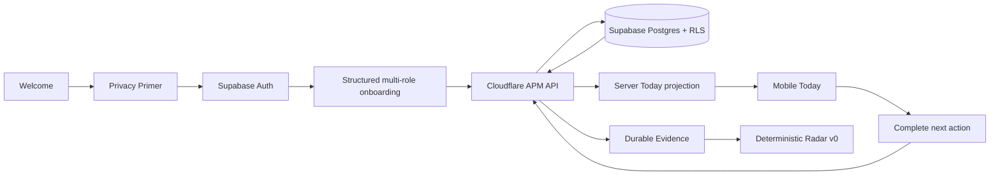
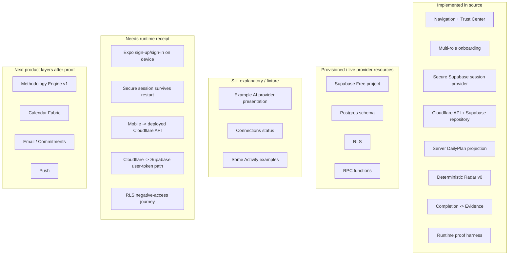
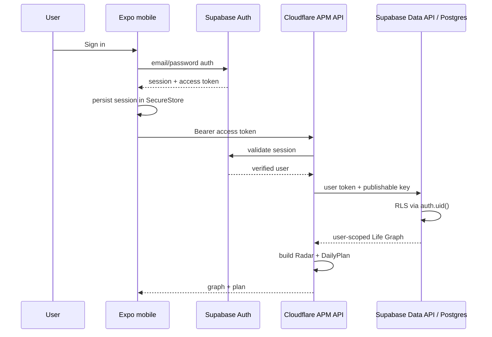

# A Player Mode — Implementation Status

**Status: LIVING EXECUTION RECORD**  
**Updated: 2026-10-06**

This file records what is actually implemented versus documented, provisioned, fixture-only, integrated-but-unproven, or still planned. Locked behavior lives in the canonical documents; this file exists to prevent roadmap drift and false completion claims.

## Current product loop

The authenticated persistence + server Today + deterministic Radar source slice is merged to `main` in commit `d1a2facaac1b909680073bb97610be72a40f6776` after exact-head CI passed. The current execution block is live runtime proof across Supabase, Cloudflare and native mobile boundaries.

## Capability ledger

| Area | State | What exists now |
|---|---|---|
| Product Constitution | `STRUCTURAL` governance | Locked product thesis and anti-drift rules |
| Privacy & AI Constitution | `STRUCTURAL` governance | Data classes, no-training rule, ZDR preference, minimum-context rule |
| Mobile shell | `STRUCTURAL` | Expo/React Native, Today/Radar/Goals/APM tabs, Settings routes |
| Trust Center | `FIXTURE_ONLY` + real navigation | Privacy/AI explanation, providers, data, connections, permissions, activity, export/delete; several provider/connection values remain explanatory fixtures |
| Multi-life positioning | `STRUCTURAL` | Parent, athlete, entrepreneur, student, professional, creator, caregiver, transition examples + multi-role intake |
| Canonical domain package | `STRUCTURAL` | Core Life Graph + DailyPlan/Radar types |
| Privacy policy package | `STRUCTURAL` | Data-class routing eligibility and secret-key guard |
| Policy package | `STRUCTURAL` | Explicit autonomy/entitlement checks; subscription never grants authority |
| AI registry/router package | `STRUCTURAL` | Privacy-first route filtering and $0-first cost ordering after eligibility |
| Supabase project | `INTEGRATED_UNPROVEN` | APM project active on Free plan |
| Supabase Auth | `INTEGRATED_UNPROVEN` | Mobile client/session code exists; live-device auth journey not yet recorded |
| PostgreSQL schema | `INTEGRATED_UNPROVEN` | user_profiles, roles, goals, next_actions, evidence applied in Supabase |
| Row Level Security | `INTEGRATED_UNPROVEN` | authenticated-user policies exist; cross-user runtime negative-access receipt still required |
| Transactional RPCs | `INTEGRATED_UNPROVEN` | onboarding + completion/evidence functions applied |
| Cloudflare API workspace | `STRUCTURAL` | Hono Worker, auth boundary, Life Graph repository, Today route |
| Cloudflare ↔ Supabase repository | `STRUCTURAL` | API validates Supabase sessions and uses user token + publishable key against Data API/RPC |
| Mobile secure session storage | `STRUCTURAL` | Expo SecureStore adapter with chunked session persistence on native platforms |
| Mobile ↔ API authenticated path | `STRUCTURAL` | bearer-token client implemented; deployed endpoint/device journey not yet proven |
| Durable onboarding path | `STRUCTURAL` | onboarding waits for server success; no fake local save fallback |
| Durable completion/evidence path | `STRUCTURAL` | completion returns fresh server state after transactional RPC |
| Server Today projection | `STRUCTURAL` | `/v1/me/today` builds DailyPlan from current server Life Graph |
| Deterministic Radar v0 | `STRUCTURAL` | no-LLM rules for near/overdue target dates, missing next actions and goal health |
| Radar unit tests | `STRUCTURAL + CI_PROVEN` | deterministic tests passed in PR #2 CI before merge |
| Runtime proof harness | `STRUCTURAL` | dedicated test-account verifier + manual GitHub workflow; live run not yet recorded |
| Full APM Methodology Engine | `PLANNED` | expanded intake, Tracks/Modes/laws/arbitration/coaching runtime sequenced after runtime proof |
| Calendar Fabric | `PLANNED` | provider-neutral model; device calendar + Google + Microsoft + Apple/iCloud paths planned |
| Email Commitment Engine | `PLANNED` | Gmail + Microsoft mail provider-neutral design planned |
| Real model calls | `ABSENT` | no production inference endpoint sends user data to OpenRouter |
| Approved live model routes | `ABSENT` | policy/schema exist; candidate evaluation and registry population still required |
| Push notifications | `ABSENT` | not connected |
| External action execution | `ABSENT` | no connector actions; policy layer exists first |

## Real vs fixture vs unproven

## Current backend routes

| Method | Route | State |
|---|---|---|
| GET | `/v1/health` | Implemented |
| GET | `/v1/me/life-graph` | Implemented; authenticated; adds deterministic Radar projection |
| GET | `/v1/me/today` | Implemented; authenticated graph + server DailyPlan |
| PUT | `/v1/onboarding` | Implemented; authenticated + RLS/RPC; returns current state |
| POST | `/v1/next-actions/:id/complete` | Implemented; authenticated + transactional RPC; returns current state |

## Current auth/persistence behavior

If an authenticated build lacks the APM API configuration, mobile enters an error state rather than silently pretending local state is durable.

## Deterministic Radar v0

Radar v0 is intentionally code-first and LLM-free.

Current rules:

| Rule | Signal |
|---|---|
| Active goal target date is overdue | urgent / critical |
| Active goal target date is within 1 day | urgent / high |
| Active goal target date is within 2–7 days | upcoming / high or medium |
| Active goal has no open/scheduled next action | slipping |
| Goal health is `stalled` or `at_risk` | slipping |
| Healthy executable goal with no near deadline | remain quiet |

Generated Radar items include reason codes, source references, confidence, severity and related goal ID. The mobile explanation screen renders those actual reasons instead of a fixture story.

## Validation state

PR #2 was merged only after CI passed on its exact head SHA. That proves source-level install/typecheck/test for the merged slice; it does not prove the live provider/device journey.

The current runtime-proof artifact adds a dedicated verification script and manual GitHub workflow. A successful live run is still required before changing provider-backed capabilities from `INTEGRATED_UNPROVEN` to a runtime-proven state.

Required proof:

- deployed Cloudflare API receipt;
- Supabase dedicated test-user sign-in;
- authenticated Life Graph read;
- durable onboarding and completion round-trip;
- server Today projection;
- deterministic Radar result;
- negative cross-user RLS check with second test account;
- live-device sign-up/sign-in;
- session restoration after app restart;
- durable state visible after restart.

## Not included in the runtime-proof artifact

- full Billionaire High-Performance Coach / APM Methodology Engine;
- device calendar access;
- Google Calendar connector;
- Microsoft Outlook/M365 calendar connector;
- Apple/iCloud calendar connector;
- Gmail or Outlook email connector;
- live OpenRouter inference;
- push notifications;
- Radar dismissal/history persistence;
- autonomous/external actions;
- Household OS;
- advanced web command center.

## Phase boundary

Current phase: **Runtime provider proof**.

Next phase after proof: **APM Methodology Engine v1**, then **Calendar Fabric**.
