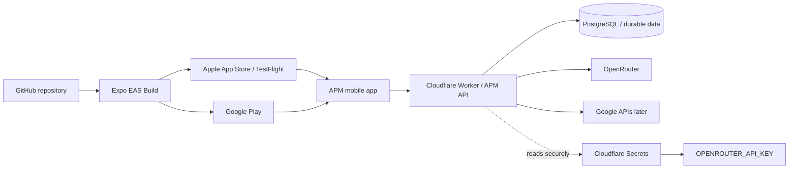
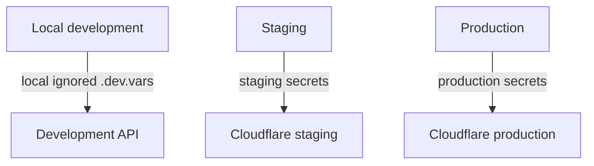
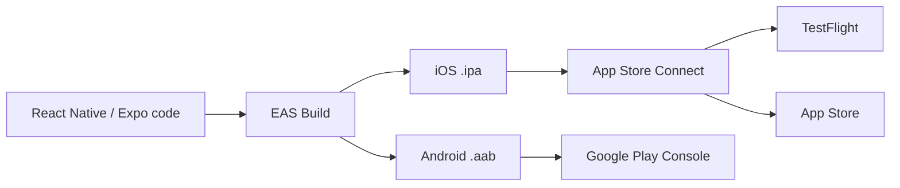

# A Player Mode — Deployment & Secrets Architecture

**Status: LOCKED BASELINE**  
**Decision date: 2026-10-06**

## Decision

A Player Mode is a mobile-first app with a server-side intelligence/API layer.

- **iOS / Android binaries** are built with Expo EAS and distributed through **Apple App Store / TestFlight** and **Google Play**.
- **Cloudflare** hosts the server-side APM API/edge layer and may also host supporting web surfaces.
- The **mobile app never contains the OpenRouter API key** or any other private server credential.
- Production runtime secrets are stored in a managed secret store, not committed to Git—even in an encrypted/password-protected file.

## Deployment map



The app-store binary and Cloudflare backend are separate deployment targets that share one product/API contract.

## Why the OpenRouter key must not be in the app

Anything shipped inside an iOS/Android application bundle must be treated as potentially recoverable by a motivated user. Obfuscation is not a security boundary.

Therefore:

```text
Mobile app
   ↓ authenticated APM request
Cloudflare APM API
   ↓ server-only secret
OpenRouter
```

The client never calls OpenRouter with APM's production credential.

## Secret storage decision

### Production

Use **Cloudflare Workers Secrets** or **Cloudflare Secrets Store** for secrets required by the deployed API.

Initial server-side secret inventory will include names such as:

```text
OPENROUTER_API_KEY
DATABASE_URL / database credential binding
AUTH_SECRET or auth-provider server credential
GOOGLE_OAUTH_CLIENT_SECRET   (when Google integration exists)
```

Actual values never appear in source files, documentation, screenshots, logs, fixture data, app bundles, or AI prompts.

### CI/CD

If GitHub Actions needs credentials to deploy infrastructure, use **GitHub Actions Secrets** for deployment credentials such as a scoped Cloudflare deploy token.

A runtime OpenRouter key should normally live in Cloudflare's secret system rather than being injected into the mobile build.

### Local development

Use a local `.dev.vars` file (or the environment mechanism selected by the Cloudflare service) and keep it ignored by Git.

Commit only a safe example file:

```text
OPENROUTER_API_KEY=
DATABASE_URL=
```

No real values.

## We are deliberately NOT using encrypted secret files in Git

Tools such as SOPS/age or git-crypt can store encrypted blobs in version control, but that is not the default APM architecture for runtime API credentials.

Reasons:

1. Runtime services still need a decryption key, creating another secret to manage.
2. A mistaken decrypt/commit can expose the entire file history.
3. Access/revocation/rotation is cleaner with managed secret stores.
4. Mobile secrets must not ship in the client regardless of repository encryption.
5. Cloudflare and GitHub already provide purpose-built secret systems.

**Locked rule:** production runtime secrets do not belong in Git history, plaintext or encrypted.

## Environment separation



Use separate credentials where practical for development, staging, and production. Never make a local developer key the permanent production key.

## OpenRouter-specific requirements

The production OpenRouter credential must be server-only and must route through APM's Privacy Gateway / Model Registry.

For private data, APM will enforce the policies defined in `01-PRIVACY-AND-AI-CONSTITUTION.md` and `05-MODEL-REGISTRY.md`, including provider eligibility, training/data-collection restrictions, retention/ZDR requirements, and no unauthorized fallback.

A valid credential is **not** permission to call arbitrary models/providers.

## Key rotation and incident rules

- Give keys descriptive names by environment and purpose.
- Apply spend/rate limits when supported.
- Rotate compromised or suspected-compromised keys immediately.
- Do not log Authorization headers or secret values.
- Treat a key pasted into an issue, commit, chat transcript, screenshot, or public log as compromised and rotate it.
- Prefer scoped deployment tokens rather than broad account credentials.

## Cloudflare's role

Cloudflare is the server deployment layer for:

- APM API endpoints;
- privacy/model routing gateway;
- server-side OpenRouter calls;
- authentication callbacks/session validation as architecture requires;
- scheduled/background jobs where appropriate;
- connector webhooks later;
- optional web command-center/API support.

Cloudflare does **not** replace Apple/Google app distribution.

## Mobile release path



EAS Submit can automate uploading signed binaries to the stores. Store review and production rollout remain controlled by Apple/Google.

## Source references

- Cloudflare Workers Secrets: https://developers.cloudflare.com/workers/configuration/secrets/
- Cloudflare environment variables/secrets: https://developers.cloudflare.com/workers/configuration/environment-variables/
- GitHub Actions secrets: https://docs.github.com/en/actions/concepts/security/secrets
- Expo EAS Build: https://docs.expo.dev/build/
- Expo app-store submission: https://docs.expo.dev/deploy/submit-to-app-stores/
- OpenRouter privacy controls: https://openrouter.ai/docs/guides/get-started/sovereign-ai

## Anti-drift rules

- No secret may be committed to source control.
- No server credential may be embedded in the mobile bundle.
- No feature may call OpenRouter directly from a client application using APM's production key.
- Production OpenRouter access must pass through the APM Privacy Gateway and Model Registry.
- Deployment architecture changes require an ADR if they weaken a locked security/privacy boundary.
