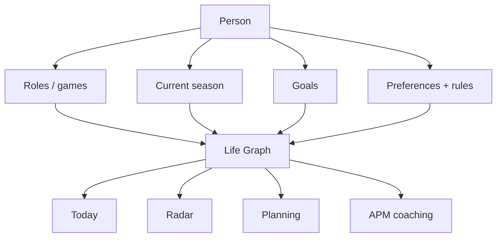
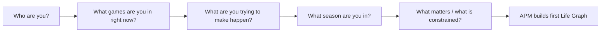
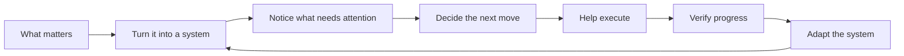

# A Player Mode — Positioning & Life Modes

**Status: LOCKED POSITIONING BASELINE**  
**Decision date: 2026-10-06**

## Core idea

> **Whatever game you're in, get into A Player Mode.**

A Player Mode is not an entrepreneur app, a student planner, a parenting organizer, or an athlete tracker.

It is the **personal operating system that helps a person operate at a higher level in whatever game matters in their life right now.**

The underlying APM engine stays consistent while goals, roles, routines, commitments, Radar signals, and execution plans adapt to the user's life.

## Brand promise

> **You decide what game you're playing. A Player Mode helps you play it like an A-player.**

Supporting product promise:

> APM learns what matters to you, turns it into a working system, notices what needs attention, and helps make sure your actual life moves in the direction you chose.

## Who APM is for

APM must visibly welcome many kinds of people from the first screen onward.

| Person / game | What APM helps carry | Example proactive value |
|---|---|---|
| Entrepreneur / founder | goals, priorities, deals, follow-ups, operating cadence | “You promised this investor a deck Friday and it is still open.” |
| Parent / caregiver | family logistics, appointments, recurring responsibilities, personal goals | “The pediatric appointment conflicts with the school pickup window.” |
| Athlete | training, recovery, competition prep, routines, schedule reality | “You need two more training sessions this week; these are the only realistic openings.” |
| Student | assignments, exams, applications, study plans, routines | “Your paper is due Friday and your calendar currently has no work block before then.” |
| Professional / leader | projects, meetings, development, follow-through, career goals | “This promotion goal has had no supporting action in nine days.” |
| Creator | publishing cadence, projects, collaborations, audience commitments | “You committed to the draft today and have not protected time for it.” |
| Person in a life transition | recovery, relocation, job search, caregiving, rebuilding routines | “Your stated priority is stabilization, but this week is overloaded.” |

These are examples, not separate product editions.

## One product, many games



The system does not create separate brains for “founder mode” and “parent mode.” It creates one Life Graph with multiple roles and adapts prioritization/context around the active goal and season.

## Marketing language vs domain model

**“Game”** is the human-facing metaphor.

In the software model, a game generally maps to:

```text
Role(s) + Goal(s) + Current Season + Rules + Routines + Commitments
```

Example:

```text
Game: Run my first marathon
Role: Athlete
Goal: Finish marathon on Nov 8
Season: Training block
Routines: running, strength, recovery
Rules: protect long-run window
Commitments: race registration, travel
```

Another:

```text
Game: Be present as a new parent while returning to work
Roles: Parent + Professional
Goals: protect family routines + successfully return to role
Season: New parent / transition
Rules: no meetings during daycare pickup
Commitments: appointments, work deliverables
```

## Onboarding requirement

The first intake must make a user from any walk of life immediately recognize themselves.

Required sequence:



### “What game are you in?” choices

The UI should allow multiple selections because real people occupy multiple roles simultaneously.

Initial choices:

- Building a business
- Parenting / caregiving
- Training / competing
- Studying / learning
- Career / leadership
- Creating / publishing
- Health / rebuilding
- Life transition
- Something else

These choices map to Life Graph roles/context and may influence later intake prompts. They do **not** lock a person into a persona.

## Example first-screen language

### Recommended hero

**Whatever game you're in, get into A Player Mode.**

A Player Mode helps you turn what matters into a working system—then keeps your goals, commitments, routines, and next moves from falling through the cracks.

Supporting audience signal:

> Founder. Parent. Athlete. Student. Leader. Creator. Or simply somebody in a season that matters.

CTA: **Build my A Player Mode**

## The intake should adapt

The engine can progressively customize language based on selected roles.

| Selected game | Follow-up language example |
|---|---|
| Building a business | “What business outcome matters most in the next 90 days?” |
| Parenting / caregiving | “What would make family life feel meaningfully better or more under control?” |
| Training / competing | “What are you training for, and by when?” |
| Studying / learning | “What academic or learning outcome are you trying to achieve?” |
| Career / leadership | “What career or leadership outcome matters most right now?” |
| Creating / publishing | “What are you trying to ship, publish, or build?” |
| Health / rebuilding | “What does progress look like in this season?” |
| Life transition | “What needs to become true for this transition to feel successful?” |

The first implementation may use a common 90-day-goal prompt, but the domain model must retain selected roles so adaptive intake can be layered in without re-platforming.

## Product examples must rotate across lives

Do not let demo/fixture copy drift into founder-only language.

Across onboarding, App Store screenshots, marketing pages, Radar fixtures, notifications, and docs, examples should intentionally rotate among:

```text
work / business
family / caregiving
fitness / competition
school / learning
career
creative work
personal transition
life administration
```

## What APM does across every game



The category changes. The operating loop does not.

## Anti-drift rules

- APM must never read as “software for founders” by default.
- A user's role is context, not identity confinement.
- A person can select multiple games/roles.
- We do not create separate apps for parents, athletes, students, founders, etc.
- Core navigation and Life Graph remain shared across audiences.
- Examples shown in product and marketing should represent multiple life contexts.
- “A-player” means operating intentionally and effectively in the user's chosen game; it does not require career ambition or entrepreneurship.
