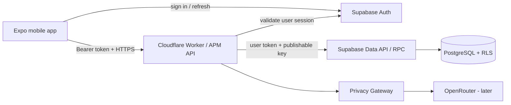
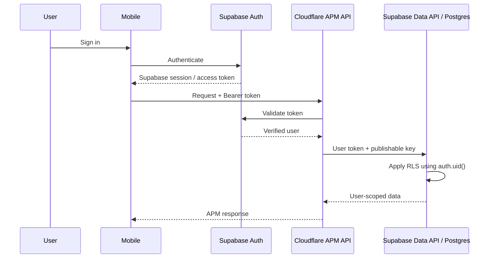
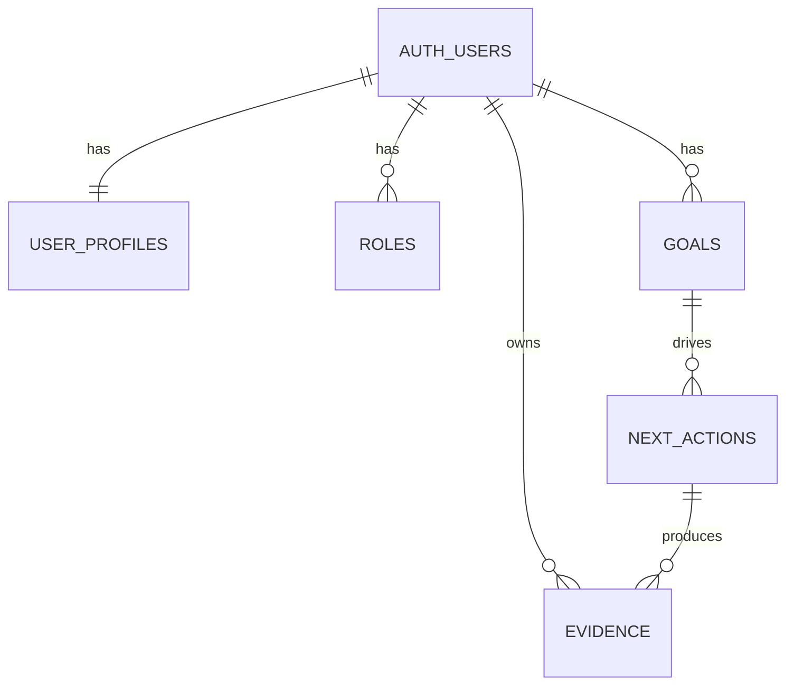
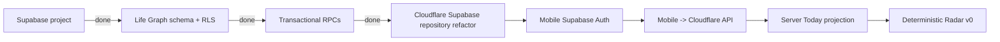

# A Player Mode — Backend Foundation

**Status: LOCKED IMPLEMENTATION BASELINE**  
**Decision date: 2026-10-06**

This document reflects ADR-0001: **Supabase + Cloudflare Hybrid Backend**.

## Deployment shape



## Locked responsibilities

| Layer | Responsibility |
|---|---|
| Expo mobile | UX, session handling, capture, approvals |
| Supabase Auth | identity, login, refresh tokens, sessions |
| Cloudflare Worker | APM API, business rules, privacy/policy boundary, Today/Radar, model routing |
| Supabase Postgres | durable Life Graph system of record |
| PostgreSQL RLS | database-level user isolation |
| Supabase RPC | atomic multi-row user mutations |
| OpenRouter | approved inference only, behind Privacy Gateway |

## Free-plan rule

APM uses the **Supabase Free plan** for beta/MVP and stays there until a real product, scale, backup/recovery, reliability, security, or operational requirement justifies an upgrade.

We do not upgrade merely because a paid tier exists.

## Authentication

Mobile authenticates with Supabase Auth. Private requests send the Supabase access token to the Cloudflare APM API.

The Worker validates the token against Supabase Auth and never trusts a client-supplied `user_id`.



The publishable key is not a server secret. RLS and the user's access token provide authorization. A Supabase service-role/secret key is **not** part of normal user Life Graph operations.

## Database baseline

Initial tables now exist in the APM Supabase project:



All first-slice public tables have RLS enabled with authenticated-user ownership policies.

Initial migrations:

```text
services/api/migrations/0001_life_graph.sql
services/api/migrations/0002_life_graph_rpc.sql
```

## Atomic mutations

Multi-row mutations use PostgreSQL RPC functions so they remain atomic while preserving RLS.

| RPC | Purpose |
|---|---|
| `apm_save_onboarding` | Profile + roles + primary goal + first next action |
| `apm_complete_next_action` | Mark action done + create completion evidence |

These functions run as **security invoker**, derive the user from `auth.uid()`, and do not accept client-supplied ownership as authority.

## API v1 baseline

| Method | Route | Auth | Purpose |
|---|---|---:|---|
| GET | `/v1/health` | No | Deployment health |
| GET | `/v1/me/life-graph` | Yes | Load first Life Graph projection |
| PUT | `/v1/onboarding` | Yes | Persist profile, roles, primary goal and first action |
| POST | `/v1/next-actions/:id/complete` | Yes | Complete an owned action and create evidence |

The Cloudflare Worker now reaches Supabase through its HTTPS Auth/Data APIs rather than holding a privileged database connection.

## Environment contract

Cloudflare API environment:

```text
SUPABASE_URL
SUPABASE_PUBLISHABLE_KEY
OPENROUTER_API_KEY        # later inference; server-only
ALLOWED_ORIGIN
```

Local-only development may additionally use:

```text
AUTH_DEV_BYPASS_USER_ID
```

Never configure the bypass in staging or production.

Mobile public configuration:

```text
EXPO_PUBLIC_APM_API_URL
EXPO_PUBLIC_SUPABASE_URL
EXPO_PUBLIC_SUPABASE_PUBLISHABLE_KEY
```

No OpenRouter key, privileged database credential, or Supabase secret/service-role key belongs in the mobile bundle.

## OpenRouter boundary

`OPENROUTER_API_KEY` remains reserved server-side and is not yet consumed by user-facing routes.

Before live inference:

1. model/provider routes must be in the Model Registry;
2. privacy eligibility must pass;
3. APM evals must pass;
4. requests must pass through the Privacy Gateway;
5. context must be minimized/classified;
6. prompt/output logging remains off where policy requires.

## Source layout

```text
services/api/
├── src/
│   ├── index.ts                 Hono/Cloudflare routes
│   ├── auth.ts                  Supabase session validation
│   ├── db.ts                    Supabase REST boundary
│   ├── env.ts                   Worker environment contract
│   └── lifeGraphRepository.ts   RLS-preserving Life Graph persistence
├── migrations/
│   ├── 0001_life_graph.sql
│   └── 0002_life_graph_rpc.sql
├── wrangler.jsonc
├── .dev.vars.example
└── package.json
```

## Security invariants

- no private route executes before authentication succeeds;
- ownership never comes from request body/query parameters;
- PostgreSQL RLS remains enabled for private Life Graph tables;
- normal user operations do not use a service-role key;
- raw secrets are never returned or logged;
- consequential multi-row mutations are atomic;
- evidence creation and completion are coupled;
- OpenRouter remains behind Cloudflare and the Privacy Gateway.

## Current milestones



Calendar remains the first external source after authenticated durable persistence works end-to-end.

## References

- ADR-0001: `docs/adr/ADR-0001-SUPABASE-CLOUDFLARE-HYBRID.md`
- Supabase Auth / Expo guide: https://supabase.com/docs/guides/auth/quickstarts/with-expo-react-native-social-auth
- Supabase RLS: https://supabase.com/docs/guides/database/postgres/row-level-security
- Cloudflare Worker secrets: https://developers.cloudflare.com/workers/configuration/secrets/

## Anti-drift

Changing the database/auth platform, removing RLS, bypassing the Cloudflare intelligence/privacy boundary, or introducing privileged Supabase credentials into normal mobile/user operations requires a new ADR and explicit approval.
