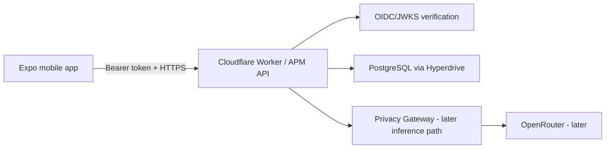
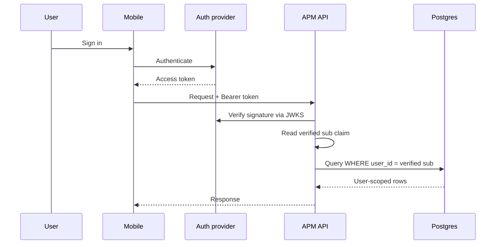
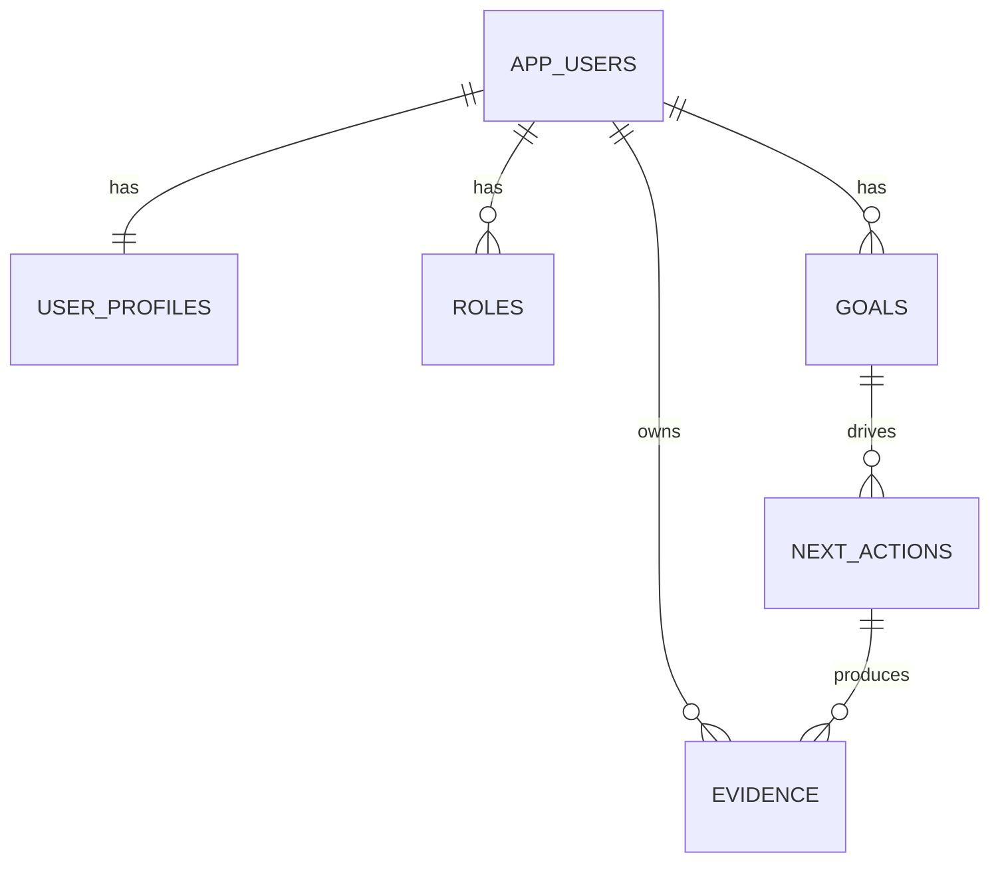
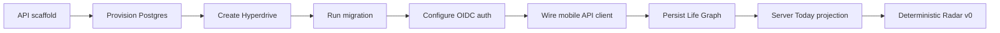

# A Player Mode — Backend Foundation

**Status: LOCKED IMPLEMENTATION BASELINE**  
**Decision date: 2026-10-06**

## Purpose

This document locks the first durable backend boundary for APM. It implements the architecture already defined in the Product, Privacy, Security, Deployment, and Domain documents without introducing Gmail, Calendar, or autonomous actions early.

## Deployment shape



### Locked boundaries

- Mobile never connects directly to PostgreSQL.
- Mobile never receives database credentials, OpenRouter credentials, OAuth client secrets, or server auth secrets.
- Every private API request resolves a server-verified user identity before data access.
- Every Life Graph query/mutation is scoped by that authenticated user ID.
- Production PostgreSQL access from Workers uses Cloudflare Hyperdrive.
- Local development may use an ignored `DATABASE_URL` in `.dev.vars`.

## Authentication architecture

The API verifies standard OIDC JWTs against a configured remote JWKS endpoint.

Required production configuration:

```text
AUTH_JWKS_URL
AUTH_ISSUER
AUTH_AUDIENCE
```

This deliberately keeps the server boundary compatible with a mature authentication provider rather than implementing password authentication or custom cryptography ourselves.



### Local-only bypass

`AUTH_DEV_BYPASS_USER_ID` exists only to let the local prototype run before an identity provider is selected/configured. It must never be configured in staging or production.

## Database baseline

Initial durable tables:



First migration: `services/api/migrations/0001_life_graph.sql`

The first durable vertical slice intentionally stores only what is needed to prove:

```text
Authenticated user
      ↓
Identity + roles
      ↓
Primary goal
      ↓
Concrete next action
      ↓
Completion
      ↓
Evidence
```

Additional Life Graph objects will be migrated incrementally rather than creating dozens of premature tables.

## API v1 baseline

| Method | Route | Auth | Purpose |
|---|---|---:|---|
| GET | `/v1/health` | No | Deployment health |
| GET | `/v1/me/life-graph` | Yes | Load user-scoped first Life Graph projection |
| PUT | `/v1/onboarding` | Yes | Persist identity, roles, primary goal and initial next action |
| POST | `/v1/next-actions/:id/complete` | Yes | Complete an owned action and create evidence |

### Mutation rule

The server never accepts a `user_id` from the client as authority. User ownership comes from the verified authentication subject.

Bad:

```text
POST /goal
{ user_id: "somebody-else", ... }
```

Correct:

```text
Bearer token → verified sub → server scopes mutation
```

## PostgreSQL / Hyperdrive rule

Cloudflare's current Hyperdrive guidance recommends `node-postgres` for Workers. The API therefore creates a request-scoped `pg.Client` using `env.HYPERDRIVE.connectionString`; Hyperdrive owns underlying connection pooling.

For development only, the same DB helper can use `DATABASE_URL` when the Hyperdrive binding is not present.

## OpenRouter boundary

`OPENROUTER_API_KEY` is part of the server environment contract but is **not yet consumed by any route**.

This is intentional.

Before the first live inference endpoint is enabled:

1. actual model/provider candidates must be entered into the Model Registry;
2. candidates must pass privacy eligibility;
3. relevant tasks must pass the APM evaluation suite;
4. the inference route must pass through the Privacy Gateway;
5. request context must be minimized/classified;
6. raw prompt logging remains off.

A configured key does not create authority to send private data to arbitrary OpenRouter endpoints.

## Current source layout

```text
services/api/
├── src/
│   ├── index.ts                 HTTP routes
│   ├── auth.ts                  OIDC/JWKS verification
│   ├── db.ts                    Postgres/Hyperdrive connection boundary
│   ├── env.ts                   Worker environment contract
│   └── lifeGraphRepository.ts   User-scoped persistence
├── migrations/
│   └── 0001_life_graph.sql
├── wrangler.jsonc
├── .dev.vars.example
├── package.json
└── tsconfig.json
```

## Security invariants

- No private route executes before authentication succeeds.
- No database ownership is derived from request body/query parameters.
- No raw OAuth/API secret is returned by an endpoint.
- No raw request bodies are written to application logs.
- Error responses use request IDs rather than echoing private input.
- Database mutations that span multiple rows use transactions.
- Evidence creation and action completion are committed atomically.

## Next backend milestones



Calendar remains the first external data source after this foundation is running end-to-end.

## External implementation references

- Cloudflare Hyperdrive + node-postgres: https://developers.cloudflare.com/hyperdrive/examples/connect-to-postgres/postgres-drivers-and-libraries/node-postgres/
- Cloudflare Worker secrets: https://developers.cloudflare.com/workers/configuration/secrets/

## Anti-drift

Changing database technology, moving private inference to the client, accepting client-supplied user ownership, bypassing server-side token verification, or bypassing Hyperdrive in production requires an explicit architecture decision and security/privacy review.
