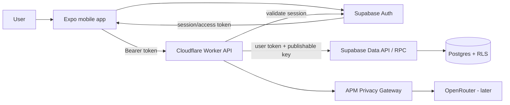
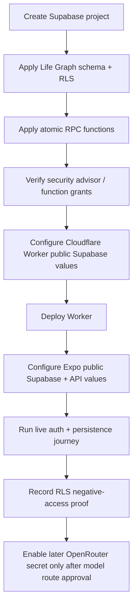
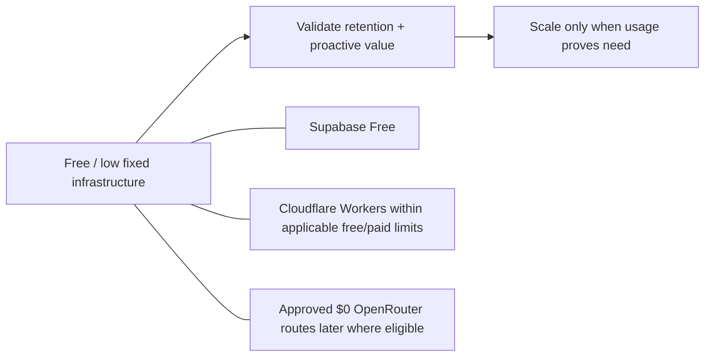

# A Player Mode — MVP Infrastructure Provisioning

**Status: SELECTED FOR MVP / REPLACEABLE BY ADR**  
**Decision date: 2026-10-06**

## Decision

For the first production-capable APM backend, use:

- **Cloudflare Workers** — APM API, Privacy Gateway, model routing, future webhooks/jobs
- **Supabase Free** — PostgreSQL, Auth, Row Level Security, authenticated Data API / RPC
- **Expo EAS** — mobile builds
- **Apple App Store / Google Play** — mobile distribution
- **OpenRouter** — model gateway, server-side only

**Cloudflare Hyperdrive is not part of the current MVP path.** The Worker currently uses Supabase HTTPS Auth/Data API/RPC calls with the user's access token and Supabase publishable key so PostgreSQL RLS remains active. Adding a privileged direct Postgres/Hyperdrive runtime would be a separate architecture decision, not an assumed optimization.

This provider selection is operational rather than constitutional. APM's domain, policy, privacy and client contracts remain isolated enough to migrate implementation details later through an ADR if economics, security, reliability, or scale demand it.

## Why Supabase for the MVP

Supabase gives APM PostgreSQL, Auth, RLS, generated APIs/RPC, migrations, dashboard tooling, and future Storage / Realtime / pgvector in one data platform. This reduces engineering burden while keeping the Life Graph relational and user-isolated.

The Free plan is the approved starting plan. Upgrade only when real product usage or operational requirements justify it.

## System map



## Responsibility boundaries

| System | Allowed responsibility | Not allowed |
|---|---|---|
| Mobile app | UI, secure user session, public config, user interaction | OpenRouter secret, service-role key, DB password, OAuth client secret |
| Supabase Auth | User authentication, sessions, access-token issuance | Owning APM business logic |
| Cloudflare Worker | APM API/business logic, authorization, privacy/model routing, Today/Radar | Trusting client-supplied user IDs |
| Supabase Data API / RPC | Authenticated data access and atomic database functions | Replacing APM product policy |
| Supabase Postgres + RLS | Durable Life Graph and database-level ownership isolation | Public unauthenticated Life Graph access |
| OpenRouter | Approved inference only | Bypassing Privacy Gateway or receiving APM secrets |

## Authentication model

1. User authenticates with Supabase Auth.
2. Mobile stores the session securely on native devices.
3. Mobile sends the access token to Cloudflare as `Authorization: Bearer <token>`.
4. Cloudflare validates the token with Supabase Auth.
5. Cloudflare calls Supabase Data API/RPC with the same user token plus the publishable key.
6. PostgreSQL RLS evaluates `auth.uid()` and restricts rows to the authenticated user.

Normal Life Graph operations do not require a Supabase service-role key.

## Mobile public configuration

The mobile application requires public client configuration:

```text
EXPO_PUBLIC_SUPABASE_URL=https://<project-ref>.supabase.co
EXPO_PUBLIC_SUPABASE_PUBLISHABLE_KEY=<publishable-key>
EXPO_PUBLIC_APM_API_URL=https://api.aplayermode.com
```

These values are bundled into the client and therefore are **not secrets**. Their safety depends on the server/RLS authorization model, not obscurity.

The following must never use `EXPO_PUBLIC_`:

```text
OPENROUTER_API_KEY
Supabase service-role / secret key
Postgres password
Cloudflare API token
Google OAuth client secret
```

## Cloudflare environment

The APM Worker requires:

```text
SUPABASE_URL
SUPABASE_PUBLISHABLE_KEY
ALLOWED_ORIGIN
```

Later live inference additionally requires:

```text
OPENROUTER_API_KEY
```

`AUTH_DEV_BYPASS_USER_ID` is local-development-only and must never be configured in staging/production.

## Provisioning sequence



The Supabase project, first schema, RLS policies and initial RPC functions are already provisioned. Cloudflare/mobile runtime configuration and live end-to-end proof remain separate provider/runtime tasks.

## Database access principle

Even though Supabase exposes client SDK and Data API access, APM's canonical product mutations stay behind the Cloudflare APM API.

Why:

- APM business rules stay server-controlled;
- authorization is consistent across clients;
- evidence/audit behavior cannot be bypassed by normal product UI;
- future Privacy Gateway/action policy stays centralized;
- mobile remains a client of APM rather than a second business-logic implementation.

RLS is defense-in-depth and remains mandatory.

## OpenRouter secret installation

After the Worker exists and live inference is approved, install the OpenRouter key directly into Cloudflare through the managed secret mechanism.

Do not pass the value as a command-line argument, commit it, paste it into an issue, or expose it as an Expo environment variable.

The key remains unused until an approved model route and Privacy Gateway execution path are enabled.

## Cost posture



Infrastructure is optimized for low early fixed cost without weakening privacy boundaries.

## Upgrade triggers

Move off a free/development tier because of **real usage or operational need**, not imagined scale.

Triggers include:

- storage/egress/MAU limits;
- production uptime or backup/recovery requirements;
- security/compliance needs;
- database compute pressure;
- Worker request volume;
- support/SLA requirements.

## Current runtime proof still required

The following are not proven merely because source exists:

1. deployed Cloudflare API hostname and environment values;
2. Expo/EAS public environment configuration;
3. live sign-up/sign-in on a device;
4. secure session restoration after restart;
5. live onboarding round-trip into Supabase;
6. live completion/evidence round-trip;
7. cross-user negative RLS check.

These must be recorded before the authenticated persistence layer is called production-ready.

## References

- ADR-0001: `docs/adr/ADR-0001-SUPABASE-CLOUDFLARE-HYBRID.md`
- Backend implementation: `docs/16-BACKEND-FOUNDATION.md`
- Auth/persistence phase: `docs/18-AUTH-PERSISTENCE-AND-RADAR-V0.md`
- Supabase Auth: https://supabase.com/docs/guides/auth
- Supabase RLS: https://supabase.com/docs/guides/database/postgres/row-level-security
- Cloudflare Workers: https://developers.cloudflare.com/workers/

## Anti-drift

- Mobile does not become a direct privileged database client.
- Supabase service-role credentials never ship to mobile.
- Supabase selection does not bypass the APM server authorization boundary.
- Hyperdrive is not part of the current approved MVP path.
- Authentication does not imply APM autonomy permission.
- OpenRouter remains behind server-side privacy/model policy even after its key is configured.
