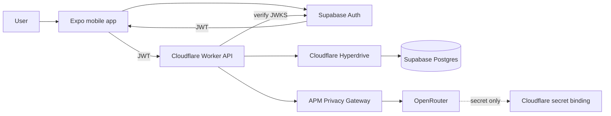
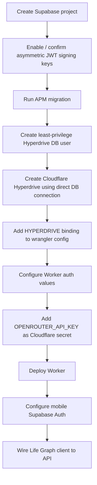
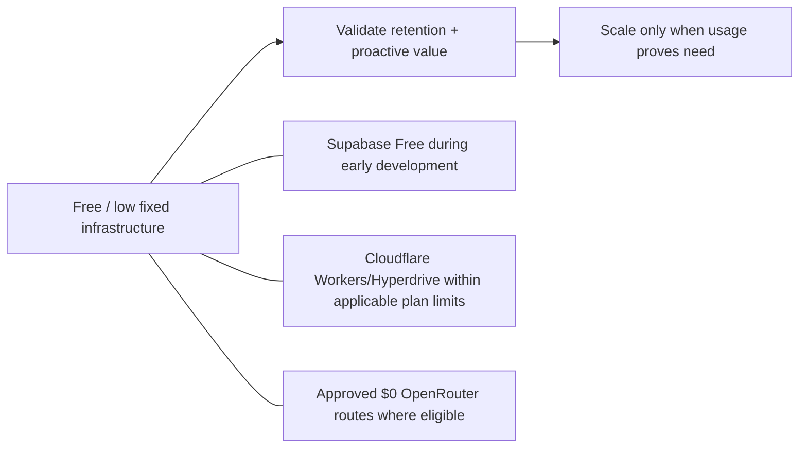

# A Player Mode — MVP Infrastructure Provisioning

**Status: SELECTED FOR MVP / REPLACEABLE BY ADR**  
**Decision date: 2026-10-06**

## Decision

For the first production-capable APM backend, use:

- **Cloudflare Workers** — APM API, Privacy Gateway, model routing, future webhooks/jobs
- **Cloudflare Hyperdrive** — production connection layer between Workers and Postgres
- **Supabase Postgres** — PostgreSQL origin
- **Supabase Auth** — consumer authentication and JWT issuance
- **Expo EAS** — mobile builds
- **Apple App Store / Google Play** — mobile distribution
- **OpenRouter** — model gateway, server-side only

This provider selection is operational rather than constitutional. APM's core interfaces remain provider-agnostic enough to migrate later through an ADR if economics, security, reliability, or scale demand it.

## Why Supabase for the MVP

Current Supabase Free includes a dedicated Postgres database, 50,000 monthly active users for Auth, 500 MB database size, and 5 GB egress. Pro currently begins at $25/month and includes 100,000 MAU before overage. This is attractive for validating APM while protecting margins.

Cloudflare officially documents Hyperdrive connectivity to Supabase and instructs applications to use the **direct Postgres connection**, not Supabase's pooled connection, because Hyperdrive performs the pooling itself.

Supabase Auth issues JWT access tokens and exposes a JWKS endpoint that is compatible with the generic OIDC/JWT verification boundary already implemented in `services/api/src/auth.ts`.

## System map



## Responsibility boundaries

| System | Allowed responsibility | Not allowed |
|---|---|---|
| Mobile app | UI, user interaction, session token, public config | OpenRouter secret, DB password, OAuth client secret |
| Supabase Auth | User authentication, sessions, JWT issuance | Owning APM business logic |
| Cloudflare Worker | APM API/business logic, authorization, privacy/model routing | Trusting client-supplied user IDs |
| Hyperdrive | Secure/efficient DB connection pooling/routing | Product authorization |
| Supabase Postgres | Durable Life Graph state | Direct mobile writes for core APM state |
| OpenRouter | Approved inference only | Storing APM secrets or bypassing Privacy Gateway |

## Authentication values

Once the Supabase project exists, production/staging API configuration will use values equivalent to:

```text
AUTH_JWKS_URL=https://<project-ref>.supabase.co/auth/v1/.well-known/jwks.json
AUTH_ISSUER=https://<project-ref>.supabase.co/auth/v1
AUTH_AUDIENCE=authenticated
```

APM should use Supabase's asymmetric JWT signing keys so the Worker can verify tokens using public JWKS rather than sharing a private signing secret.

## Mobile public configuration

The mobile application may contain **public** client configuration:

```text
EXPO_PUBLIC_SUPABASE_URL=https://<project-ref>.supabase.co
EXPO_PUBLIC_SUPABASE_PUBLISHABLE_KEY=<publishable-key>
EXPO_PUBLIC_APM_API_URL=https://api.aplayermode.com
```

The Supabase publishable key is designed for client applications. It is not equivalent to a service-role/database credential.

The following must never use `EXPO_PUBLIC_`:

```text
OPENROUTER_API_KEY
Supabase service-role / secret key
Postgres password
Cloudflare API token
Google OAuth client secret
```

## Provisioning sequence



## Database access principle

Even though Supabase can expose the database directly through its client SDK, APM's canonical Life Graph writes stay behind the APM API.

Why:

- APM business rules stay server-controlled.
- authorization is consistent across clients;
- audit/event behavior cannot be bypassed;
- the future Privacy Gateway/action policy can be applied centrally;
- we avoid splitting business logic between Postgres RLS and mobile code.

Supabase RLS may still be used as defense-in-depth where appropriate, but it is not the primary APM business-authorization mechanism.

## Hyperdrive user

Create a dedicated database login for Hyperdrive rather than using a broad owner credential indefinitely. Grant only the privileges the APM API requires.

Initial development may temporarily use a project owner connection to bootstrap migrations, but production runtime should move to the dedicated role before public launch.

## OpenRouter secret installation

After the Worker exists, install the OpenRouter key directly into Cloudflare via an interactive secret prompt:

```text
cd services/api
npx wrangler secret put OPENROUTER_API_KEY
```

Do not pass the value as a command-line argument, commit it, paste it into an issue, or expose it as an Expo environment variable.

The key remains unused until an approved model route and Privacy Gateway execution path are enabled.

## Cost posture



Infrastructure is optimized for low early fixed cost without weakening privacy boundaries.

## Upgrade triggers

Move off a free/development tier because of **real usage**, not imagined scale.

Triggers include:

- storage/egress limits;
- MAU threshold;
- production uptime/backups requirements;
- security/compliance needs;
- database compute pressure;
- Worker/Hyperdrive request volume;
- support/SLA requirements.

## Current external setup still required

The repository now contains the implementation boundaries, migration, API, and mobile API client. The following are external resources and cannot be represented by code alone:

1. Supabase project
2. Supabase DB/Auth configuration
3. Cloudflare Hyperdrive configuration ID
4. Cloudflare Worker secret values
5. deployed API hostname/domain

Once these exist, they are wired into the existing source rather than requiring an architectural redesign.

## References

- Supabase pricing: https://supabase.com/pricing
- Supabase Auth JWT/JWKS: https://supabase.com/docs/guides/auth/jwts
- Supabase + Expo: https://supabase.com/docs/guides/getting-started/quickstarts/expo-react-native
- Cloudflare Hyperdrive + Supabase: https://developers.cloudflare.com/hyperdrive/examples/connect-to-postgres/postgres-database-providers/supabase/

## Anti-drift

- Mobile does not become a direct privileged database client.
- Supabase service-role credentials never ship to mobile.
- Supabase selection does not bypass the APM server authorization boundary.
- Hyperdrive remains the production Worker-to-Postgres path unless changed by ADR.
- Authentication does not imply APM autonomy permission.
- OpenRouter remains behind server-side privacy/model policy even after its key is configured.
