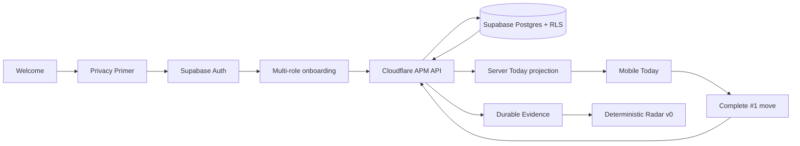
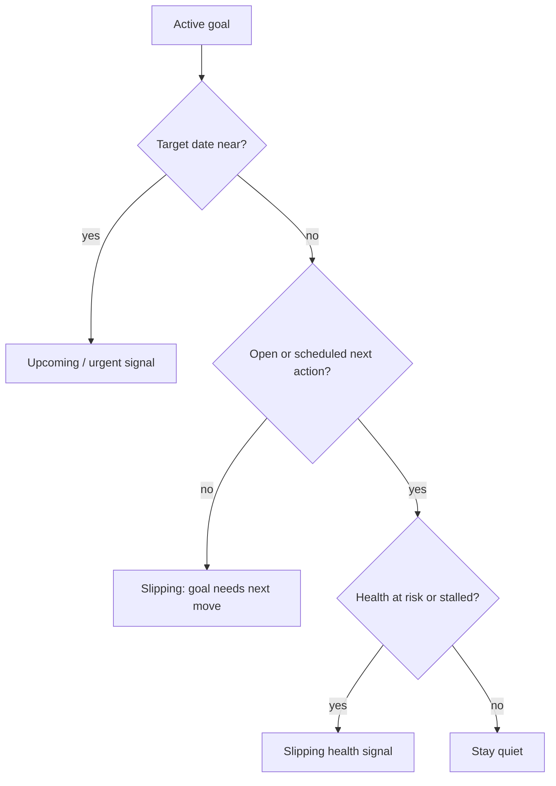

# A Player Mode — Auth, Durable Persistence & Radar v0

**Status: IMPLEMENTATION BASELINE**  
**Phase:** authenticated persistence bridge + server Today projection + deterministic Radar v0  
**Decision date:** 2026-10-06

This document records the implementation contract for the first durable APM user journey. It does not expand scope into Calendar, Gmail, live OpenRouter inference, push notifications, or external actions.

## User journey



## Locked runtime boundary

The authenticated mobile app never treats local React state as durable truth.

| State | Required behavior |
|---|---|
| Signed out | No private Life Graph mutation |
| Signed in + API unavailable/unconfigured | Fail visibly; do not pretend state was saved |
| Signed in + API available | Mobile sends Supabase access token to Cloudflare |
| Cloudflare | Validates session and performs APM business logic |
| Supabase Data API / RPC | Executes with the user's token so RLS remains effective |
| Mobile state | Hydrated from server response |

## Session storage

Native iOS/Android sessions use Expo SecureStore through the Supabase client adapter. Large serialized session values are chunked before secure storage so the implementation does not rely on a single oversized SecureStore value.

Mobile public configuration:

```text
EXPO_PUBLIC_SUPABASE_URL
EXPO_PUBLIC_SUPABASE_PUBLISHABLE_KEY
EXPO_PUBLIC_APM_API_URL
```

These are public app configuration, not server secrets. Server-only credentials remain prohibited from `EXPO_PUBLIC_*` variables.

## Server Today projection

`GET /v1/me/today` is the canonical first Today projection endpoint.

It returns:

```text
{
  graph: LifeGraphSnapshot,
  plan: DailyPlan
}
```

The API computes Radar first, attaches justified open signals to the graph, and then builds the DailyPlan from that server-side state.

## Deterministic Radar v0

Radar v0 deliberately uses no LLM.



Noise rules:

- maximum five open generated items per projection;
- one dominant deterministic rule per goal in v0;
- healthy executable goals with no near deadline remain quiet;
- no fixture Radar cards are shown as if they were real user signals;
- each signal carries reason codes, source references, scores, severity, and related goal ID;
- the “Why APM saw this” screen renders the actual rule path and source reference.

## Current API surface

| Method | Route | Purpose |
|---|---|---|
| GET | `/v1/health` | Service health |
| GET | `/v1/me/life-graph` | Authenticated graph + deterministic Radar |
| GET | `/v1/me/today` | Authenticated graph + server DailyPlan |
| PUT | `/v1/onboarding` | Atomic durable onboarding, then return current state |
| POST | `/v1/next-actions/:id/complete` | Atomic completion/evidence, then return current state |

## Failure behavior

- authentication failure returns 401;
- mobile does not silently downgrade an authenticated user to local-only persistence;
- onboarding waits for durable server success before navigating to Today;
- completion waits for the server response before replacing canonical client state;
- API and data failures surface a request/error state instead of manufacturing success;
- no OpenRouter route is involved in this phase.

## Validation requirements

This phase requires:

1. workspace TypeScript validation;
2. deterministic Radar unit tests;
3. GitHub CI green on the exact branch SHA;
4. later live-device proof with configured Expo/Supabase/Cloudflare environments before calling the end-to-end runtime production-ready.

A green static/unit CI run proves source-level integration. It does not by itself prove the Cloudflare deployment, mobile network path, Supabase email delivery, App Store build, or device runtime.

## Not included in this phase

- Calendar read/write;
- Gmail read/write;
- live OpenRouter inference;
- model-provider selection in production;
- push notifications;
- Radar persistence/dismissal history;
- autonomous actions;
- Life-area modules beyond the current Life Graph slice.
