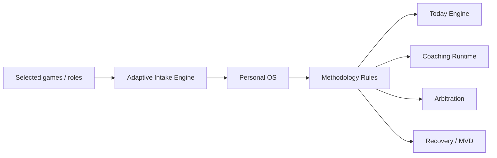

# A Player Mode — Methodology Engine v1

**Status: LOCKED IMPLEMENTATION BASELINE**  

> **Amendment (owner decision, 7 Oct 2026; supersedes the four-pillar model below).** APM has **three pillars, Mind, Body and Spirit**, all on by default (a whole pillar can be switched off). Everything the engine plans, floors and scores lives in an **area** inside a pillar: Mind = work (labelled per persona), money, learning, focus, mental health; Body = movement, food, sleep, weight, health routines; Spirit = faith, meditation, gratitude, nature, service, family. Critical/flexible, minimum floors, MVD and scoring work at area level and roll up to the three pillars for display and the day verdict. Stored legacy keys were migrated without loss (execution→work, wealth→money, body→movement, family→family, spirit→an area read from its floor text): migration 0060, `@apm/domain` `AREA_PILLAR` / `LEGACY_AREA_MAP`, docs/34 §14.
**Decision date: 2026-10-06**

## Brand constraint

> **Whatever game you're in, get into A Player Mode.**

> **You decide what game you're playing. A Player Mode helps you play it like an A-player.**

“Game” is human-facing language, not a separate technical architecture.

```text
YOUR GAME
=
Roles
+ Goals
+ Current season
+ Routines
+ Commitments
+ Rules
+ Preferences
```

A user may be a Parent + Entrepreneur + Athlete at the same time. APM adapts the same operating system to those roles rather than creating separate products or artificial personas.

## Purpose

The Methodology Engine converts the Billionaire High-Performance Coach OS principles into reusable A Player Mode software primitives for parents, athletes, entrepreneurs, students, professionals, creators, caregivers, and people in transition.

Billionaire-specific language is **not** imposed on every user. The underlying high-performance methodology is generalized; role-specific tracks such as Billionaire Mindset are installed only when relevant or explicitly selected.

## Source-derived operating principles

The canonical methodology requires:

- one-question-at-a-time initialization;
- explicit Pillars, Tracks, Modes, values, constraints, cadence, scoring and accountability choices;
- Never Miss Twice, Continuity > Intensity, No Catch-Up, No Mid-Day Negotiation, Zeros Are Allowed, and Minimum Viable Day;
- Foreground vs Background priority handling;
- Arbitration across competing projects;
- 30/60/90 planning;
- state-dependent Recovery, High-Pressure and Executive Review modes;
- daily runtime that removes ambiguity and reduces cognitive load.

## Product translation



The legacy three-chat architecture becomes:

| Manual concept | App implementation |
|---|---|
| Chat A — Rulebook | Persistent Personal OS / Life Graph |
| Chat B — Daily Runtime | Today + APM Coach |
| Chat C — Governance | Settings + change history + explicit OS edits |

## Adaptive intake

The intake remains one question at a time. Selected games influence wording without changing the underlying schema.

| Selected game | Example adaptive question |
|---|---|
| Building a business | What business outcome matters most in the next 90 days? |
| Parenting / caregiving | What would make family life feel meaningfully better or more under control? |
| Training / competing | What are you training for, and by when? |
| Studying / learning | What academic or learning outcome matters most right now? |
| Career / leadership | What career or leadership outcome matters most right now? |
| Creating / publishing | What are you trying to ship, publish, or build? |
| Health / rebuilding | What does meaningful progress look like in this season? |
| Life transition | What needs to become true for this transition to feel successful? |

The remaining intake captures identity/time/context, North Star, values/non-negotiables, constraints/failure patterns, optional body/work/mind context, weekly cadence, critical pillars/minimum floors, coaching style, accountability behavior, and tracks.

## Pillars

APM v1 uses the canonical four-pillar model:

- Wealth
- Body
- Spirit
- Execution

Users choose which pillars are **critical** and define minimum floors for hard days. Future UI may allow aliases without changing the underlying semantics.

## Core laws

These are first-class software rules, not prompt decoration:

1. **Never Miss Twice** — one miss is data; the next day prioritizes continuity.
2. **Continuity > Intensity** — smaller completed work outranks ambitious abandonment.
3. **No Catch-Up** — yesterday does not create debt.
4. **No Mid-Day Negotiation** — the morning plan remains authoritative unless a real external condition changes.
5. **Zeros Are Allowed** — a zero does not trigger shame or a reset.
6. **Minimum Viable Day** — low mood/overwhelm can reduce the day to one critical minimum action.

## Modes

| Mode | Purpose | Runtime effect |
|---|---|---|
| Standard | normal execution | normal Today plan |
| Recovery | low capacity / after a miss | reduced scope; one continuity-preserving action |
| High-Pressure Coaching | avoidance / hard decision | more direct challenge; no expansion of scope |
| Executive Review | scattered / weekly review | organize and decide; no idea-generation spiral |

## Tracks

Tracks are long-horizon filters, not tasks.

Initial built-in library:

- Billionaire Mindset — ownership, leverage, compounding, asymmetric upside; relevant/optional for business/investing games
- Operator Discipline — follow-through and reduced renegotiation
- Strategic Patience — prevent premature pivoting
- Manifestation Mastery — identity/expectancy/alignment without overriding evidence or execution
- Investor + AI Leverage — opportunity recognition, capital allocation and AI leverage

Users may have zero or several tracks. Tracks are explicit durable Life Graph state.

## Foreground / Background

Exactly one project or goal may hold Foreground status when active initiatives compete for aggressive advancement. Other active areas receive maintenance/background treatment.

Arbitration factors:

| Factor | Meaning |
|---|---|
| Leverage | disproportionate value relative to effort |
| Urgency | real deadline or compounding cost of delay |
| Energy Match | fit between available capacity and task demands |
| Compounding | builds an asset/capability that pays forward |
| Downside | consequence of not acting now |

## Coaching runtime

Coaching is sequential and execution-oriented:

1. ask one question;
2. gather signal;
3. reflect/synthesize;
4. choose the next physical action;
5. close into execution.

The coach is behavioral and organizational, not therapy or diagnosis.

## Day-start policy

- **Guided Start** — show the agenda, but execution begins with the opening action.
- **Hard Start** — surface only the opening action until it is completed/confirmed.

Default: Guided Start.

## v1 software boundary

This phase implements structured methodology state, deterministic rules, built-in track/mode definitions, durable Personal OS persistence, and adaptive mobile intake foundations.

It does **not** yet implement LLM-generated coaching dialogue, Calendar Fabric, Gmail/Outlook mail, live OpenRouter inference, push, or autonomous actions.

## Anti-drift

- Do not collapse APM into a generic task manager.
- Do not make billionaire-specific positioning mandatory for non-business users.
- Do not let Tracks become daily task lists.
- Do not let Recovery become catch-up.
- Do not silently change Personal OS rules from ordinary usage.
- Do not make the LLM the source of truth for Personal OS state.
- Product examples must rotate across work, family, athletics, study, career, creative work, transition, and life administration.
