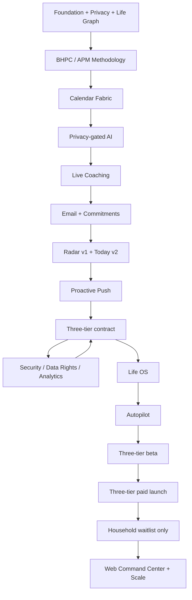
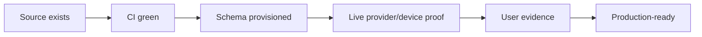

# A Player Mode — Full Program Execution Ledger

**Status: CANONICAL EXECUTION LEDGER**  
**Updated: 2026-10-07**

This document maps the full intended A Player Mode system to what is implemented in source, what is provisioned, what is runtime-proven, and what remains gated by external credentials, distribution accounts, beta evidence, or qualified legal review.

> **Whatever game you're in, get into A Player Mode.**
>
> You decide what game you're playing. A Player Mode helps you play it like an A-player.

## 0. Program status (2026-10-07)

| Work | Status | Evidence |
|---|---|---|
| Phase A — three-tier contract / gating / plan UX / Household waitlist | **DONE** (`SOURCE_COMPLETE`) | docs/29, ADR-0002 |
| Phase B — Life OS domain modules | **DONE** (`SOURCE_COMPLETE` + `DB_PROVISIONED`) | docs/30-LIFE-OS-PHASE-B.md, migrations 0015–0017 |
| Phase C — Autopilot standing-rule engine + UX | **DONE** (`SOURCE_COMPLETE` + `DB_PROVISIONED`) | docs/31, migrations 0018–0019 |
| BHPC core — coaching state machine, five Modes, daily loop, Tracks | **DONE** (`SOURCE_COMPLETE` + `DB_PROVISIONED`) | rows 3 and 26; docs/32 Track library |
| Autopilot action classes (ADR-0003) and daily-loop hardening | **DONE** (`SOURCE_COMPLETE` + `DB_PROVISIONED`; classes ship inactive) | PRs #23, #24; migrations 0033–0039 |
| Final pricing | **DECIDED** (owner, final) | ADR-0004: Chief of Staff $24.99, Life OS $39.99, Autopilot $79.99; Founding 100 and 3-month intro at $9.99 |
| Annual plans | **DECIDED** (owner, final) | ADR-0005: $249.99 / $399.99 / $799.99 per year (2 months free); no intro offer on annual |
| **Phase D — billing / entitlement reconciliation** | **DONE** (`SOURCE_COMPLETE` + `DB_PROVISIONED`; store/RevenueCat configuration is Phase E) | docs/33-BILLING-PHASE-D.md; migrations 0040–0042; RevenueCat webhook + Founding 100 counter + paywall |

"DONE" here means source (and, where stated, database) complete. None of it is runtime-proven until the external gates in §6 have receipts.

## 1. Full intended system


One account, one private Life Graph, one APM intelligence/policy layer. A person may be a parent + entrepreneur + athlete + student + caregiver at the same time.

```text
YOUR GAME
  = Roles
  + Goals
  + Current season
  + Routines
  + Commitments
  + Rules
  + Preferences
```

## 2. Status vocabulary

| Status | Meaning |
|---|---|
| `SOURCE_COMPLETE` | Code/schema/docs exist and CI can validate the source layer |
| `DB_PROVISIONED` | Required Supabase migration is applied |
| `STRUCTURAL` | Architecture/UI contract exists but external runtime may not |
| `RUNTIME_PROVEN` | Live external path has been exercised with receipts |
| `EXTERNAL_GATE` | Requires credentials/account/provider/legal/beta evidence not available in repo |
| `DEFERRED_BY_EVIDENCE` | Product capability exists only after customer evidence earns it |

## 3. Program map



## 4. Phase ledger

| # | Phase | Source status | External/runtime status | Notes |
|---:|---|---|---|---|
| 1 | Infrastructure loose ends | `STRUCTURAL` | `EXTERNAL_GATE` | Cloudflare secrets/deploy + GitHub secrets require account actions |
| 2 | Live runtime proof | `SOURCE_COMPLETE` | `EXTERNAL_GATE` | verifier/workflow exist; deployed receipt still required |
| 3 | BHPC intent parity | `SOURCE_COMPLETE` | CI required | morning sequence, boundaries, scheduling preference, review gates, scoring, Resilience, Sprint, Deep Work |
| 4 | Calendar Fabric | `SOURCE_COMPLETE` foundation | `EXTERNAL_GATE` | device calendar + Google + Microsoft source; live OAuth/provider credentials required; direct Apple server sync remains separate from iCloud-on-device coverage |
| 5 | OpenRouter Privacy Gateway | `SOURCE_COMPLETE` | `EXTERNAL_GATE` | candidate registry + fail-closed routing + public-synthetic eval harness; no candidate is auto-approved |
| 6 | Live APM coaching | `SOURCE_COMPLETE` | `EXTERNAL_GATE` | UI/API/session persistence exist; needs approved private-data model route |
| 7 | Email + Commitment Engine | `SOURCE_COMPLETE` foundation | `EXTERNAL_GATE` | Gmail + Outlook source and normalized signals; live OAuth verification required |
| 8 | Radar v1 | `SOURCE_COMPLETE` | CI required | goals + commitments + review gates + calendar conflicts |
| 9 | Today v2 | `SOURCE_COMPLETE` foundation | CI/runtime required | methodology + calendar blocks + approvals + continuity |
| 10 | Proactive mobile push | `SOURCE_COMPLETE` foundation | `EXTERNAL_GATE` | device registration + server suppression/dedupe; EAS push receipt required |
| 11 | Live Trust Center | `SOURCE_COMPLETE` foundation | runtime required | model registry, connections, permissions, activity, export/delete are live-backed in app source |
| 12 | Data rights | `SOURCE_COMPLETE` request/export foundation | `EXTERNAL_GATE` | privileged deletion worker + retention completion proof remain |
| 13 | Analytics/evaluation | `SOURCE_COMPLETE` foundation | runtime evidence required | analytics + AI usage + model-eval report path |
| 14 | Security hardening | `SOURCE_COMPLETE` foundation | ongoing | RLS + encryption + fail-closed policy; security advisor must remain clean |
| 15 | Mobile release infrastructure | `SOURCE_COMPLETE` foundation | `EXTERNAL_GATE` | EAS profiles exist; Apple/Google signing/submission required |
| 16 | Legal/privacy launch readiness | docs/policy foundation | `EXTERNAL_GATE` | qualified legal review cannot be simulated |
| 17 | Closed beta | runbook required | `EXTERNAL_GATE` | requires 25–50 real users and evidence |
| 18 | Three-tier product contract | `SOURCE_COMPLETE` in Phase A | DB/runtime validation required | Chief of Staff / Life OS / Autopilot boundaries + Household waitlist |
| 18A | Commercial entitlement activation (Phase D) | `SOURCE_COMPLETE` + `DB_PROVISIONED` (migrations 0040–0042) | `EXTERNAL_GATE` | RevenueCat webhook -> service-role entitlement writer; App Store / Play products, RevenueCat project and secrets are Phase E (docs/33 checklist); no store transaction is live |
| 19 | Distribution engine | product contract | other-repo / market gate | audit/acquisition belongs primarily to marketing web stack |
| 20 | Action Engine | `SOURCE_COMPLETE` foundation | provider/runtime required | permissioned calendar/email actions with approval lifecycle |
| 21 | Life OS | `SOURCE_COMPLETE` + `DB_PROVISIONED` (Phase B, migrations 0015–0017) | runtime evidence still required | relationships + personal administration domains; governed RPC writes; see docs/30-LIFE-OS-PHASE-B.md |
| 22 | Autopilot | `SOURCE_COMPLETE` + `DB_PROVISIONED` (Phase C, migrations 0018–0019, 0033–0034) | `EXTERNAL_GATE` — every action class ships **inactive**; activation needs runtime/security receipts | standing-rule engine + UX: `calendar.create`, `email.draft` and, by ADR-0003, `email.send`, `calendar.reschedule`, `calendar.decline`, `appointment.book` (free only), `subscription.cancel`; level 5 needs entitlement AND permission 5 AND active rule AND activated class AND switches AND a write-scoped connection; outcomes recorded by the Worker's server key only; daily done-list with Undo / can't undo; see docs/31-AUTOPILOT-PHASE-C.md |
| 23 | Household OS | dormant schema foundation | **WAITLIST ONLY** | shared primitives remain inactive; user interest is recorded without access |
| 24 | Web Command Center | architecture contract | later implementation | mobile remains daily control plane; advanced desktop UX is not falsely claimed complete |
| 25 | Scale / reliability / economics | instrumentation foundation | usage-driven | Supabase Free remains until actual limits/requirements justify upgrade |
| 26 | BHPC daily loop | `SOURCE_COMPLETE` + `DB_PROVISIONED` (migrations 0021–0032, 0035–0039: next actions RPC-only, Phase Bridge enforced in the database, rebuilds update the live plan in place and keep the 90 days, body rebuilds after check-in replan today as a declared safety change, pillar-floor changes reach plans on their effective date, Track 1 shapes arbitration/Today/coaching) | `EXTERNAL_GATE` — Worker not deployed; cron, push and `SUPABASE_SECRET_KEY` need a deployed Worker receipt | persisted 30/60/90 goal plans; Today supplied daily (Never Miss Twice, No Catch-Up, Mood Gate MVD, one foreground by arbitration, No Mid-Day Negotiation); agendas, plans and evidence server-derived; Morning Trigger cron; end-of-day close; Diary; Phase Bridge; REPRINT; Drift/Return-Reset; weekly debrief; Drafting Room OS changes; First 7 Days; coaching check-in; Track rules on Today and Radar; Body red-flag pause until clearance |

## 5. What "complete all remaining phases" means operationally

The repo may contain a complete **source foundation** for a phase while the phase is still not production complete. Production completion requires evidence appropriate to the layer:



The ledger must never collapse those states into one word.

## 6. External gates that cannot be fabricated

- Cloudflare production deployment and secrets installation;
- OpenRouter secret installation + real candidate evaluation + explicit route promotion;
- Google OAuth app credentials/verification and live Gmail/Calendar receipts;
- Microsoft app registration/consent and live Outlook receipts;
- Apple/iCloud direct-server access where product evidence requires it;
- EAS project ID, push credentials and real device receipt;
- Apple Developer / App Store Connect / Google Play signing and submission;
- real in-app purchase/subscription transactions and receipt validation;
- privileged deletion worker and deletion lifecycle proof;
- qualified legal/privacy review;
- closed-beta retention, Radar quality and willingness-to-pay evidence.

## 7. Non-drift gates

Every remaining feature must preserve:

| Gate | Requirement |
|---|---|
| Multi-game | No founder-only assumptions |
| BHPC intent | Map methodology behavior to the user's game |
| Privacy | Minimum necessary context; private routes no-training + ZDR by default |
| Authority | Subscription never equals permission |
| Provenance | Important inferred facts and Radar items explain their source |
| Audit | Consequential state/action changes are recorded |
| Determinism | Do not use an LLM where deterministic code is sufficient |
| Continuity | Misses trigger recomputation, not guilt or catch-up |
| Economics | Measure cost per successful task, not token price alone |
| Truth | Do not label provider/store/legal/beta work complete without receipts |

## 8. Current critical path

```text
CI GREEN ON PROGRAM BRANCH
  -> Cloudflare + device runtime proof
  -> install OpenRouter secret + run model eval
  -> explicitly approve eligible route(s)
  -> live Google/Microsoft OAuth proofs
  -> push/device proof
  -> security/data-rights proof
  -> Phase A three-tier contract         (done)
  -> Phase B Life OS domains            (source + DB done)
  -> Phase C Autopilot standing rules   (source + DB done; classes inactive)
  -> Autopilot action classes, ADR-0003 (PRs #23, #24 done; classes inactive)
  -> Phase D billing (App Store + Google Play IAP via RevenueCat)  <- source + DB done (docs/33)
  -> Phase E runtime evidence (incl. Autopilot class activation receipts)
  -> three-tier closed beta
  -> three-tier paid launch
  -> Household remains waitlist-only until separate approval
```
