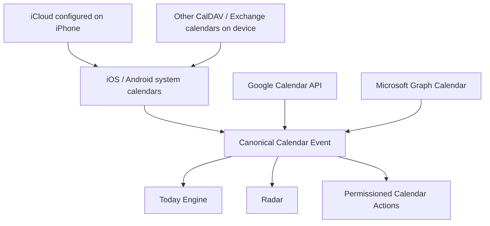
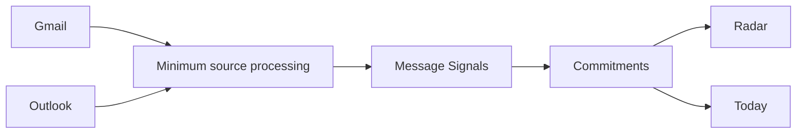
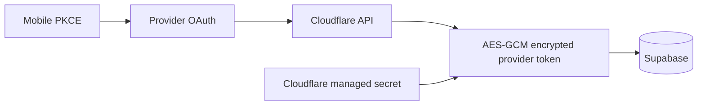

# A Player Mode — Connector Fabric

**Status: IMPLEMENTATION CONTRACT**  
**Updated: 2026-10-06**

APM does not equate "calendar" with Google or "email" with Gmail. Providers are normalized into canonical APM state.

## Calendar architecture

| Lane | Purpose | Current source state | Production gate |
|---|---|---|---|
| Device | Immediate phone-resident calendar awareness; includes iCloud/Google/Outlook when configured on device | Implemented | Real-device permission + sync receipt |
| Google | Durable server-side Calendar awareness/action path | Implemented | Google OAuth credentials + live consent |
| Microsoft | Outlook.com / M365 / Exchange-backed cloud awareness/action path | Implemented | Microsoft app registration + live consent |
| Apple direct | Server-side iCloud/CalDAV if later needed beyond device lane | Contract only | Separate Apple-compatible credential/security design |

The direct Apple lane is **not** required to claim iCloud-on-device support. It is required only if APM must synchronize iCloud while the mobile app is not participating.

## Email architecture

APM should persist normalized durable meaning where possible—not become a duplicate mailbox.

Normalized signal types:

- commitment;
- request;
- follow-up;
- waiting-for;
- deadline;
- meeting;
- cancellation;
- completion;
- person.

## Permission separation

| Capability | Separate user authority? |
|---|---:|
| Read Google Calendar | Yes |
| Read Gmail | Yes |
| Write Google Calendar | Yes |
| Send Gmail | Yes |
| Read Microsoft Calendar | Yes |
| Read Microsoft Mail | Yes |
| Write Microsoft Calendar | Yes |
| Send Microsoft Mail | Yes |
| Read device calendars | OS permission |

Connecting one capability must not imply another.

## Credential architecture

Provider client secrets, refresh tokens, access tokens and encryption keys never enter model context.

## Sync rules

- all provider data maps to canonical IDs + provenance;
- incremental cursors are preferred after initial sync;
- recurrence and timezone are preserved;
- disconnected/error/reauth states remain visible to the user;
- duplicate events from device and direct-cloud lanes must be suppressible before product launch;
- write actions run only through the Action Engine and explicit permission policy;
- email/source content is untrusted and cannot grant tool authority.
