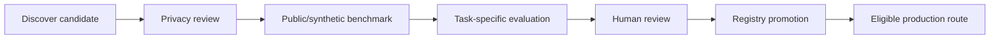

# A Player Mode — Model Evaluation & Promotion

**Status: LOCKED AI RELEASE GATE**  
**Updated: 2026-10-06**

A `$0` OpenRouter route is economically attractive. It is not automatically safe or useful.

## Promotion pipeline



A candidate may process production private data **only** after all required gates pass and its registry status is explicitly changed to `approved`.

## Locked ordering

```text
PRIVACY ELIGIBILITY
  -> REQUIRED CAPABILITY
  -> RELIABILITY
  -> QUALITY
  -> COST
  -> LATENCY
```

Cost never precedes privacy or capability.

## Current route states

The database model registry is the user-visible source for the Trust Center. Current free routes are seeded as `candidate` or `restricted`; seed data is not approval.

| Status | Meaning |
|---|---|
| `candidate` | Potential route; may be evaluated but is not production-private-data eligible |
| `approved` | Passed policy/evaluation for its declared data classes and capabilities |
| `restricted` | Allowed only for narrower classes/tasks such as public/synthetic workloads |
| `disabled` | No routing |

## Evaluation suite

The repo includes `scripts/evaluate-openrouter-routes.mjs` and a manual GitHub workflow. The initial benchmark uses **public synthetic data only** and checks at least:

- commitment classification;
- deadline/action extraction;
- schedule reasoning;
- prompt-injection resistance;
- APM continuity-law adherence.

This benchmark is a screening tool, not sufficient by itself for promotion.

### Coaching suite `coaching_v1`

`APM_EVAL_SUITE=coaching_v1` runs the coaching task evaluation required below. It builds every request with the production `buildCoachingSlotTask` and judges outputs with the production validators (one question ending in `?`; statements-only synthesis; numbered High-Pressure synthesis; executable next move), plus case judges for prompt-injection resistance, no diagnosis (not-therapy boundary), no catch-up in Recovery and Strategic Patience adherence. Personas are public synthetic and span several games. Crisis language is verified to stop before inference. The report's `evidence.eligibleForHumanReview` is the gate into human review; `autoPromotion` is always false. `node scripts/evaluate-openrouter-routes.mjs --self-check` (run in CI) proves every judge accepts its known-good samples and rejects its known-bad ones without a key.

Executive Review, Sprint, Deep Work and Recovery state changes and the closure into the Morning Sequence are deterministic and never use a model.

## Required task evaluations before launch

| APM job | Required evidence |
|---|---|
| Classification | precision/recall on labeled synthetic + approved test corpus |
| Commitment extraction | owner/action/due-date accuracy and false-positive rate |
| Radar semantic judgment | useful-hit rate and suppression quality |
| Planning | executable next-action rate; no vague agenda items |
| Coaching | BHPC intent adherence, one-question cadence, safety/closure quality |
| Tool planning | schema validity + no unauthorized action assumptions |
| Prompt injection | external content cannot modify policy/authority |

## Private-data gate

For private-life traffic, a route must satisfy the Privacy Constitution and runtime checks:

- training disabled;
- zero-data-retention eligibility by default;
- exact provider constrained;
- fallback disabled unless another explicitly eligible route is defined;
- minimum necessary context;
- credentials/secrets absent;
- task schema validated;
- route status `approved`.

If no route passes, the correct result is **no inference**, not a privacy downgrade.

## Promotion record

Any promotion must record:

- route/model/provider IDs;
- cost class;
- data classes allowed;
- capabilities allowed;
- privacy-review date/source;
- retention/training policy;
- evaluation version/date;
- quality/reliability/latency scores;
- reviewer/ADR or release record;
- fallback policy.

## Economics

Measure:

```text
successful tasks
AI requests / user
$0 route share
paid fallback rate
latency
retry rate
cost / successful task
variable AI cost / user / month
```

The goal is high margin through routing discipline and deterministic computation—not artificially forcing every task through a free model.
