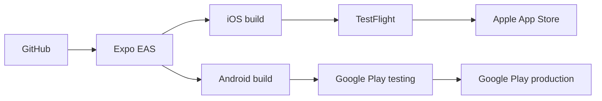
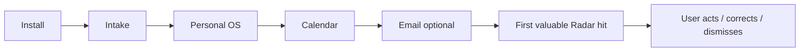
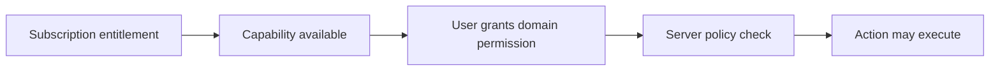

# A Player Mode — Release, Beta & Commercialization

**Status: IMPLEMENTATION + EVIDENCE CONTRACT**  
**Updated: 2026-10-06**

## Mobile distribution



Cloudflare runs the APM server. It does not distribute the iOS/Android binary.

The repo contains EAS preview/production build profiles. Production completion still requires external signing identities, store accounts, EAS project configuration, store privacy declarations, screenshots and submission receipts.

## Closed beta gate

Target: **25–50 users** spanning multiple games, not 25 founders.

Suggested mix should include meaningful representation of:

- parent/caregiver;
- athlete/training;
- student/learning;
- entrepreneur/business;
- career/leadership;
- creator/publishing;
- health/rebuilding or major transition.

### Activation loop



The key beta question remains:

> **Does APM reliably notice valuable things the user would otherwise have missed?**

## Beta metrics

| Metric | Why it matters |
|---|---|
| Intake completion | Can users install their Personal OS without friction? |
| Time to first Radar hit | Time to product magic |
| Valuable Proactive Interventions / user / week | Chief-of-Staff north star |
| Radar false-positive / correction rate | Trust and quality |
| Radar action rate | Utility |
| Notification disable rate | Noise / intrusion |
| W1 / W4 / W8 / W12 retention | Durable value |
| Cost / successful AI task | Unit economics |
| Variable cost / active user | Gross-margin guardrail |
| Trust-center comprehension | Privacy promise understood |

## Commercial ladder

| Product state | Promise | Pricing hypothesis |
|---|---|---:|
| Closed beta | Prove proactive value | Free |
| Founding Chief of Staff | Keep me on top of my life | $24/mo or $228/yr |
| Chief of Staff | Keep me on top of my life | $29/mo or $276/yr |
| Life OS | Carry more of my mental load | ~$59/mo / $564/yr |
| Autopilot | Handle approved recurring work | ~$129+/mo |
| Household | Coordinate shared mental load | ~$179–199/mo target |

These prices are hypotheses. They are not permission to expose capabilities that do not exist.

## Entitlement vs authority



Paying for Autopilot never grants Autopilot authority.

## Billing foundation

The Life Graph/platform stores server-side subscription entitlements independently from client UI. The production billing adapter must eventually support:

- Apple / Google purchase or approved cross-platform subscription provider;
- trial state;
- monthly/annual plans;
- server-side receipt/entitlement verification;
- restore purchases;
- cancellation/expiration;
- grandfathered Founding pricing;
- webhook/reconciliation;
- no client-only entitlement trust.

No billing provider is silently locked by this document. Provider selection should be an ADR based on then-current store requirements, engineering effort and margin.

## Distribution engine

The acquisition thesis remains:

```text
CONTENT
  -> A PLAYER / MENTAL LOAD AUDIT
  -> PERSONALIZED RESULT
  -> APP INSTALL
  -> INTAKE
  -> CALENDAR / EMAIL
  -> FIRST RADAR HIT
  -> TRIAL
  -> PAID
```

The existing digital APM/BHPC product remains a DIY acquisition/revenue layer; the recurring app is the managed system.

The public marketing/audit implementation may live in the existing web/distribution repo rather than forcing acquisition code into the mobile-platform repo.

## Launch blockers that require outside evidence

- real TestFlight / Play internal build;
- store privacy metadata;
- qualified legal/privacy review;
- Google/Microsoft OAuth compliance as applicable;
- live push receipt;
- live billing receipt validation;
- beta evidence strong enough to justify paid launch.
