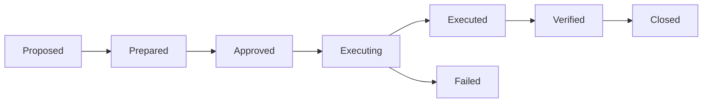
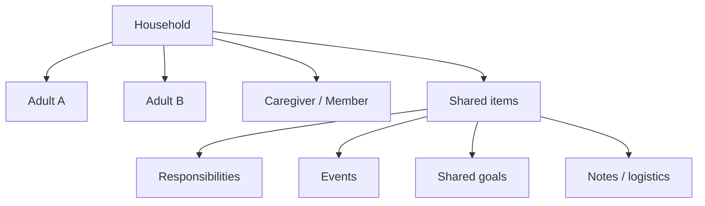

# A Player Mode — Actions, Autopilot, Household & Web

**Status: LONG-HORIZON IMPLEMENTATION CONTRACT**  
**Updated: 2026-10-06**

## Action lifecycle

Every consequential external action follows one lifecycle:



An LLM may recommend or prepare an action. It never grants itself authority and never receives provider credentials.

## Autonomy ladder

| Level | Meaning |
|---:|---|
| 0 | Observe |
| 1 | Remind |
| 2 | Recommend |
| 3 | Prepare |
| 4 | Ask once, then execute this action |
| 5 | Autopilot inside explicit standing rules |

The effective authority is the minimum of:

```text
product entitlement
AND
user permission
AND
server policy
AND
current kill switches
```

## Initial executable actions

- create/update calendar event;
- prepare email draft;
- send approved email where provider permission and APM authority both allow it;
- routine scheduling;
- later Life Graph/notification actions that have explicit schemas.

Every new action type needs schema, permission, constraints, idempotency, connector, verification, audit and kill-switch behavior before merge.

Autopilot (level 5) classes, by the owner's ruling of 6 Oct 2026, are listed with their guardrails in docs/31: calendar blocks, drafts, rule-bound sending (scheduling replies, follow-ups, confirmations, templates), moving/declining flexible meetings inside declared boundaries, FREE appointment requests, and subscription cancellations. Each has a daily done-list entry with Undo, or a clear "can't undo". Purchases, payments, upgrades, clinical/healthcare decisions and money movement are never on Autopilot.

## Life OS expansion

ADR-0002 authorizes Life OS as the next source implementation phase. It is still not "add every life-admin feature": build the agreed high-value domains on the same Life Graph/Today/Radar/action primitives, then refine breadth from beta evidence.

Candidate domains already discussed:

- relationships / birthdays;
- appointments;
- travel;
- household;
- bills / subscriptions;
- meals / shopping;
- health routines;
- family obligations.

These domains use the same Life Graph, Radar, Today, permission and action primitives instead of separate mini-apps.

## Autopilot implementation + activation gate

ADR-0002 authorizes building the Autopilot standing-rule engine and UX after Life OS. **Activation remains evidence-gated**: standing authority is only usable for supported action classes that pass security/runtime proof and only after the user explicitly grants it.

Standing rules must define scope such as:

```text
Domain: routine scheduling
Action: calendar event write
Level: 5 / Autopilot
Allowed windows: weekday mornings
Maximum duration: 90 minutes
Collision rule: never override hard-boundary events
Reversibility: calendar event can be removed/restored
```

## Household OS — waitlist only



The database foundation includes household/member/item primitives with RLS. ADR-0002 keeps them dormant: customer-facing Household mutation is blocked and the current app only records authenticated interest. That is **not** the same as a completed Household product.

Household UX must later define:

- adult/member consent;
- private vs shared information;
- who can assign/complete/edit what;
- dependent/child data handling;
- shared vs individual calendars;
- household action authority;
- leaving/removal/revocation behavior;
- audit/provenance across members.

## Web Command Center

```text
PHONE = run my day
WEB   = run/configure my system
```

The advanced web surface should eventually cover:

- Life Graph editing;
- goal → project → milestone architecture;
- 30/60/90 and quarterly planning;
- Personal OS governance/history;
- integrations;
- model/provider transparency;
- permissions/autonomy policies;
- activity/audit history;
- weekly/monthly review;
- analytics and subscription/account administration.

Web uses the same API, auth, Life Graph, policy engine and connectors. It is not a second brain.

## Scale rule

Do not upgrade Supabase Free, add vector infrastructure, add queues, or add another vendor simply because the capability exists. Add infrastructure when real usage, reliability, compliance, latency or cost data requires it.
