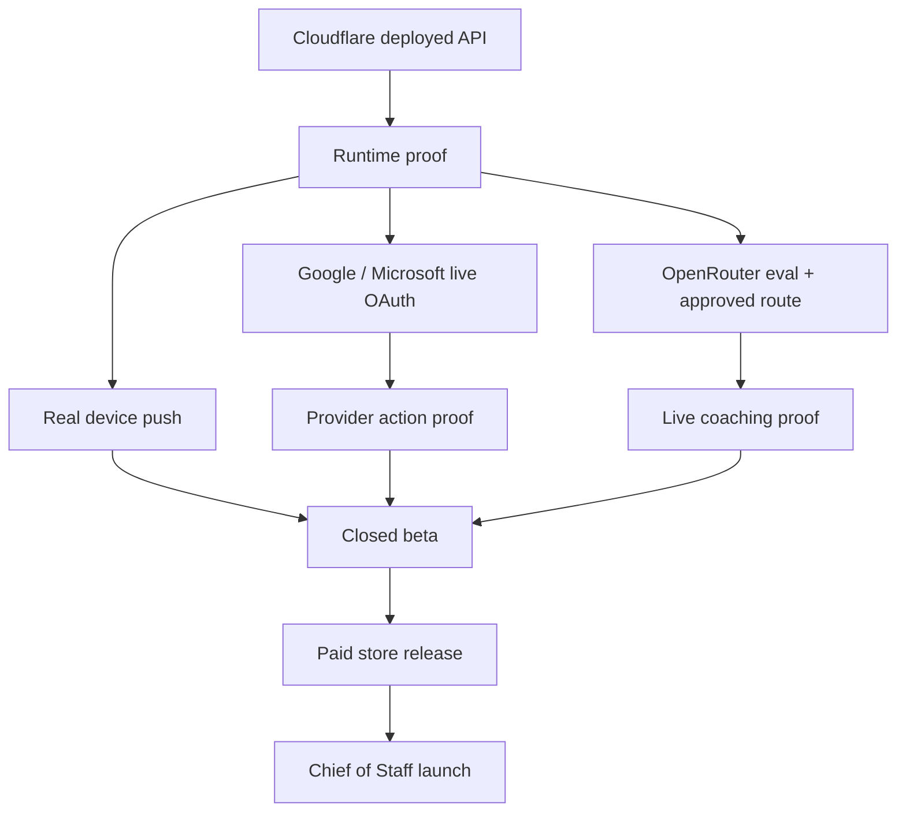

# A Player Mode — External Runtime Gates

**Status: OPERATIONS RUNBOOK**  
**Updated: 2026-10-06**

This document lists the work that cannot be proven by source code alone. A gate stays open until a real external receipt exists.

## Gate map



## 1. Cloudflare runtime

Required server configuration:

| Setting | Secret? | Purpose |
|---|---:|---|
| `SUPABASE_URL` | No | Data/auth project URL |
| `SUPABASE_PUBLISHABLE_KEY` | No / treat carefully | RLS-bound Supabase API access |
| `OPENROUTER_API_KEY` | **Yes** | Server-only inference |
| `CONNECTOR_CREDENTIAL_KEY` | **Yes** | AES-GCM provider-token encryption |
| `OAUTH_STATE_SECRET` | **Yes** | OAuth state integrity |
| `GOOGLE_OAUTH_CLIENT_SECRET` | **Yes** | Google token exchange if configured as confidential client |
| `MICROSOFT_OAUTH_CLIENT_SECRET` | **Yes** where used | Microsoft token exchange |
| `GLOBAL_ACTION_EXECUTION` | Config | Global action kill switch |
| `ACTION_*_EXECUTION` | Config | Per-domain action kill switches |

Production must not set `AUTH_DEV_BYPASS_USER_ID`.

Receipt:

- `/v1/health` from deployed API;
- authenticated test-user call;
- request ID captured;
- no dev bypass.

## 2. Supabase runtime proof

Run the existing runtime verifier against dedicated test accounts.

Must prove:

- user A sign-in;
- Life Graph hydration;
- methodology intake persistence;
- Today/Radar response;
- completion/evidence persistence;
- app restart/session restoration;
- user A cannot read user B state;
- security advisor has no open security findings.

## 3. OpenRouter gate

1. Install `OPENROUTER_API_KEY` as a Cloudflare secret and GitHub Actions secret only where required.
2. Run the manual `Model Eval` workflow using public/synthetic cases.
3. Review exact provider privacy/retention policy again at promotion time.
4. Run task-specific evals.
5. Explicitly update the model registry route to `approved` with scores/date only after evidence passes.
6. Prove a private-life coaching call uses the exact approved route and fail-closed behavior remains intact.

Never auto-promote from benchmark output.

## 4. Google gate

Separate consent paths for Calendar and Gmail.

Receipt set:

- OAuth consent completes on a real test account;
- encrypted credentials stored server-side;
- direct Calendar sync succeeds;
- Gmail sync extracts normalized signals/commitments;
- disconnect/reauth state works;
- requested scopes match documented UX;
- if Google verification/security assessment is required by scopes, complete it before public launch.

## 5. Microsoft gate

Separate Microsoft Graph Calendar and Mail capabilities.

Receipt set:

- test Outlook.com / Microsoft 365 account consent;
- Calendar sync;
- Mail signal extraction;
- token refresh;
- disconnect/reauth;
- approved action proof for calendar/email only after action kill switches are deliberately enabled.

## 6. Apple / iCloud calendar gate

The mobile device lane already supports calendars configured in the OS, including iCloud calendars on iPhone. Prove:

- iOS permission prompt;
- iCloud event ingestion;
- provenance retained as device calendar;
- duplicate handling when the same Google/Microsoft calendar is also directly connected.

A direct server-side iCloud/CalDAV connector is a separate gate and should be built only if background requirements cannot be met through the mobile/device architecture.

## 7. Push gate

Required:

- EAS project ID;
- iOS/Android push credentials;
- explicit notification permission;
- Expo push token registered;
- one high-severity synthetic/test Radar event delivered to a real device;
- quiet-hour/suppression/dedup behavior tested;
- private lock-screen detail reviewed.

## 8. Action Engine gate

External execution remains off until both:

```text
GLOBAL_ACTION_EXECUTION=true
AND
ACTION_<DOMAIN>_EXECUTION=true
```

are deliberately configured.

For each action type prove:

- entitlement permits capability;
- user permission permits requested level;
- prepared action payload passes schema/validation;
- approval is required where level < 5;
- connector executes exactly once using idempotency key;
- result is verified;
- audit event exists;
- provider failure produces failed state without silent retry loops.

## 9. Data-rights gate

Export can be user-authenticated. Account deletion needs a privileged orchestrator because deleting the auth identity and derived data cannot safely rely on normal user RLS alone.

Prove deletion lifecycle against a dedicated test account before exposing production completion language.

## 10. Store / billing gate

External requirements:

- Apple Developer account;
- App Store Connect app/subscription setup;
- Google Play Console app/subscription setup;
- EAS signing/builds;
- real sandbox purchases;
- restore purchase;
- cancellation/expiration reconciliation;
- server entitlement verification;
- Founding price/grandfathering behavior.

## 11. Legal gate

Qualified review must cover final product behavior—not aspirational docs—including:

- Privacy Policy;
- Terms;
- AI disclosure/training/retention claims;
- connected-account scopes;
- subprocessors;
- retention/export/deletion promises;
- app-store privacy disclosures;
- jurisdiction-specific requirements.

## 12. Beta gate

Do not call Chief of Staff product-market fit proven until real users establish:

- valuable proactive interventions;
- acceptable false-positive/correction rate;
- retention;
- trust comprehension;
- sustainable AI/infrastructure economics;
- willingness to pay.
