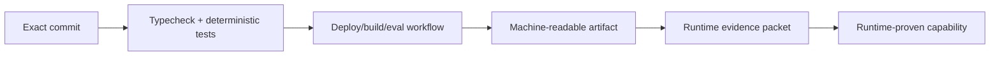

# A Player Mode — Runtime Evidence Hardening

**Status: IMPLEMENTATION + OPERATIONS GATE**  
**Updated: 2026-10-06**

This document hardens the transition from source-complete software to externally proven software. It does not add product scope.

## Principle

> A workflow log is not a production claim. A production claim needs an immutable source SHA plus a reproducible receipt.

## Evidence chain



## Locked receipt requirements

Every external proof should contain, where applicable:

| Field | Requirement |
|---|---|
| Gate | Exact capability being proven |
| Status | PASS / FAIL |
| Commit SHA | Exact immutable source |
| Environment | staging / production / preview |
| Timestamp | UTC |
| Request/build/provider ID | Non-secret correlation identifier |
| Expected behavior | Explicit |
| Actual behavior | Explicit |
| Sensitive values | Never stored in receipt |
| Failure | Recorded rather than hidden |

## Hardened workflows

### Runtime Proof

The verifier requires **two dedicated test accounts**. Cross-user RLS proof is not optional for a full runtime receipt.

Each run deliberately creates a fresh proof goal + next action instead of reusing arbitrary historical test-account state. That makes Today, completion/evidence and Radar assertions repeatable rather than dependent on leftovers from an earlier run.

The RLS negative proof checks both the user profile boundary and a user-owned goal boundary from account B. The workflow validates the exact source first, then runs the live proof and uploads `evidence/runtime-proof.json`.

### Cloudflare Deploy

Staging and production are distinct Worker environments:

| Environment | Worker |
|---|---|
| staging | `aplayer-mode-api-staging` |
| production | `aplayer-mode-api` |

The deploy workflow must pass the selected Wrangler environment explicitly. An environment label may never secretly deploy the same Worker.

Deployment passes source validation first. A deployment is not proof until the selected environment's `/v1/health` endpoint returns the expected APM service contract **and** request tracing header. The workflow emits a deployment receipt tied to the exact source SHA.

Runtime secrets/variables are environment-specific in Cloudflare and must be configured separately for staging and production.

### OpenRouter Model Eval

Model evaluation validates the exact source and emits a public/synthetic report tied to the source SHA. Passing this screening report does **not** promote a model. Promotion remains an explicit registry/governance act.

### EAS Mobile Build

The build workflow validates source before queueing EAS and preserves the EAS JSON build response plus immutable source metadata as an artifact.

## Action execution kill switches

Provider-side action execution is fail-closed.

```text
GLOBAL_ACTION_EXECUTION=true
        AND
ACTION_<DOMAIN>_EXECUTION=true
        AND
active entitlement permits requested level
        AND
user permission permits requested level
        ↓
provider execution may proceed
```

Initially implemented domains:

- calendar
- email

Unknown domains default to disabled.

Preparing a recommendation/draft can remain available while provider-side execution is disabled.

## Branch governance

`main` should require the `validate` CI check and PR-based changes before production launch. Repository-admin branch/ruleset configuration is an external GitHub setting, not source code; it must be proven separately. This is tracked in issue #7.

## Completion rule

Source hardening is complete when the hardening PR is green and merged.

Runtime hardening is **not** complete until the corresponding external receipts in `27-RUNTIME-EVIDENCE-PACKET.md` are green.
