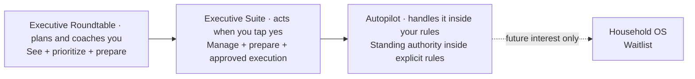
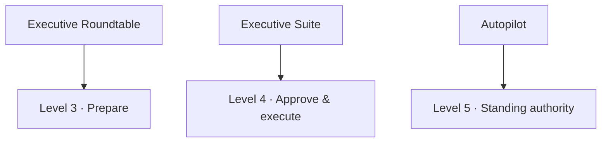

# A Player Mode — Three-Tier Product Contract

**Status: LOCKED IMPLEMENTATION CONTRACT**  
**Decision authority:** ADR-0002; pricing ADR-0004, ADR-0005  
**Updated:** 2026-10-07

> **Whatever game you're in, get into A Player Mode.**

The user's game can include several simultaneous roles. The tier changes how much responsibility APM carries; it does not change who the product is for.

## Product ladder

## Tiers and prices

| Tier | Job | Monthly | Includes |
|---|---|---:|---|
| Executive Roundtable | plans and coaches you | $24.99 | — |
| Executive Suite | acts when you tap yes | $39.99 | everything in Executive Roundtable |
| Autopilot | handles it inside your rules | $79.99 | everything in Executive Suite |

- **Annual plans (ADR-0005, 2 months free):**

| Tier | Monthly | Annual |
|---|---:|---:|
| Executive Roundtable | $24.99 | $249.99 |
| Executive Suite | $39.99 | $399.99 |
| Autopilot | $79.99 | $799.99 |

- **Executive Roundtable intro offers:** Founding 100 (the first 100 subscribers) pay $9.99/mo, locked while continuously subscribed; everyone else pays $9.99/mo for the first 3 months, then $24.99/mo.
- **Every tier reduces cognitive load; upper tiers reduce more.**
- **Billing:** App Store + Google Play in-app subscriptions via RevenueCat (Phase D, docs/33). No free trial.
- **Buying a tier never grants autonomy.** Prices come from `PLAN_PRICES` in `packages/policy/src/index.ts`; `packages/policy/test/pricing.test.mjs` pins this table to it.

## Capability grid

| Capability | Executive Roundtable | Executive Suite | Autopilot |
|---|---:|---:|---:|
| Adaptive intake + Personal OS | ✓ | ✓ | ✓ |
| Goals / projects / routines | ✓ | ✓ | ✓ |
| Today + Run of Show | ✓ | ✓ | ✓ |
| Radar + proactive notices | ✓ | ✓ | ✓ |
| Calendar/email awareness | ✓ | ✓ | ✓ |
| BHPC-derived coaching modes | ✓ | ✓ | ✓ |
| Prepare calendar/email/routine actions | ✓ | ✓ | ✓ |
| Relationships / birthdays | — | ✓ | ✓ |
| Appointments / travel | — | ✓ | ✓ |
| Bills / subscriptions | — | ✓ | ✓ |
| Meals / shopping planning | — | ✓ | ✓ |
| Health routines / recurring life admin | — | ✓ | ✓ |
| Per-action execution after approval | — | ✓ | ✓ |
| Standing authority within constraints | — | — | ✓ |
| Connected calendars & inboxes | 1 | 1 | Multiple |
| Household shared graph | — | — | — |

### Connected calendars & inboxes (owner decision, 2026-10-07)

Executive Roundtable and Executive Suite (and the beta) connect **one** cloud calendar and **one** inbox. Autopilot connects **several at once** (work and personal), with a user-chosen label on each ("Work", "Personal") and one primary per kind. The capability is `multi_account` on the autopilot plan in `packages/policy` (`productPlanPolicies`), and the limit is enforced in the database, not only the app (migration 0065: a trigger refuses a second live account of a kind without an active or trialing Autopilot entitlement). Calendars read through the phone's own calendar app are not cloud accounts and are not counted.

- **Downgrade:** nothing is deleted. The primary stays live; every extra account is paused (no sync, no actions), the app says so plainly, and the user reactivates it after upgrading, or makes it the primary instead on any plan.
- **Disconnect** always works, on every plan, paused or not.
- **Across accounts:** sync, Today/Radar, the Run of Show and Autopilot's collision check span every connected calendar, so work is never double-booked against personal. Each Autopilot rule and each prepared action names the account it acts on, and Undo goes back to that account.

Pinned by `packages/policy/test/product-plans.test.mjs` (this row and the capability), `services/api/test/multi-account-db.test.mjs` (the database) and `apps/mobile/test/connected-accounts.test.mjs` (what the app says).

## Autonomy ceiling

The product ceiling is not permission. A user's configured permission can always be lower.

## Household waitlist

Household remains deliberately unavailable. The app may:

- explain the future Household concept;
- record authenticated user interest;
- allow the user to withdraw that interest.

The app must not:

- create a new customer Household;
- sell a Household subscription;
- infer Household authority from an individual plan.

## Server enforcement

The API is the authority boundary. Client UI may explain a plan but cannot grant it.

- plan status must be active/trialing to unlock plan capabilities;
- permission writes above the current plan ceiling fail;
- action preparation/execution remains independently policy-checked;
- Household read and mutation routes stay unavailable; authenticated Supabase RLS exposes no Household customer read/write policy while the product is waitlist-only;
- billing (Phase D, migration 0040) writes entitlements only from the verified RevenueCat webhook; CANCELLATION keeps access to period end, BILLING_ISSUE keeps it through store grace, EXPIRATION and refunds end it.

## Phase ledger after this contract

1. **Phase A — three-tier contract / gating / plan UX / Household waitlist**.
2. **Phase B — life-area modules**.
3. **Phase C — Autopilot standing-rule engine + UX**.
4. **Phase D — billing / entitlement reconciliation** (App Store + Google Play in-app subscriptions via RevenueCat; `SOURCE_COMPLETE` + `DB_PROVISIONED`, docs/33).
5. **Phase E — external runtime/provider evidence**.
6. **Phase F — three-tier beta/release evidence**.
7. **Household — later, separate approval.**
