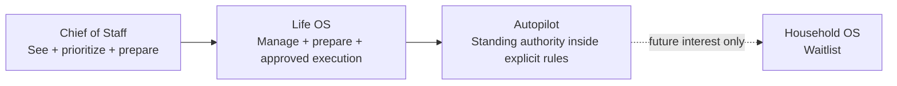
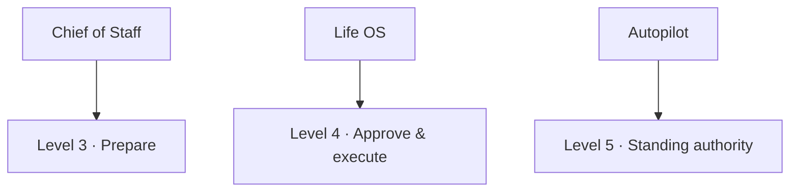

# A Player Mode — Three-Tier Product Contract

**Status: LOCKED IMPLEMENTATION CONTRACT**  
**Decision authority:** ADR-0002  
**Updated:** 2026-10-06

> **Whatever game you're in, get into A Player Mode.**

The user's game can include several simultaneous roles. The tier changes how much responsibility APM carries; it does not change who the product is for.

## Product ladder

## Capability grid

| Capability | Chief of Staff | Life OS | Autopilot |
|---|---:|---:|---:|
| Adaptive intake + Personal OS | ✓ | ✓ | ✓ |
| Goals / projects / routines | ✓ | ✓ | ✓ |
| Today + Run of Show | ✓ | ✓ | ✓ |
| Radar + proactive notices | ✓ | ✓ | ✓ |
| Calendar/email awareness | ✓ | ✓ | ✓ |
| BHPC-derived coaching modes | ✓ | ✓ | ✓ |
| Prepare calendar/email/routine actions | ✓ | ✓ | ✓ |
| Relationships / birthdays | — | ✓ | ✓ |
| Appointments / travel | — | ✓ | ✓ |
| Bills / subscriptions | — | ✓ | ✓ |
| Meals / shopping planning | — | ✓ | ✓ |
| Health routines / recurring life admin | — | ✓ | ✓ |
| Per-action execution after approval | — | ✓ | ✓ |
| Standing authority within constraints | — | — | ✓ |
| Household shared graph | — | — | — |

## Autonomy ceiling

The product ceiling is not permission. A user's configured permission can always be lower.

## Household waitlist

Household remains deliberately unavailable. The app may:

- explain the future Household concept;
- record authenticated user interest;
- allow the user to withdraw that interest.

The app must not:

- create a new customer Household;
- sell a Household subscription;
- infer Household authority from an individual plan.

## Server enforcement

The API is the authority boundary. Client UI may explain a plan but cannot grant it.

- plan status must be active/trialing to unlock plan capabilities;
- permission writes above the current plan ceiling fail;
- action preparation/execution remains independently policy-checked;
- Household read and mutation routes stay unavailable; authenticated Supabase RLS exposes no Household customer read/write policy while the product is waitlist-only;
- billing will later reconcile verified store/provider receipts into server-side entitlements.

## Phase ledger after this contract

1. **Phase A — three-tier contract / gating / plan UX / Household waitlist**.
2. **Phase B — Life OS domain modules**.
3. **Phase C — Autopilot standing-rule engine + UX**.
4. **Phase D — billing / entitlement reconciliation**.
5. **Phase E — external runtime/provider evidence**.
6. **Phase F — three-tier beta/release evidence**.
7. **Household — later, separate approval.**
