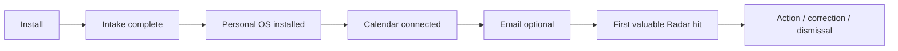

# A Player Mode — Closed Beta Scorecard

**Status: EVIDENCE TEMPLATE**  
**Target cohort: 25–50 users**

The closed beta exists to prove proactive value and trust—not to collect feature requests indiscriminately.

## Cohort coverage

Track enough users across different games that founder-only behavior cannot hide:

| Game / life context | Target presence |
|---|---|
| Parent / caregiver | Yes |
| Athlete / training | Yes |
| Student / learning | Yes |
| Entrepreneur / business | Yes |
| Career / leadership | Yes |
| Creator / publishing | Yes |
| Health / rebuilding / transition | Yes |

A user may belong to multiple categories.

## Activation funnel



## Product scorecard

| Metric | Result | Decision use |
|---|---:|---|
| Intake completion % | TBD | onboarding friction |
| Median time to first valuable Radar hit | TBD | activation |
| Valuable Proactive Interventions / user / week | TBD | north star |
| Radar false-positive rate | TBD | trust |
| Radar correction rate | TBD | extraction/state quality |
| Radar action rate | TBD | utility |
| Notification disable rate | TBD | intrusion/noise |
| W1 retention | TBD | initial value |
| W4 retention | TBD | durable value |
| W8 retention | TBD | habit/system value |
| W12 retention | TBD | launch confidence |
| AI cost / successful task | TBD | routing economics |
| Variable cost / active user / month | TBD | gross margin |
| Trust comprehension pass rate | TBD | privacy UX |
| Willing to pay $24 founding price | TBD | commercialization |

## Qualitative beta questions

Use a small consistent set rather than broad brainstorming:

1. What did APM notice that you would otherwise have missed?
2. Which Radar item felt wrong or noisy, and why?
3. What did you repeatedly wish APM would simply do for you after you reviewed it?
4. Was there any moment APM felt creepy, confusing, or too intrusive?
5. Would you pay the Founding Chief of Staff price to keep this running? Why or why not?

## Expansion gate

Life OS and Autopilot work should be promoted from repeated evidence:

```text
Users repeatedly value a domain
  -> Life OS module candidate
Users repeatedly approve the same safe action
  -> Autopilot rule candidate
```

One-off requests do not automatically become roadmap commitments.
