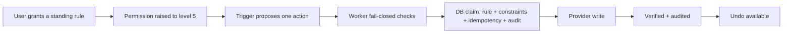

# Phase C — Autopilot Standing Rules

**Status:** SOURCE IMPLEMENTATION
**Authority:** Product Constitution + Privacy & AI Constitution + ADR-0002 + Three-Tier Product Contract (docs/29) + Actions/Autopilot contract (docs/25)
**Scope:** Individual Autopilot only. Household remains waitlist-only. Billing (Phase D) is not part of this phase.

## Full intended system

Autopilot is the third individual service level: **level 5, standing authority inside explicit rules the user writes and can revoke**. It carries approved recurring work without asking each time, on the same Life Graph, policy engine, connectors, audit trail and action lifecycle used by Chief of Staff and Life OS.



## Authority invariant

```text
Autopilot entitlement (plan = autopilot, status active/trialing)
AND explicit domain permission at level 5 (permissions row, enabled)
AND an active, unexpired standing rule for that action class
AND the proposal satisfies every constraint of the rule
AND the action class is ACTIVATED by runtime/security evidence
AND the user's master pause is off
AND GLOBAL_ACTION_EXECUTION + the domain switch + AUTOPILOT_EXECUTION are 'true'
= the only path to level-5 execution
```

**Buying Autopilot never grants authority.** The plan only raises the ceiling. A rule must be granted, the permission must be raised to 5, and the class must be activated. Each of these is independently checked in the Worker (`decideStandingAuthority`, `packages/policy`) and again, authoritatively, in the database (`private.apm_autopilot_claim`).

The per-action approval route (`POST /v1/actions/:id/approve`) is always level 4 now. A client-writable `requires_approval = false` can no longer escalate an action to level 5; every prepared action needs its own approval, and standing authority exists only through the claim path.

## Supported action classes (the whole allow-list)

| Class | Domain | What APM may do | Constraints | Undo |
|---|---|---|---|---|
| `calendar.create` | calendar | create a new calendar block (e.g. routine scheduling) on a connected Google/Microsoft calendar | timezone; ISO weekdays; local window start/end; max duration (15–240 min, within the window); max blocks per local day (1–10); horizon (1–30 days ahead); collision = `never_overlap_busy` | delete the created event |
| `email.draft` | email | prepare a draft on a connected Gmail/Outlook account | timezone; ISO weekdays; local window; max drafts per local day (1–20); allowed recipient domains (1–10) | delete the draft |

Both classes are reversible. Both ship **inactive** (`autopilot_action_classes.activation_status = 'inactive'`). Activation is a separate, reviewed migration that records the runtime/security receipt in `evidence_ref`; no API path can activate a class. Deactivating a class is a global kill switch for every existing rule.

## Never on Autopilot

Rejected by name in the database (`autopilot_unsupported_action_class`) and listed to the user in the app:

- purchases of any kind (`purchase.*`);
- healthcare transactions (`healthcare.*`);
- banking, bill payment or any other financial execution (`financial.*`);
- sending email (`email.send`) — irreversible;
- editing existing calendar events (`calendar.update`) — can override commitments;
- connector administration (`connector.*`).

Life OS bills, subscriptions and health routines remain reminders/preparation only.

## Data model (migration 0018)

| Table | Purpose |
|---|---|
| `autopilot_action_classes` | catalogue of supported classes + activation status/evidence; readable by any authenticated user; never client-writable |
| `autopilot_rules` | one live (active/paused) rule per user per class; `constraints`, `version`, `granted_at`, `expires_at` (≤ 90 days after the latest explicit grant), pause/revoke timestamps |
| `autopilot_executions` | the authority ledger: one row per claim, linked to the rule version and the `actions` row; status `claimed → verified / failed → reverted`; unique `(user_id, idempotency_key)` |
| `autopilot_settings` | the user's master pause |

Every claim also creates a normal `actions` row (`status = executing`, `requires_approval = false`, idempotency key `autopilot:<key>`) and an `action_attempts` row on completion, so Activity and the action lifecycle stay unified.

## Rule lifecycle

```text
grant (active, v1, expires ≤ 90d)
  -> update constraints / renew expiry   (version check; renewal re-grants from now)
  -> pause  <-> resume                   (resume needs entitlement and an unexpired rule)
  -> revoke                              (terminal)
expired rules fail closed and must be renewed explicitly.
```

## Standing execution

1. A trigger (in source today: `POST /v1/autopilot/rules/:id/run`; a scheduled trigger is Phase E runtime) proposes one action with an idempotency key, a reason and a payload.
2. The Worker checks kill switches, entitlement, the level-5 permission, rule status/expiry, class activation and master pause, and validates the payload shape. Any failure returns `403 autopilot_not_authorized` with the reason and **no database or provider call**.
3. `apm_autopilot_claim` locks the rule and re-checks everything, then enforces the rule: payload whitelist; own connected calendar/email connection of the right kind; for calendar — future start, within horizon, single local day, weekday, window, max duration, no overlap with any non-free calendar event or another live Autopilot block; for drafts — single recipient in an allowed domain, inside today's local window; the per-local-day cap (claimed, verified and reverted count; failed attempts do not). It inserts the `actions` row and the execution and writes `autopilot.execution_claimed` (actor `system`, `autopilot_rule:<id>`) in the same transaction.
4. Only after a successful claim does the Worker call the provider. The outcome is recorded through `apm_autopilot_record_result` (`verified` with the provider reference, or `failed` with a code), which updates the action, adds the attempt and audits.
5. A replayed idempotency key with the same payload returns the original execution and never re-executes; a different payload under the same key is `409 idempotency_conflict`.

## Governed database surface

Same shape as Phase B (0017): the Worker holds only the publishable key plus the user's JWT, so RLS and the functions are the security boundary.

- `anon`/`authenticated` hold **no** INSERT/UPDATE/DELETE on any `autopilot_*` table; the only policies are SELECT.
- Ordinary reads of rules, executions and settings need own-row **and** the Autopilot entitlement.
- Writes go through thin `SECURITY INVOKER` wrappers in `public` over `SECURITY DEFINER` bodies in `private` (`search_path = ''`):
  `apm_autopilot_grant_rule`, `apm_autopilot_update_rule`, `apm_autopilot_set_rule_status`, `apm_autopilot_revoke_rule`, `apm_autopilot_set_master_pause`, `apm_autopilot_claim`, `apm_autopilot_record_result`, `apm_autopilot_undo_target`, `apm_autopilot_record_undo`, `apm_autopilot_data_rights_export`.
- Each writes its `autopilot.*` audit event atomically. The Worker never writes a second audit event for these transitions.
- **Stopping never needs an entitlement:** pause, revoke, master pause on, undo and recording the result of an already-claimed run are owner-only, so a downgraded or lapsed user can always switch authority off. Granting, updating, resuming, un-pausing and claiming need the entitlement.

## API

| Route | Purpose |
|---|---|
| `GET /v1/autopilot` | classes + activation, rules, recent runs, master pause, current level per class, the never-on-Autopilot list |
| `POST /v1/autopilot/rules` | grant `{ actionClass, constraints, expiresAt }` |
| `PATCH /v1/autopilot/rules/:id` | update constraints and/or renew `{ expectedVersion, constraints?, expiresAt? }` |
| `POST /v1/autopilot/rules/:id/pause` · `/resume` | `{ expectedVersion }` |
| `POST /v1/autopilot/rules/:id/revoke` | terminal `{ reason? }` |
| `PUT /v1/autopilot/pause` | master pause `{ paused }` |
| `POST /v1/autopilot/rules/:id/run` | standing execution `{ idempotencyKey, reason, payload }` |
| `POST /v1/autopilot/executions/:id/undo` | revert a verified run at the provider, then record it |
| `GET /v1/privacy/autopilot` | owner-only retained rules/runs/settings (also inside `POST /v1/privacy/export`) |

## Failure behavior

- missing/expired Autopilot entitlement → `403 autopilot_required`;
- Worker fail-closed check → `403 autopilot_not_authorized` + `reason` (`autopilot_execution_disabled`, `global_execution_disabled`, `domain_execution_disabled`, `capability_not_entitled`, `permission_missing_or_disabled`, `permission_too_low`, `rule_inactive`, `rule_expired`, `class_not_activated`, `autopilot_paused`);
- class not activated / permission below 5 in the DB → `403 class_not_activated` / `403 permission_required`;
- proposal outside the rule → `403 outside_rule`; overlap → `409 collision`; daily cap → `409 rate_limited`;
- unsupported or forbidden class → `400 unsupported_action_class`; bad constraints/expiry/payload → `400`;
- stale version → `409 conflict`; second live rule for a class → `409 rule_exists`; revoked/expired/paused → `409`;
- provider failure → recorded as `failed`, `502 execution_failed`;
- a claim whose Worker dies before recording stays `claimed`: it keeps its slot and counts toward the cap (fail-safe; never re-executed by replay).

## Mobile journey

```text
Settings -> Autopilot
  -> master pause
  -> per class: activation state, current level, undo method
  -> write a rule (days, window, caps, scope, lifetime ≤ 90 days)
     -> explicit "Grant standing authority" (raises the permission to 5 + grants)
  -> pause / resume / renew / revoke
  -> recent runs with Undo
  -> "Never on Autopilot" list
Privacy & AI -> Your Data shows retained rule/run counts (owner-only read)
```

Non-Autopilot accounts see the boundary and the explanation that a plan alone grants nothing.

## Not included in Phase C

- activating any action class (needs runtime/security receipts — Phase E);
- a scheduled/cron trigger that proposes routine blocks (runtime — Phase E);
- billing receipt reconciliation (Phase D);
- shared Household authority;
- purchases, healthcare, financial execution, email sending, editing existing events.

## Validation gates

Before merge:

1. exact-head workspace typecheck;
2. exact-head workspace tests:
   - `services/api/test/autopilot-db.test.mjs` runs migration 0018 in embedded Postgres and proves, as `authenticated`, that direct writes fail; anon cannot call any RPC; definers are not exposed and pin `search_path`; classes ship inactive; forbidden classes are rejected; only Autopilot can grant; permission 5 and activation are both required; every rule constraint, idempotency, master pause, expiry and revoke hold; stopping works after downgrade; reads need the entitlement and the export still returns retained rows; deactivation stops existing rules;
   - `services/api/test/autopilot-worker.test.mjs` proves the Worker fails closed before any call, executes only after a claim, records results and undo by RPC, never re-executes a replay, never writes Autopilot tables directly or re-audits, and that the approval route is pinned to level 4;
   - `packages/policy/test/autopilot.test.mjs` covers the allow-list, constraint validation, the calendar evaluator and `decideStandingAuthority`;
3. migration applies to Supabase; security advisor reports 0 lints;
4. PR security review has no unresolved actionable findings.

## Privacy / lifecycle receipt

- **Owner:** the authenticated individual user.
- **Classification:** rule constraints are Class 1–2 (schedule preferences, recipient domains). Run payloads (event titles, draft recipients/subjects/bodies) live on the existing `actions` row and are Class 2.
- **Audit/analytics:** audit metadata is structural only (class, rule id/version, action id, failure code) — no titles, recipients, subjects or bodies. Analytics record `autopilot_rule_granted` / `autopilot_executed` with the class only.
- **Persistence:** rules and runs remain as history until account deletion; revocation is recorded, not deleted.
- **Export:** `POST /v1/privacy/export` includes `autopilot` via the owner-only function, including after downgrade.
- **Deletion:** account deletion cascades through user ownership.
- **AI processing:** Phase C is deterministic. No inference route receives Autopilot data, and an LLM cannot grant, widen or activate a rule. External content cannot create rules.
- **Inspection/correction:** Settings → Autopilot (manage, pause, revoke, undo); Privacy & AI → Your Data and Activity (audit events).

## Provisioning receipt — 2026-10-06

**Supabase project:** `aplayer-mode` (`klzbnchgoqmnwsgolwoe`)

- Applied via the Management API as migration `autopilot_standing_rules` (listed after `life_os_governed_writes`).
- Post-migration Supabase security advisor: **0 security lints**.
- The forbidden paths (direct writes, anon RPC calls, exposed definers, unpinned `search_path`, grant/claim without entitlement, permission or activation) are proven against the same migration file in `services/api/test/autopilot-db.test.mjs`. The management token used for provisioning has no `database_read` scope, so live SQL inspection of the applied schema is not part of this receipt.
- Both action classes are `inactive` as shipped: **no standing execution is possible in production** until a reviewed activation migration records runtime evidence.
