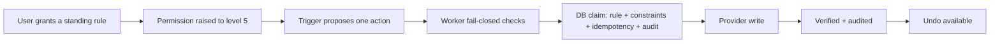

# Phase C — Autopilot Standing Rules

**Status:** SOURCE IMPLEMENTATION
**Authority:** Product Constitution + Privacy & AI Constitution + ADR-0002 + ADR-0003 (Autopilot action classes) + Three-Tier Product Contract (docs/29) + Actions/Autopilot contract (docs/25)
**Scope:** Individual Autopilot only. Household remains waitlist-only. Billing (Phase D) is not part of this phase.

## Full intended system

Autopilot is the third individual service level: **level 5, standing authority inside explicit rules the user writes and can revoke**. It carries approved recurring work without asking each time, on the same Life Graph, policy engine, connectors, audit trail and action lifecycle used by Executive Roundtable and Executive Suite.



## Authority invariant

```text
Autopilot entitlement (plan = autopilot, status active/trialing)
AND explicit domain permission at level 5 (permissions row, enabled)
AND an active, unexpired standing rule for that action class
AND the proposal satisfies every constraint of the rule
AND the action class is ACTIVATED by runtime/security evidence
AND the user's master pause is off
AND GLOBAL_ACTION_EXECUTION + the connector's domain switch + AUTOPILOT_EXECUTION are 'true'
AND the class is listed in AUTOPILOT_ENABLED_CLASSES (per-class Worker switch)
AND the connection carries the provider WRITE scope the class needs
AND the Worker holds the server-only key that alone may record the outcome
= the only path to level-5 execution
```

**Buying Autopilot never grants authority.** The plan only raises the ceiling. A rule must be granted, the permission must be raised to 5, and the class must be activated. Each of these is independently checked in the Worker (`decideStandingAuthority`, `packages/policy`) and again, authoritatively, in the database (`private.apm_autopilot_claim`).

The per-action approval route (`POST /v1/actions/:id/approve`) is always level 4 now. A client-writable `requires_approval = false` can no longer escalate an action to level 5; every prepared action needs its own approval, and standing authority exists only through the claim path.

## Supported action classes (the whole allow-list)

Owner's ruling, 6 Oct 2026, recorded as **ADR-0003**: Autopilot may act on its own, inside user-written standing rules, for the classes below. Every class follows docs/25 (schema, permission, constraints, idempotency, connector, verification, audit, kill switch) and lands on the daily done-list with **Undo** where reversible and a clear **"Can't undo"** label where not.

| Class | Permission domain · connector | What APM may do | Rule constraints (user-written) | Server-side guardrails | Undo |
|---|---|---|---|---|---|
| `calendar.create` | calendar · calendar | create a new block (e.g. a routine) | timezone; ISO weekdays; local window; max duration 15–240 min; max/day 1–10; horizon 1–30 days; `never_overlap_busy` | future, single local day, inside window/weekday, no overlap with busy time, another Autopilot slot or a Deep Work session | delete the event |
| `email.draft` | email · email | prepare a draft | timezone; weekdays; window; max/day 1–20; recipient domains 1–10 | single recipient in an allowed domain, CR/LF-free subject, inside today's window | delete the draft |
| `email.send` | email · email | **send** a message of a rule-defined kind: scheduling reply, follow-up/chaser on what **others** owe the user, confirmation, or a pre-approved template (e.g. birthday) | allowed kinds (1–4); allowed recipients (≤25 addresses) and/or domains (≤10), at least one; max/day 1–20; **max per recipient per day 1–3**; templates (≤10, exact subject + body, required iff `template` is allowed) | each kind is bound to a real source: a follow-up needs an open commitment owned by someone else; a scheduling reply/confirmation needs a scheduling message that arrived on the **same** mailbox; a template sends exactly the stored text; single lower-cased recipient on the allow-list (exact domain, no subdomain); no control characters in To/Subject (header injection); no card-number-shaped digits anywhere | **Can't undo** — a sent message cannot be recalled |
| `calendar.reschedule` | calendar · calendar | move a meeting to a new time | timezone; weekdays; target window; max/day 1–10; horizon 1–30; max shift 0–7 local calendar days (0 = same day); `never_overlap_busy`; criteria: title keywords (≤10), max attendees 0–50, protected keywords (≤10) | only events the user **marked flexible** or that match the criteria (keyword AND ≤ max attendees); only the user's own meetings (organiser) or solo blocks; same duration; target inside window, no collision; **never** a protected block: titles with Deep Work / focus / foreground or the rule's protected words, anything overlapping a declared Deep Work session, or a routine block Autopilot created; one live move/decline per event; attendees notified by the provider | move it back to the original time |
| `calendar.decline` | calendar · calendar | decline an invitation with a polite note | timezone; max/day 1–10; horizon 1–30; **declared boundaries** (1–10 × weekdays + no-meeting window); criteria as above; optional note (10–500 chars, else a kind default) | only invitations from someone else (never the user's own meeting) that **violate a declared boundary**; flexible/criteria and protection rules as above; the note is the rule's own text | re-accept the invitation (the organiser has already seen the decline) |
| `appointment.book` | appointment · email | request a **FREE** booking by emailing an allow-listed provider | timezone; weekdays; window; max/day 1–3; horizon 1–60; providers (≤10 × booking email, label, category, allowed appointment types 1–5) | provider and appointment type must be on the rule; slot future, inside window, no collision; the email is **fixed text** composed by the database (date, time, type — no free text), so medical visits stay scheduling logistics and APM makes no clinical choice; **anything that asks for a card or deposit STOPS** (declared `paymentRequired`, or a linked booking message mentioning card/deposit/prepay/fee/currency) and becomes a prepared action + a life areas appointment item for the user | **Can't undo** — reply to the provider to cancel |
| `subscription.cancel` | subscription · email | cancel a subscription tracked in life areas — it may **save** money, never **spend** it | timezone; max/day 1–5; allowed provider domains (1–10) | the item must be the user's own open `subscription`; the cancellation address must be on an allowed domain; the email is **fixed text** ("cancel and stop all future charges; do not renew, upgrade or change the plan"); an optional account reference is checked for payment data; a provider with no emailed route becomes a **prepared cancellation request** (`route: web` → stop), APM never logs in or touches payment settings; one live cancel per item | **Can't undo** — re-subscribing would spend money, so APM never does it |

Every class ships **inactive** (`autopilot_action_classes.activation_status = 'inactive'`) until Phase E runtime proof. Activation is a separate, reviewed migration that records the runtime/security receipt in `evidence_ref`; no API path can activate a class. Deactivating a class is a global kill switch for every existing rule; the Worker's `AUTOPILOT_ENABLED_CLASSES` is a second, per-class switch held by the server.

**Connector scopes.** Connecting read access never implies write access (docs/22). `POST /v1/connections/oauth/start` takes `access: 'act'` to request the write scopes as a separate consent, and the claim checks the connection's stored scopes per class (`required_scopes`: Google `calendar.events`, `gmail.compose`, `gmail.send`; Microsoft `Calendars.ReadWrite`, `Mail.ReadWrite`, `Mail.Send`) and fails with `connector_scope_missing`.

**Composed writes.** For every class the claim stores the exact provider write in `actions.payload.composed` (resolved event id and connection, recipient, subject, body, note). The Worker executes only `composed`, never the raw proposal, so event ids, recipients and message text are always database-derived or database-validated.

## Never on Autopilot

Rejected by name in the database (`autopilot_unsupported_action_class`; the class catalogue CHECK is the whole allow-list) and listed to the user in the app:

- purchases of any kind (`purchase.*`);
- payments and entering card/payment details (`payment.*`; outgoing text with card-number-shaped digits is refused with `payment_data_refused`);
- upgrades and sign-ups (`subscription.upgrade`, `subscription.signup`) — Autopilot may save money, never spend it;
- clinical and healthcare decisions (`healthcare.*`) — appointments are scheduling logistics only;
- banking, bill payment, transfers or any other money movement (`financial.*`);
- generic edits of existing events (`calendar.update`) — only rule-bound moves and declines;
- connector administration (`connector.*`).

Approving a stopped Autopilot action through `POST /v1/actions/:id/approve` is refused (`409 needs_user`): a stop is the user's to finish themselves.

## Data model (migrations 0018, 0019, 0033, 0034)

| Table | Purpose |
|---|---|
| `autopilot_action_classes` | catalogue of supported classes + activation status/evidence; readable by any authenticated user; never client-writable |
| `autopilot_rules` | one live (active/paused) rule per user per class; `constraints`, `version`, `granted_at`, `expires_at` (≤ 90 days after the latest explicit grant), pause/revoke timestamps |
| `autopilot_executions` | the authority ledger: one row per claim, linked to the rule version and the `actions` row; status `claimed → verified / failed → reverted`; unique `(user_id, idempotency_key)` |
| `autopilot_settings` | the user's master pause |
| `autopilot_flexible_events` | events the user marked flexible, by provider + provider event id (kept apart from `calendar_events`, which a sync replaces); owner + entitlement to mark, owner-only to unmark |

0033 adds to `autopilot_action_classes` the `connector_kind`, `undo_label` and `required_scopes` columns (undo methods `delete_event`, `delete_draft`, `restore_time`, `reaccept`, `none`; `reversible = (undo_method <> 'none')`), and to `autopilot_executions` the server-derived `target_ref`, `original_starts_at`/`original_ends_at` (what undo restores) and `recipient` (per-recipient caps).

Every claim also creates a normal `actions` row (`status = executing`, `requires_approval = false`, idempotency key `autopilot:<key>`) and an `action_attempts` row on completion, so Activity and the action lifecycle stay unified.

## Rule lifecycle

```text
grant (active, v1, expires ≤ 90d)
  -> update constraints / renew expiry   (version check; renewal re-grants from now)
  -> pause  <-> resume                   (resume needs entitlement and an unexpired rule)
  -> revoke                              (terminal)
expired rules fail closed and must be renewed explicitly.
```

## Standing execution

1. A trigger (in source today: `POST /v1/autopilot/rules/:id/run`; a scheduled trigger is Phase E runtime) proposes one action with an idempotency key, a reason and a payload.
2. The Worker checks kill switches, entitlement, the level-5 permission, rule status/expiry, class activation and master pause, and validates the payload shape. Any failure returns `403 autopilot_not_authorized` with the reason and **no database or provider call**.
3. `apm_autopilot_claim` locks the rule and re-checks everything, then enforces the rule: payload whitelist; own connected calendar/email connection of the right kind; for calendar — future start, within horizon, single local day, weekday, window, max duration, no overlap with any non-free calendar event or another live Autopilot block; for drafts — single recipient in an allowed domain, inside today's local window; the per-local-day cap (claimed, verified and reverted count; failed attempts do not). It inserts the `actions` row and the execution and writes `autopilot.execution_claimed` (actor `system`, `autopilot_rule:<id>`) in the same transaction.
   From 0033 each class has its own proposal check (`private.apm_autopilot_prepare_<class>`) and composes the exact write. A class may instead **stop**: `appointment.book` when payment is asked, `subscription.cancel` when there is no emailed route. A stop inserts a `prepared` action (`requires_approval = true`, `payload.stoppedReason`), for a booking also a life areas `appointment` item, audits `autopilot.execution_stopped`, creates no execution and reaches no provider; the API answers `202` with `stopped`.
4. Only after a successful claim does the Worker call the provider. The outcome is recorded **only by the Worker with the server-only key** through `apm_service_autopilot_record_result` (`verified` with the provider reference, or `failed` with a code), which updates the action, adds the attempt and audits (`recordedBy: worker`).
5. A replayed idempotency key with the same payload returns the original execution and never re-executes; a different payload under the same key is `409 idempotency_conflict`.

## Governed database surface

Same shape as Phase B (0017): the Worker holds only the publishable key plus the user's JWT, so RLS and the functions are the security boundary.

- `anon`/`authenticated` hold **no** INSERT/UPDATE/DELETE on any `autopilot_*` table; the only policies are SELECT.
- Ordinary reads of rules, executions and settings need own-row **and** the Autopilot entitlement.
- Writes go through thin `SECURITY INVOKER` wrappers in `public` over `SECURITY DEFINER` bodies in `private` (`search_path = ''`):
  `apm_autopilot_grant_rule`, `apm_autopilot_update_rule`, `apm_autopilot_set_rule_status`, `apm_autopilot_revoke_rule`, `apm_autopilot_set_master_pause`, `apm_autopilot_claim`, `apm_autopilot_undo_target`, `apm_autopilot_set_event_flexible`, `apm_autopilot_done_list`, `apm_autopilot_data_rights_export`.
- **Service-role only** (the Worker's server key; `anon`/`authenticated` have no EXECUTE): `apm_service_autopilot_record_result`, `apm_service_autopilot_record_undo`. The 0018 self-service `apm_autopilot_record_result` / `apm_autopilot_record_undo` are dropped.
- Each writes its `autopilot.*` audit event atomically. The Worker never writes a second audit event for these transitions.
- **Stopping never needs an entitlement:** pause, revoke, master pause on, undo, un-marking a flexible event and reading the done-list are owner-only, so a downgraded or lapsed user can always switch authority off. Granting, updating, resuming, un-pausing, marking an event flexible and claiming need the entitlement. Recording outcomes is the Worker's alone.

## API

| Route | Purpose |
|---|---|
| `GET /v1/autopilot` | classes + activation, rules, recent runs, master pause, current level per class, the never-on-Autopilot list |
| `POST /v1/autopilot/rules` | grant `{ actionClass, constraints, expiresAt }` |
| `PATCH /v1/autopilot/rules/:id` | update constraints and/or renew `{ expectedVersion, constraints?, expiresAt? }` |
| `POST /v1/autopilot/rules/:id/pause` · `/resume` | `{ expectedVersion }` |
| `POST /v1/autopilot/rules/:id/revoke` | terminal `{ reason? }` |
| `PUT /v1/autopilot/pause` | master pause `{ paused }` |
| `POST /v1/autopilot/rules/:id/run` | standing execution `{ idempotencyKey, reason, payload }` |
| `POST /v1/autopilot/executions/:id/undo` | revert a verified, reversible run at the provider (delete, move back, re-accept), then record it with the server key; irreversible classes → `409 cannot_undo` |
| `GET /v1/autopilot/done?day=YYYY-MM-DD` | the daily done-list (default: the user's local today): each run with summary, status, `canUndo` and `undoLabel`; stops as `needs you` |
| `PUT /v1/autopilot/flexible-events/:eventId` | mark/unmark one of the user's events flexible `{ flexible }` |
| `GET /v1/privacy/autopilot` | owner-only retained rules/runs/settings (also inside `POST /v1/privacy/export`) |

## Failure behavior

- missing/expired Autopilot entitlement → `403 autopilot_required`;
- Worker fail-closed check → `403 autopilot_not_authorized` + `reason` (`autopilot_execution_disabled`, `global_execution_disabled`, `domain_execution_disabled`, `capability_not_entitled`, `permission_missing_or_disabled`, `permission_too_low`, `rule_inactive`, `rule_expired`, `class_not_activated`, `autopilot_paused`);
- class not activated / permission below 5 in the DB → `403 class_not_activated` / `403 permission_required`;
- proposal outside the rule → `403 outside_rule`; overlap or an already-targeted event/item → `409 collision`; daily or per-recipient cap → `409 rate_limited`;
- protected block (Deep Work / focus / foreground / Autopilot routine) → `403 event_protected`; missing write scope → `403 connector_scope_missing`; payment data in outgoing text → `403 payment_data_refused`;
- per-class Worker switch off → `403 autopilot_not_authorized` + `class_switch_off`; no server key → `service_credential_missing`;
- payment asked / no emailed route → `202` with `stopped: payment_required | needs_user` and the prepared action;
- undo of an irreversible class → `409 cannot_undo`;
- unsupported or forbidden class → `400 unsupported_action_class`; bad constraints/expiry/payload → `400`;
- stale version → `409 conflict`; second live rule for a class → `409 rule_exists`; revoked/expired/paused → `409`;
- provider failure → recorded as `failed`, `502 execution_failed`;
- a claim whose Worker dies before recording stays `claimed`: it keeps its slot and counts toward the cap (fail-safe; never re-executed by replay).

## Mobile journey

```text
Settings -> Autopilot
  -> master pause
  -> Done today: every run with Undo, or a clear "Can't undo"; stops shown as "needs you"
  -> Kill switches: master pause, per-rule pause/revoke, per-class activation state
  -> per class: activation state, current level, what Undo does / "Can't undo"
  -> write a rule (days, window, caps, scope, lifetime ≤ 90 days): recipients + kinds +
     templates for sending; keywords, attendee cap, protected words for moves/declines;
     a declared boundary for declines; providers + appointment types for bookings;
     provider domains for cancellations
     -> explicit "Grant standing authority" (raises the permission to 5 + grants)
  -> pause / resume / renew / revoke
  -> recent runs with Undo
  -> "Never on Autopilot" list
Privacy & AI -> Your Data shows retained rule/run counts (owner-only read)
```

Non-Autopilot accounts see the boundary and the explanation that a plan alone grants nothing.

## Migration 0019 — `autopilot_draft_header_hardening`

Self security review of `8468775` (the requested Codex review could not run: Codex usage limit). The Gmail draft is built as raw MIME, so a subject carrying CR/LF could inject `Cc`/`Bcc` headers with recipients outside `allowedRecipientDomains`. `apm_autopilot_claim` now rejects any control character in the subject; the API schema does the same, and `executeEmail` refuses control characters in `To`/`Subject` for every email action (approved or standing) before loading credentials.

## Phase C P2 — fixed in 0033: failure is server-verified

Before 0033 the Worker recorded outcomes with the user's own JWT, so a user could call `apm_autopilot_record_result` on their own claimed run and mark it `failed` to free a slot in their daily cap. 0033 drops the self-service result and undo RPCs; only `apm_service_autopilot_record_result` / `apm_service_autopilot_record_undo`, executable by `service_role` alone, can move a run out of `claimed`. The Worker refuses to claim (`service_credential_missing`) when it does not hold the server key, so no run can be left without a recorder. A claimed run whose Worker dies stays `claimed` and keeps its slot (fail-safe).

## Not included in Phase C

- activating any action class (needs runtime/security receipts — Phase E);
- a scheduled/cron trigger that proposes routine blocks (runtime — Phase E);
- billing receipt reconciliation (Phase D, now docs/33);
- shared Household authority;
- purchases, payments, upgrades/sign-ups, clinical/healthcare decisions, money movement, generic event edits;
- booking flows that need a provider API or a web form (scheduling links): today only emailed requests;
- message threading of scheduling replies (sent as a new message to the allow-listed recipient).

## Validation gates

Before merge:

1. exact-head workspace typecheck;
2. exact-head workspace tests:
   - `services/api/test/autopilot-db.test.mjs` runs migrations 0018–0019 in embedded Postgres and proves, as `authenticated`, that direct writes fail; anon cannot call any RPC; definers are not exposed and pin `search_path`; classes ship inactive; forbidden classes are rejected; only Autopilot can grant; permission 5 and activation are both required; every rule constraint, idempotency, master pause, expiry and revoke hold; stopping works after downgrade; reads need the entitlement and the export still returns retained rows; deactivation stops existing rules;
   - `services/api/test/autopilot-worker.test.mjs` proves the Worker fails closed before any call, executes only after a claim, records results and undo by RPC, never re-executes a replay, never writes Autopilot tables directly or re-audits, and that the approval route is pinned to level 4;
   - `services/api/test/autopilot-actions-db.test.mjs` runs 0018 + 0019 + 0033 and proves, per new class, every guardrail above (kinds bound to sources, allow-lists, per-recipient caps, header and payment-data refusals, flexible/criteria eligibility, protected blocks, declared boundaries, payment stops into prepared life areas actions, cancellation routes, write scopes, undo targets, the done-list labels) and that a user can no longer record their own run;
   - `packages/policy/test/autopilot.test.mjs` covers the allow-list, the names that stay rejected, constraint validation, the calendar evaluator and `decideStandingAuthority` (including the per-class switch);
3. migration applies to Supabase; security advisor reports 0 lints;
4. PR security review has no unresolved actionable findings.

## Privacy / lifecycle receipt

- **Owner:** the authenticated individual user.
- **Classification:** rule constraints are Class 1–2 (schedule preferences, recipient domains). Run payloads (event titles, draft recipients/subjects/bodies) live on the existing `actions` row and are Class 2.
- **Audit/analytics:** audit metadata is structural only (class, rule id/version, action id, failure code) — no titles, recipients, subjects or bodies. Analytics record `autopilot_rule_granted` / `autopilot_executed` with the class only.
- **Persistence:** rules and runs remain as history until account deletion; revocation is recorded, not deleted.
- **Export:** `POST /v1/privacy/export` includes `autopilot` via the owner-only function, including after downgrade.
- **Deletion:** account deletion cascades through user ownership.
- **AI processing:** Phase C is deterministic. No inference route receives Autopilot data, and an LLM cannot grant, widen or activate a rule. External content cannot create rules.
- **Inspection/correction:** Settings → Autopilot (manage, pause, revoke, undo); Privacy & AI → Your Data and Activity (audit events).

## Provisioning receipt — 2026-10-06

**Supabase project:** `aplayer-mode` (`klzbnchgoqmnwsgolwoe`)

- Applied via the Management API as migration `autopilot_standing_rules` (listed after `life_os_governed_writes`).
- Post-migration Supabase security advisor: **0 security lints**.
- The forbidden paths (direct writes, anon RPC calls, exposed definers, unpinned `search_path`, grant/claim without entitlement, permission or activation) are proven against the same migration file in `services/api/test/autopilot-db.test.mjs`. The management token used for provisioning has no `database_read` scope, so live SQL inspection of the applied schema is not part of this receipt.
- Applied migration `autopilot_draft_header_hardening` (0019) the same day; advisor still **0 security lints**.
- Both action classes are `inactive` as shipped: **no standing execution is possible in production** until a reviewed activation migration records runtime evidence.
- Applied migration `autopilot_reschedule_shift_bound` (0034, Codex P1 on #23: the reschedule shift bound compares local dates exactly) the same day; advisor **0 security lints**.
- Applied migration `autopilot_action_classes` (0033, the owner's 6 Oct 2026 ruling: `email.send`, `calendar.reschedule`, `calendar.decline`, `appointment.book`, `subscription.cancel`, plus the server-verified-failure fix) the same day via the Management API; advisor still **0 security lints**. All seven classes remain `inactive`; activation needs Phase E runtime proof.
