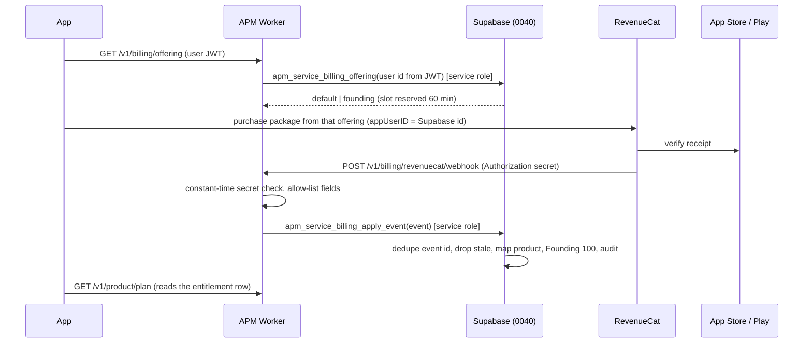

# A Player Mode — Phase D: In-App Subscription Billing (RevenueCat)

**Status:** `SOURCE_COMPLETE` + `DB_PROVISIONED` (migrations 0040–0042, applied to Supabase; security advisor 0 lints). Store products, the RevenueCat project and the secrets below are **Phase E** — nothing is runtime-proven and no store transaction is live.
**Decisions:** owner, 7 Oct 2026 (final). Prices: ADR-0004 (monthly), ADR-0005 (annual).
**Code:** `packages/policy/src/index.ts` (`PLAN_PRICES`, `CHIEF_OF_STAFF_INTRO_OFFERS`, `BILLING_PRODUCTS`, `REVENUECAT_CONFIG`), `services/api/src/billing.ts`, `services/api/migrations/0040_billing_revenuecat.sql` + `0041_billing_explicit_deny_all.sql` + `0042_billing_founding_claim_eligibility.sql`, `apps/mobile/app/settings/plan.tsx`, `apps/mobile/src/billing/`.

## 1. What was decided

- **Provider:** RevenueCat over App Store and Google Play in-app subscriptions (`react-native-purchases` in the Expo app; needs a development/EAS build — Expo Go cannot load it).
- **Prices** (cumulative tiers; annual = 2 months free; no free trial):

| Tier | Monthly | Annual | Includes |
|---|---:|---:|---|
| Executive Roundtable | $24.99 | $249.99 | — |
| Executive Suite | $39.99 | $399.99 | everything in Executive Roundtable |
| Autopilot | $79.99 | $799.99 | everything in Executive Suite |

- **Executive Roundtable monthly intro offers** (none on annual, none on Executive Suite / Autopilot):
  - **Founding 100:** the first 100 subscribers pay $9.99/mo, locked while continuously subscribed. A separate store product, shown only while the server holds a Founding 100 slot for that user. A lapse loses the lock for good.
  - **Everyone else:** $9.99/mo for the first 3 months, then $24.99/mo — the store's introductory offer on the standard Executive Roundtable monthly product.
- **RevenueCat app user id = Supabase user id.** The app logs RevenueCat in with the signed-in user's id; anonymous RevenueCat ids are never credited.
- **Buying a tier never grants autonomy.** Effective authority = min(entitlement, user permission, server policy, kill switch). The billing code never writes `public.permissions`.

## 2. Store product IDs (exact)

One App Store subscription group, **"A Player Mode"**, holds all seven App Store products (so a change between any two is an upgrade / downgrade / crossgrade Apple prorates). On Google Play each tier is one subscription with base plans; RevenueCat reports Play products as `<subscription id>:<base plan id>`.

| Tier | Period | Offer | App Store product id | Google Play `subscription:base plan` | Price |
|---|---|---|---|---|---:|
| Executive Roundtable | monthly | standard + 3-month intro | `apm_cos_monthly` | `apm_cos:monthly` (offer `intro-3m`) | $24.99/mo (intro $9.99 × 3) |
| Executive Roundtable | monthly | **Founding 100** | `apm_cos_monthly_founding` | `apm_cos:founding-monthly` | $9.99/mo |
| Executive Roundtable | annual | standard | `apm_cos_annual` | `apm_cos:annual` | $249.99/yr |
| Executive Suite | monthly | standard | `apm_lifeos_monthly` | `apm_lifeos:monthly` | $39.99/mo |
| Executive Suite | annual | standard | `apm_lifeos_annual` | `apm_lifeos:annual` | $399.99/yr |
| Autopilot | monthly | standard | `apm_autopilot_monthly` | `apm_autopilot:monthly` | $79.99/mo |
| Autopilot | annual | standard | `apm_autopilot_annual` | `apm_autopilot:annual` | $799.99/yr |

`BILLING_PRODUCTS` is the source of truth; `private.billing_products` (migration 0040) seeds the same 14 rows and `services/api/test/billing-db.test.mjs` fails if they diverge. **A product id not in this table never grants anything** (the event is recorded `ignored_unknown_product`).

## 3. Phase E setup checklist (do not do in Phase D)

### App Store Connect
1. Paid Applications agreement, banking and tax complete.
2. Subscription group **A Player Mode**; add the seven products above with the prices above (USD base; let Apple derive other storefronts).
3. Group levels (highest first): Autopilot annual, Autopilot monthly, Executive Suite annual, Executive Suite monthly, Executive Roundtable annual, Executive Roundtable monthly, Executive Roundtable monthly founding.
4. `apm_cos_monthly` introductory offer: **Pay as you go, $9.99, 3 periods of 1 month**, new subscribers. No free trial anywhere.
5. Billing Grace Period: **on (16 days)** — the server keeps access through grace (BILLING_ISSUE handling below).
6. App Store Server Notifications V2 → the RevenueCat-provided URL; in-app purchase key (`.p8`) uploaded to RevenueCat.
7. Each product's review screenshot + description; the app's EULA link and privacy policy URL set in App Information.

### Google Play Console
1. Merchant account; subscriptions `apm_cos`, `apm_lifeos`, `apm_autopilot`.
2. Base plans: `monthly` (auto-renewing, 1 month) and `annual` (1 year) on each; `founding-monthly` ($9.99, 1 month) on `apm_cos`.
3. `apm_cos:monthly` offer `intro-3m`: one phase, 3 × 1 month at $9.99, eligibility **new customer acquisition**. No free trial.
4. Grace period 7 days (plus account hold); Real-time developer notifications (Pub/Sub topic) and service-account credentials connected to RevenueCat.

### RevenueCat
1. Project **A Player Mode**; apps for iOS (`com.aplayermode.app`) and Android (`com.aplayermode.app`).
2. Products: import all 14 ids above.
3. Entitlements: `chief_of_staff` (all Executive Roundtable products), `life_os` (Executive Suite products), `autopilot` (Autopilot products). Informational only — the server maps product ids itself.
4. Offerings (package ids are `REVENUECAT_CONFIG.packages`):
   - `default` (current): `cos_monthly` → `apm_cos_monthly` / `apm_cos:monthly`; `cos_annual`; `lifeos_monthly`; `lifeos_annual`; `autopilot_monthly`; `autopilot_annual`.
   - `founding`: identical, except `cos_monthly` → `apm_cos_monthly_founding` / `apm_cos:founding-monthly`.
5. **Restore behaviour: "Keep with original App User ID"** (transfers disabled). TRANSFER events are recorded and ignored by the server; transfers must not move a paid entitlement between APM accounts.
6. Webhook: URL `https://<api host>/v1/billing/revenuecat/webhook` (production: `https://api.aplayermode.com/v1/billing/revenuecat/webhook`); Authorization header = the value of `REVENUECAT_WEBHOOK_SECRET`; environment filter: production for the production Worker, sandbox+production for staging; all event types.
7. Public SDK keys → `EXPO_PUBLIC_REVENUECAT_IOS_API_KEY` (`appl_…`), `EXPO_PUBLIC_REVENUECAT_ANDROID_API_KEY` (`goog_…`) in the EAS build environment.

### Secrets / config (placeholders until Phase E)

| Name | Where | Purpose |
|---|---|---|
| `REVENUECAT_WEBHOOK_SECRET` | Cloudflare Worker secret (staging and production, different values) | Webhook Authorization; ≥ 32 random characters. Absent → 503 `billing_webhook_not_configured`. |
| `BILLING_ALLOW_SANDBOX` | Worker var, staging only | `true` accepts SANDBOX events. |
| `SUPABASE_SECRET_KEY` | Worker secret (exists) | The webhook, offering and sweep call service-role functions. |
| `EXPO_PUBLIC_REVENUECAT_IOS_API_KEY` | EAS env | Public RevenueCat Apple key. |
| `EXPO_PUBLIC_REVENUECAT_ANDROID_API_KEY` | EAS env | Public RevenueCat Google key. |
| `EXPO_PUBLIC_TERMS_URL` | EAS env | Terms of use shown on the paywall (iOS falls back to Apple's standard EULA). |
| `EXPO_PUBLIC_PRIVACY_POLICY_URL` | EAS env | Privacy policy on the paywall. Purchases stay disabled until it is set. |

## 4. Trust model and data flow

- **The entitlement row is the only truth.** `public.subscription_entitlements` is not writable by `anon` or `authenticated` (0040 revokes writes); the only writer is `private.apm_billing_apply_event`, `SECURITY DEFINER`, `search_path = ''`, executable by `service_role` only through a `SECURITY INVOKER` wrapper in `public`. There is no API route that accepts a client-reported purchase; after buying, the app re-reads `/v1/product/plan`.
- **Webhook authentication:** `Authorization` must equal `REVENUECAT_WEBHOOK_SECRET` (raw or `Bearer …`), compared as SHA-256 digests with a non-short-circuiting loop, before the body is read. Bodies over 64 KB are refused. Only allow-listed fields (`id, type, app_user_id, product_id, new_product_id, store, environment, event_timestamp_ms, expiration_at_ms, cancel_reason, period_type`) reach the database; subscriber attributes, prices, aliases and RevenueCat's own entitlement ids are dropped.
- **Idempotency:** `private.billing_events.event_id` is the primary key. A replay returns the first outcome and changes nothing; concurrent duplicates apply once.
- **Ordering:** an event older than the last applied event for that user is recorded `stale` and changes nothing.
- **Identity:** `app_user_id` must be a UUID of an existing `auth.users` row; anything else (including `$RCAnonymousID:…`) is `ignored_unknown_user`.
- **Store / environment:** only `APP_STORE` and `PLAY_STORE`, and the product must belong to that store; SANDBOX only where `BILLING_ALLOW_SANDBOX=true`. Promotional / Stripe / Amazon grants are ignored.
- **Responses:** 200 once the event is durably recorded (applied, replayed, or ignored with a reason); 400 malformed; 401 bad secret; 413 too large; 503 not configured; 500 on a database failure so RevenueCat retries.

## 5. Event handling

| RevenueCat event | Entitlement effect |
|---|---|
| `INITIAL_PURCHASE`, `RENEWAL`, `UNCANCELLATION`, `SUBSCRIPTION_EXTENDED`, `REFUND_REVERSED` | plan = the product's tier, `active` until `expiration_at` (or `expired` if that is already past); store, product, period and offer recorded; billing issue cleared. A RENEWAL with a new product applies a pending downgrade. |
| `PRODUCT_CHANGE` | **Upgrade** (higher tier): applies immediately (the store prorates). **Downgrade / period change:** recorded as `pending_plan`; the paid-for tier stays until the RENEWAL that carries the new product. Unknown new product: ignored. |
| `CANCELLATION` (auto-renew off) | `cancel_at_period_end = true`; access continues to `current_period_end`. |
| `CANCELLATION` with `cancel_reason = CUSTOMER_SUPPORT`, or `REFUND` | Refund: `expired` now; a Founding 100 lock is lost. |
| `BILLING_ISSUE` | With store grace (`expiration_at` in the future): stays `active` through grace with `billing_issue_at` set (the app asks the user to update payment). Without grace: `past_due` — no access until a RENEWAL. |
| `EXPIRATION` | `expired`; a Founding 100 lock is lost. |
| `TEST`, `TRANSFER`, `NON_RENEWING_PURCHASE`, `SUBSCRIPTION_PAUSED`, others | Recorded, no change. |

Cancellation, billing issue, expiration, refund and product-change events about a product the user is no longer on (e.g. after a crossgrade) change nothing (`ignored_other_product`). Access checks (`apm_has_core_access`, `apm_has_life_os_access`, `apm_has_autopilot_access`, the Worker's plan gates) are unchanged: `status in ('active','trialing')` and the tier.

**Sweep (safety net):** the Worker cron (every 15 min) calls `apm_service_billing_expire_lapsed()`, which expires any store entitlement more than one day past `current_period_end` in case an EXPIRATION webhook never arrives. A later RENEWAL is newer than the last applied event and restores access.

## 6. Founding 100

- `private.billing_founding_slots` has slot numbers 1–100 as its primary key (a 101st slot cannot exist). Status `reserved` (offered, 60-minute hold), `claimed` (verified founding purchase), `lapsed` (lock lost). Claimed and lapsed slots stay consumed: "the first 100 subscribers".
- `GET /v1/billing/offering` → `apm_service_billing_offering(user)` takes one advisory lock and decides: an existing claim or live reservation → `founding`; a lapsed founder or anyone who has already held a store subscription → `default`; otherwise reserve a free slot (or reuse an expired reservation) → `founding`; none free → `default`. The app only ever *shows* the offering the server named.
- The founding purchase webhook turns the reservation into a claim. If the user has no slot, one is still free AND they have never held a store subscription (the same rule the offering applies; 0042), it claims one — so a tampered client that loads the `founding` offering itself cannot hand a former subscriber the lock. If none is free (e.g. a purchase made outside the app after the reservation lapsed), **access is honoured** — the store already charged — but the lock is not granted (`offer = standard`) and `billing.founding_without_slot` is audited for review.
- Moving off the founding product (upgrade, period change), expiry or refund lapses the lock; re-subscribing is at the then-current price.
- Known limit: Apple lets a lapsed subscriber resubscribe to an expired product from iOS Settings. That purchase is credited (they paid) but never restores the lock; it is audited.

## 7. App

- `apps/mobile/app/settings/plan.tsx` is the paywall/Plan screen: monthly/annual toggle, the three tiers with prices from the store (fallback to `PLAN_PRICES`), the server-chosen offering, restore purchases, a manage-subscription link (the store's subscription settings), and the store-required disclosure: auto-renewal terms, price and period, cancel-anytime, intro terms, and links to Terms of Use and the Privacy Policy.
- **Builds:** `react-native-purchases` is a native module (autolinked; no config plugin needed). `expo-dev-client` + the EAS `development` profile (`developmentClient: true`) give a dev build that can purchase in sandbox; the `preview` and `production` profiles include the module. Expo Go and web show "purchases unavailable".
- `react-native-purchases` is configured once the user is signed in, with `appUserID` = the Supabase user id; it is logged out on sign-out. Without the public SDK keys (or in Expo Go / web) the screen explains that purchases are unavailable in this build — it never fakes a plan.
- After a purchase or restore the app re-reads `/v1/product/plan` (polling briefly while the webhook lands). The SDK's own `customerInfo` is display-only.

## 8. What is not done (Phase E)

**Named stops from the first-run build (docs/34 §14, 7 Oct 2026).** The Management API token used for migrations does not carry `auth_config_read` / `auth_config_write` (PATCH `/config/auth` answered 403), so these Supabase Auth settings are the owner's, in the dashboard (Authentication → Sign In / Providers, Emails, Rate limits, Attack protection):
- **Email code:** OTP length **6**, and the Magic Link / Confirm signup / Change email templates use `{{ .Token }}` (a code, not a link); custom SMTP (the built-in sender is rate-limited).
- **Anonymous sign-ins: on**, with **CAPTCHA (Turnstile)** and the per-IP anonymous rate limit; **manual identity linking: on**. Until then the app keeps the draft on the device only and asks for an account before install (no data is lost).
- **Sign in with Apple:** Services ID, key and team id in the Apple provider; the App ID's Sign in with Apple capability (EAS). **Google:** web + iOS + Android OAuth client ids in the Google provider; the redirect `aplayermode://auth/callback` in the allow-list.
- **App Review reviewer account: BUILT (docs/35, 7 Oct 2026); only the two values are left to set.** Sign-in is a 6-digit email code, which a reviewer cannot receive, so one reviewer address may sign in with a fixed code instead (`services/api/src/reviewLogin.ts`, `POST /v1/auth/review-login`, tested in `services/api/test/review-login-worker.test.mjs`):
  - **Off unless both are set** on the Worker: `APP_REVIEW_EMAIL` (var, e.g. `appreview@aplayermode.com`) and `APP_REVIEW_CODE` (secret, 6–12 digits). With either missing, a code that is not 6–12 digits, or no `SUPABASE_SECRET_KEY`, the route answers 404 to everyone and makes no network call.
  - **Only that one address.** Any other address gets the same 404 as "off" (no account enumeration); the fixed code never works for it. Both the address and the code are compared in constant time.
  - **No email involved.** In the app the reviewer types the address on "Email me a 6-digit code"; the server says it is the reviewer account, the app skips sending mail and shows the code box; the fixed code returns a session for that account (created on first use, `email_confirm: true`).
  - **Audited:** every review sign-in writes an `auth.review_login` audit row (user actor; on the Worker allow-list in migration 0066, pinned by `security-write-surface-db.test.mjs`).
  - **Set for review:** `wrangler secret put APP_REVIEW_CODE` and `APP_REVIEW_EMAIL` in `wrangler.jsonc` vars (production), then put the address and code in App Store Connect → App Review Information → Sign-in required, and in Play Console → App access. **Unset both after approval** and the path is gone.
- **Closed-beta builds** set `EXPO_PUBLIC_CLOSED_BETA=true` (shows "Start with the closed beta" on the plan choice); store builds never do.

- Creating the App Store / Play products, the RevenueCat project, offerings, entitlements and webhook (checklist §3).
- Setting `REVENUECAT_WEBHOOK_SECRET`, the public SDK keys and the terms / privacy URLs.
- A sandbox purchase receipt per store, the webhook receipt on staging, and a restore on a second device.
