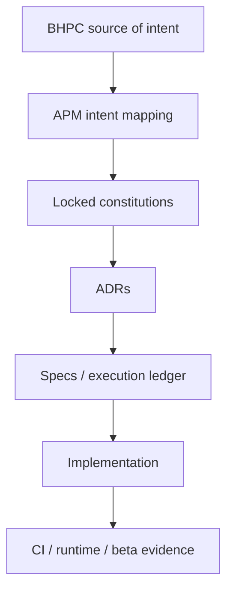

# A Player Mode — Documentation Index

This directory is the canonical source of product, privacy, methodology, AI, architecture, pricing, security, data, UX, deployment, integration, release and execution decisions for A Player Mode.

## Decision status

| Status | Meaning |
|---|---|
| **LOCKED** | Engineering must conform. Material changes require an ADR + explicit approval. |
| **RECOMMENDED / TESTABLE** | Current decision expected to evolve with evidence. |
| **SELECTED FOR MVP / REPLACEABLE BY ADR** | Current infrastructure choice. |
| **LIVING EXECUTION RECORD** | Must match the code/runtime truth. |
| **CANONICAL SOURCE-OF-INTENT** | Preserves original methodology intent for translation/review. |

## Canonical documents

| # | Document | Status | Purpose |
|---:|---|---|---|
| 00 | [PRODUCT CONSTITUTION](./00-PRODUCT-CONSTITUTION.md) | **LOCKED** | Product thesis, system loop, surfaces, autonomy and north star |
| 01 | [PRIVACY & AI CONSTITUTION](./01-PRIVACY-AND-AI-CONSTITUTION.md) | **LOCKED** | Data classes, privacy promise, AI/model-provider policy |
| 02 | [PRICING STRATEGY](./02-PRICING-STRATEGY.md) | **RECOMMENDED / TESTABLE** | Tier ladder, launch pricing and margin strategy |
| 03 | [TECHNICAL ARCHITECTURE](./03-TECHNICAL-ARCHITECTURE.md) | **LOCKED** | System boundaries, Supabase/Cloudflare/AI architecture |
| 04 | [DOMAIN MODEL](./04-DOMAIN-MODEL.md) | **LOCKED** | Life Graph, evidence, action and state primitives |
| 05 | [MODEL REGISTRY](./05-MODEL-REGISTRY.md) | **LOCKED POLICY / DYNAMIC CANDIDATES** | $0 strategy, route eligibility and registry governance |
| 06 | [MOBILE UX SPEC](./06-MOBILE-UX-SPEC.md) | **LOCKED BASELINE** | Today/Radar/Goals/APM, onboarding and trust UX |
| 07 | [IMPLEMENTATION ROADMAP](./07-IMPLEMENTATION-ROADMAP.md) | **LOCKED SEQUENCE** | Phased product progression |
| 08 | [SECURITY THREAT MODEL](./08-SECURITY-THREAT-MODEL.md) | **LOCKED** | Trust boundaries, prompt injection, action security and kill switches |
| 09 | [DATA LIFECYCLE](./09-DATA-LIFECYCLE.md) | **LOCKED** | Ingest, retention, provenance, disconnect, export and deletion |
| 10 | [ANALYTICS & EVALUATION](./10-ANALYTICS-AND-EVALUATION.md) | **LOCKED BASELINE** | VPI, trust/quality metrics, evals and economics |
| 11 | [PRIVACY UX & TRUST CENTER](./11-PRIVACY-UX-AND-TRUST-CENTER.md) | **LOCKED PRODUCT REQUIREMENT** | User-facing trust, permissions, providers and audit UX |
| 12 | [TRUST CENTER SCREEN MAP](./12-TRUST-CENTER-SCREEN-MAP.md) | **IMPLEMENTATION REFERENCE** | Trust Center page/flow map |
| 13 | [IMPLEMENTATION STATUS](./13-IMPLEMENTATION-STATUS.md) | **LIVING EXECUTION RECORD** | What is actually real now |
| 14 | [DEPLOYMENT & SECRETS](./14-DEPLOYMENT-AND-SECRETS.md) | **LOCKED BASELINE** | Cloudflare/Expo/store deployment and secret handling |
| 15 | [POSITIONING & LIFE MODES](./15-POSITIONING-AND-LIFE-MODES.md) | **LOCKED** | “Whatever game you're in” + multi-role anti-drift rules |
| 16 | [BACKEND FOUNDATION](./16-BACKEND-FOUNDATION.md) | **LOCKED BASELINE** | API/Auth/RLS/RPC architecture |
| 17 | [MVP INFRASTRUCTURE PROVISIONING](./17-MVP-INFRASTRUCTURE-PROVISIONING.md) | **SELECTED FOR MVP / REPLACEABLE BY ADR** | Supabase Free + Cloudflare provisioning |
| 18 | [AUTH, PERSISTENCE & RADAR V0](./18-AUTH-PERSISTENCE-AND-RADAR-V0.md) | **IMPLEMENTATION BASELINE** | Mobile session, persistence, Today and Radar v0 |
| 19 | [RUNTIME PROOF RUNBOOK](./19-RUNTIME-PROOF-RUNBOOK.md) | **IMPLEMENTATION BASELINE** | Live Expo/Cloudflare/Supabase proof |
| 20 | [APM METHODOLOGY ENGINE V1](./20-APM-METHODOLOGY-ENGINE-V1.md) | **LOCKED IMPLEMENTATION BASELINE** | Personal OS, adaptive intake, Pillars/Tracks/Modes/core laws |
| 21 | [FULL PROGRAM EXECUTION LEDGER](./21-FULL-PROGRAM-EXECUTION-LEDGER.md) | **CANONICAL EXECUTION LEDGER** | Complete program, phase states and external gates |
| 22 | [CONNECTOR FABRIC](./22-CONNECTOR-FABRIC.md) | **IMPLEMENTATION CONTRACT** | Device/Google/Microsoft/iCloud calendar and Gmail/Outlook architecture |
| 23 | [MODEL EVAL & PROMOTION](./23-MODEL-EVAL-AND-PROMOTION.md) | **LOCKED AI RELEASE GATE** | Candidate → privacy/eval → explicit approval process |
| 24 | [RELEASE, BETA & COMMERCIALIZATION](./24-RELEASE-BETA-AND-COMMERCIALIZATION.md) | **IMPLEMENTATION + EVIDENCE CONTRACT** | EAS/store release, beta metrics, pricing and billing gates |
| 25 | [ACTIONS, AUTOPILOT, HOUSEHOLD & WEB](./25-AUTONOMY-HOUSEHOLD-AND-WEB.md) | **LONG-HORIZON CONTRACT** | Action lifecycle, standing authority, Household and web command center |
| 26 | [EXTERNAL RUNTIME GATES](./26-EXTERNAL-RUNTIME-GATES.md) | **OPERATIONS RUNBOOK** | Cloudflare, provider, model, push, store, billing, legal and beta receipts |
| 27 | [RUNTIME EVIDENCE PACKET](./27-RUNTIME-EVIDENCE-PACKET.md) | **OPEN EXTERNAL VALIDATION PACKET** | Receipt ledger for proving deployed/provider/device/store behavior after the merged source baseline |
| 28 | [RUNTIME EVIDENCE HARDENING](./28-RUNTIME-EVIDENCE-HARDENING.md) | **IMPLEMENTATION + OPERATIONS GATE** | Machine-readable receipts, exact-SHA proof workflows, kill-switch and branch-governance hardening |
| 29 | [THREE-TIER PRODUCT CONTRACT](./29-THREE-TIER-PRODUCT-CONTRACT.md) | **LOCKED IMPLEMENTATION CONTRACT** | Executive Roundtable / Executive Suite / Autopilot capability boundaries + Household waitlist |
| 30B | [LIFE OS PHASE B](./30-LIFE-OS-PHASE-B.md) | **PHASE B IMPLEMENTATION CONTRACT** | Individual relationships + personal administration lifecycle, privacy and entitlement boundaries |
| 31 | [AUTOPILOT PHASE C](./31-AUTOPILOT-PHASE-C.md) | **PHASE C IMPLEMENTATION CONTRACT** | Standing rules, level-5 authority invariant, supported/forbidden classes, governed DB surface, kill switches and undo |

## Canonical methodology reference

| Reference | Status | Purpose |
|---|---|---|
| [BHPC v2.1 Reference](./reference/BHPC-v2.1/README.md) | **CANONICAL SOURCE-OF-INTENT** | Full BHPC manual available to contributors |
| [BHPC → APM Intent Mapping](./reference/BHPC-v2.1/APP-INTENT-MAPPING.md) | **REFERENCE TRANSLATION CONTRACT** | Translate methodology behavior across every game/persona |

> **Whatever game you're in, get into A Player Mode.**

A parent, athlete, entrepreneur, student, professional, creator, caregiver, or user in transition shares the same operating loop. Their Life Graph supplies the context; the product does not fork into persona-specific apps.

## Architecture decision records

| ADR | Status | Decision |
|---|---|---|
| [ADR-0001](./adr/ADR-0001-SUPABASE-CLOUDFLARE-HYBRID.md) | **ACCEPTED / LOCKED** | Supabase owns Auth/Postgres/RLS; Cloudflare owns API/intelligence/privacy/action boundary |
| [ADR-0002](./adr/ADR-0002-THREE-TIER-LAUNCH.md) | **ACCEPTED / LOCKED** | Build Executive Roundtable + Executive Suite + Autopilot in one individual-product train; Household waitlist-only |
| [ADR-0006](./adr/ADR-0006-PLAN-DISPLAY-NAMES.md) | **ACCEPTED** | Plans are shown as Executive Roundtable / Executive Suite / Autopilot; internal keys, store ids and DB values unchanged |

## Authority / anti-drift hierarchy

If code conflicts with a locked constitution, the code is wrong until an approved decision changes the governing document. If methodology behavior changes, preserve BHPC functional intent or document the deliberate supersession.

## Current program picture

```mermaid
flowchart LR
  BASE[Foundation / Life Graph] --> METHOD[Methodology]
  METHOD --> CONNECT[Connector Fabric]
  CONNECT --> AI[Privacy-gated AI]
  AI --> PROACTIVE[Today / Radar / Push]
  PROACTIVE --> ACTIONS[Permissioned Actions]
  ACTIONS --> PROOF[Runtime evidence + hardening]
  PROOF --> TIER[Three-tier contract]
  TIER --> LIFE[Executive Suite]
  LIFE --> AUTO[Autopilot]
  AUTO --> BETA[Three-tier beta / launch]
  BETA -. later .-> HOUSE[Household waitlist]
```

Use `13-IMPLEMENTATION-STATUS.md` for current implementation truth, `21-FULL-PROGRAM-EXECUTION-LEDGER.md` for the complete program/gates, `27-RUNTIME-EVIDENCE-PACKET.md` for the active external validation work, and `28-RUNTIME-EVIDENCE-HARDENING.md` for receipt and workflow rules.

## Documentation standard

Prefer Mermaid diagrams, status grids, state tables, decision matrices and concrete examples over walls of prose. Documentation must distinguish **source-complete**, **DB-provisioned**, **runtime-proven**, **beta-proven**, and **production-ready**.

## Legal note

Engineering/product privacy principles are not a substitute for qualified legal review. Final Privacy Policy, Terms, consent language, app-store disclosures, subprocessors, DPAs and jurisdiction-specific obligations require external review before production launch.
