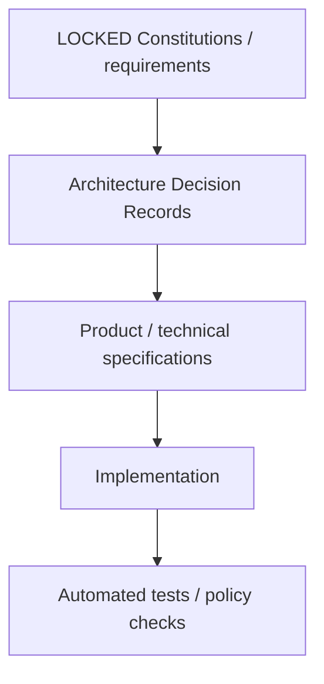

# A Player Mode — Documentation Index

This directory is the canonical source of product, privacy, AI, architecture, pricing, security, data, UX, deployment, positioning, backend, infrastructure, and methodology decisions for A Player Mode.

## Decision status

| Status | Meaning |
|---|---|
| **LOCKED** | Engineering must conform. Material changes require an ADR + explicit approval. |
| **RECOMMENDED / TESTABLE** | Current decision, but expected to evolve with evidence. Changes must be documented. |
| **SELECTED FOR MVP / REPLACEABLE BY ADR** | Current infrastructure provider choice; implementation should use it unless an ADR changes the provider. |
| **DRAFT** | Under discussion; not authoritative. |
| **LIVING EXECUTION RECORD** | Describes what is actually implemented now; updated as code changes. |

## Canonical documents

| # | Document | Status | Purpose |
|---:|---|---|---|
| 00 | [PRODUCT CONSTITUTION](./00-PRODUCT-CONSTITUTION.md) | **LOCKED** | Product thesis, surfaces, system loop, autonomy, build order, north-star metric |
| 01 | [PRIVACY & AI CONSTITUTION](./01-PRIVACY-AND-AI-CONSTITUTION.md) | **LOCKED** | Data classes, privacy promise, AI routing rules, model/provider governance |
| 02 | [PRICING STRATEGY](./02-PRICING-STRATEGY.md) | **RECOMMENDED / TESTABLE** | Launch pricing, tier ladder, market anchors, pricing gates, margin strategy |
| 03 | [TECHNICAL ARCHITECTURE](./03-TECHNICAL-ARCHITECTURE.md) | **LOCKED** | System boundaries, stack, Privacy Gateway, policy/action architecture |
| 04 | [DOMAIN MODEL](./04-DOMAIN-MODEL.md) | **LOCKED** | Life Graph objects, state, evidence and core APM software primitives |
| 05 | [MODEL REGISTRY](./05-MODEL-REGISTRY.md) | **LOCKED POLICY / DYNAMIC CANDIDATES** | $0-model strategy, route fields, data eligibility, approval/eval process |
| 06 | [MOBILE UX SPEC](./06-MOBILE-UX-SPEC.md) | **LOCKED BASELINE** | Mobile IA, Today/Radar/Goals/APM, onboarding and trust surfaces |
| 07 | [IMPLEMENTATION ROADMAP](./07-IMPLEMENTATION-ROADMAP.md) | **LOCKED SEQUENCE** | Phased execution from Trust Center through Household OS |
| 08 | [SECURITY THREAT MODEL](./08-SECURITY-THREAT-MODEL.md) | **LOCKED** | Trust boundaries, crown jewels, prompt injection, action security and kill switches |
| 09 | [DATA LIFECYCLE](./09-DATA-LIFECYCLE.md) | **LOCKED** | Ingest, retention, provenance, disconnection, export, deletion and logging |
| 10 | [ANALYTICS & EVALUATION](./10-ANALYTICS-AND-EVALUATION.md) | **LOCKED BASELINE** | VPI metric, trust metrics, AI eval suites, cost/successful-task measurement |
| 11 | [PRIVACY UX & TRUST CENTER](./11-PRIVACY-UX-AND-TRUST-CENTER.md) | **LOCKED PRODUCT REQUIREMENT** | User-facing trust pages, provider transparency, permissions and audit UX |
| 12 | [TRUST CENTER SCREEN MAP](./12-TRUST-CENTER-SCREEN-MAP.md) | **IMPLEMENTATION REFERENCE** | Visual page map, privacy flow, autonomy flow and screen acceptance grid |
| 13 | [IMPLEMENTATION STATUS](./13-IMPLEMENTATION-STATUS.md) | **LIVING EXECUTION RECORD** | Real vs fixture behavior, current vertical slice, next engineering block |
| 14 | [DEPLOYMENT & SECRETS](./14-DEPLOYMENT-AND-SECRETS.md) | **LOCKED BASELINE** | Cloudflare server deployment, Expo/app-store release path, secret storage and rotation |
| 15 | [POSITIONING & LIFE MODES](./15-POSITIONING-AND-LIFE-MODES.md) | **LOCKED POSITIONING BASELINE** | “Whatever game you're in” positioning, multi-role onboarding and audience anti-drift rules |
| 16 | [BACKEND FOUNDATION](./16-BACKEND-FOUNDATION.md) | **LOCKED IMPLEMENTATION BASELINE** | Cloudflare API + Supabase Auth/Data API/RLS/RPC architecture and v1 endpoints |
| 17 | [MVP INFRASTRUCTURE PROVISIONING](./17-MVP-INFRASTRUCTURE-PROVISIONING.md) | **SELECTED FOR MVP / REPLACEABLE BY ADR** | Supabase Free + Cloudflare Worker provisioning, public/mobile config and runtime boundaries |
| 18 | [AUTH, PERSISTENCE & RADAR V0](./18-AUTH-PERSISTENCE-AND-RADAR-V0.md) | **IMPLEMENTATION BASELINE** | Secure mobile session, durable Life Graph bridge, server Today projection and deterministic Radar v0 |
| 19 | [RUNTIME PROOF RUNBOOK](./19-RUNTIME-PROOF-RUNBOOK.md) | **IMPLEMENTATION BASELINE** | Live Expo/Cloudflare/Supabase proof, dedicated test-account verifier, RLS negative-access receipt |
| 20 | [APM METHODOLOGY ENGINE V1](./20-APM-METHODOLOGY-ENGINE-V1.md) | **LOCKED IMPLEMENTATION BASELINE** | Adaptive intake, Personal OS, Pillars, Tracks, Modes, core laws, MVD, arbitration and coaching runtime foundations |

## Architecture decision records

| ADR | Status | Decision |
|---|---|---|
| [ADR-0001](./adr/ADR-0001-SUPABASE-CLOUDFLARE-HYBRID.md) | **ACCEPTED / LOCKED** | Supabase owns Auth/Postgres/RLS; Cloudflare owns the APM API/intelligence/privacy boundary |

## Anti-drift hierarchy

If implementation conflicts with a locked constitution, **the implementation is wrong until an approved ADR changes the constitution.**

## Current execution state

### Implemented and merged before Methodology Engine v1

- Expo / React Native workspace and Today · Radar · Goals · APM navigation;
- broad multi-life positioning and multi-role game selection;
- Trust Center and privacy architecture;
- Supabase Free project, schema, RLS and transactional RPCs;
- Cloudflare API and Supabase Auth/Data API repository path;
- SecureStore-backed mobile sessions;
- durable onboarding/completion evidence;
- server Today projection;
- deterministic Radar v0;
- runtime-proof harness and provider-neutral Calendar Fabric sequencing.

### Current Methodology Engine v1 branch

The current artifact adds:

- durable Personal OS state;
- first-class Pillar settings, Tracks and Operating Modes;
- source-derived core laws and deterministic MVD/recovery behavior;
- adaptive one-question-at-a-time intake based on selected games;
- explicit approval before Personal OS installation;
- role-relevant track recommendations rather than founder-only defaults;
- APM mode control surface and deterministic coaching opening;
- Today awareness of Standard vs Recovery mode;
- deterministic arbitration and methodology tests.

The Supabase methodology migration is already applied to the project and its security advisor currently reports no findings. Source-level CI still must pass before this branch is merge-eligible.

### Still not runtime-proven / not built

The live Expo → deployed Cloudflare → Supabase journey remains unproven until the runtime harness is configured and executed. Calendar Fabric, email connectors, production OpenRouter inference, push notification delivery, LLM coaching dialogue and external action execution are not connected yet.

Use `13-IMPLEMENTATION-STATUS.md` as the detailed current-state record.

## Documentation rule

Prefer diagrams, grids, state tables, decision matrices, and concrete examples over walls of prose. Mermaid diagrams are the default for architecture and flows because they render directly in GitHub Markdown and remain version-controlled as text.

## Legal note

Engineering/product privacy principles are not a substitute for legal review. Before production launch, user-facing Privacy Policy, Terms, consent flows, app-store disclosures, data-processing agreements, subprocessors, and applicable regulatory obligations must be reviewed for the jurisdictions in which APM operates.
