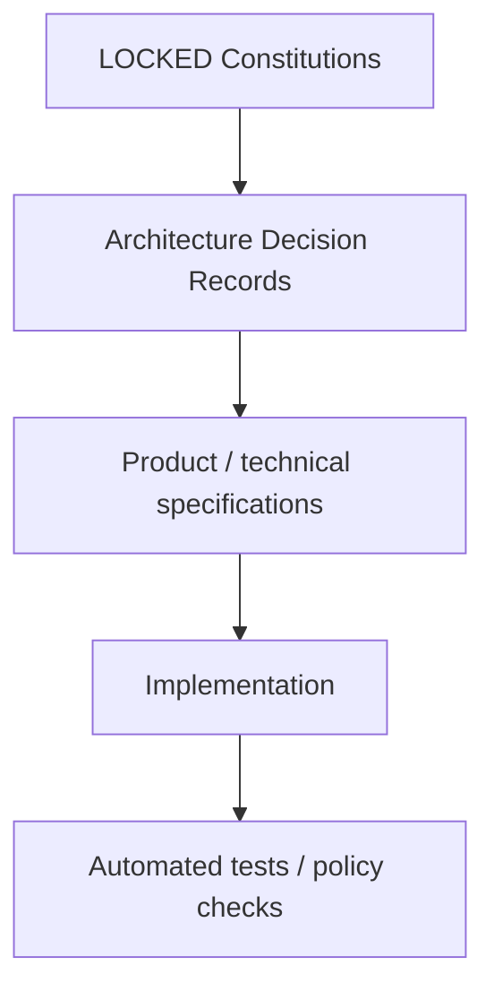

# A Player Mode — Documentation Index

This directory is the canonical source of product, privacy, AI, architecture, and pricing decisions for A Player Mode.

## Decision status

| Status | Meaning |
|---|---|
| **LOCKED** | Engineering must conform. Material changes require an ADR + explicit approval. |
| **RECOMMENDED / TESTABLE** | Current decision, but expected to evolve with evidence. Changes must be documented. |
| **DRAFT** | Under discussion; not authoritative. |

## Canonical documents

| Document | Status | Purpose |
|---|---|---|
| [00-PRODUCT-CONSTITUTION.md](./00-PRODUCT-CONSTITUTION.md) | **LOCKED** | Product thesis, surfaces, system loop, autonomy, build order, north-star metric |
| [01-PRIVACY-AND-AI-CONSTITUTION.md](./01-PRIVACY-AND-AI-CONSTITUTION.md) | **LOCKED** | Data classes, privacy promise, AI routing rules, model/provider governance |
| [02-PRICING-STRATEGY.md](./02-PRICING-STRATEGY.md) | **RECOMMENDED / TESTABLE** | Launch pricing, tier ladder, market anchors, pricing gates, margin strategy |

## Anti-drift hierarchy

If implementation conflicts with a locked constitution, **the implementation is wrong until an approved ADR changes the constitution.**

## Required next documents

1. `03-TECHNICAL-ARCHITECTURE.md`
2. `04-DOMAIN-MODEL.md`
3. `05-MODEL-REGISTRY.md`
4. `06-MOBILE-UX-SPEC.md`
5. `07-IMPLEMENTATION-ROADMAP.md`
6. `08-SECURITY-THREAT-MODEL.md`
7. `09-DATA-LIFECYCLE.md`
8. `10-ANALYTICS-AND-EVALUATION.md`
9. `adr/ADR-0001-*.md` and subsequent decisions

## Documentation rule

Prefer diagrams, grids, state tables, decision matrices, and concrete examples over walls of prose. Mermaid diagrams are the default for architecture and flows because they render directly in GitHub Markdown and remain version-controlled as text.

## Legal note

Engineering/product privacy principles are not a substitute for legal review. Before production launch, user-facing Privacy Policy, Terms, consent flows, app-store disclosures, data-processing agreements, subprocessors, and applicable regulatory obligations must be reviewed for the jurisdictions in which APM operates.