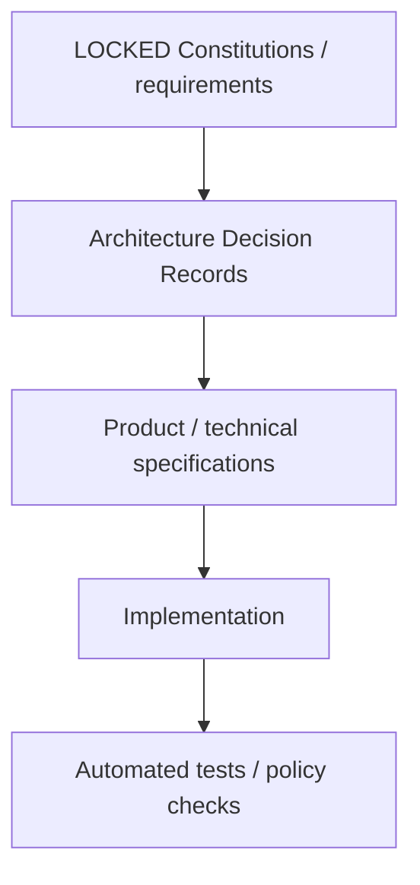
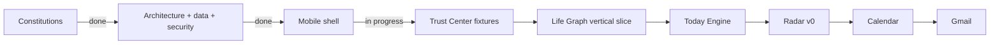

# A Player Mode — Documentation Index

This directory is the canonical source of product, privacy, AI, architecture, pricing, security, data, and UX decisions for A Player Mode.

## Decision status

| Status | Meaning |
|---|---|
| **LOCKED** | Engineering must conform. Material changes require an ADR + explicit approval. |
| **RECOMMENDED / TESTABLE** | Current decision, but expected to evolve with evidence. Changes must be documented. |
| **DRAFT** | Under discussion; not authoritative. |

## Canonical documents

| # | Document | Status | Purpose |
|---:|---|---|---|
| 00 | [PRODUCT CONSTITUTION](./00-PRODUCT-CONSTITUTION.md) | **LOCKED** | Product thesis, surfaces, system loop, autonomy, build order, north-star metric |
| 01 | [PRIVACY & AI CONSTITUTION](./01-PRIVACY-AND-AI-CONSTITUTION.md) | **LOCKED** | Data classes, privacy promise, AI routing rules, model/provider governance |
| 02 | [PRICING STRATEGY](./02-PRICING-STRATEGY.md) | **RECOMMENDED / TESTABLE** | Launch pricing, tier ladder, market anchors, pricing gates, margin strategy |
| 03 | [TECHNICAL ARCHITECTURE](./03-TECHNICAL-ARCHITECTURE.md) | **LOCKED** | System boundaries, stack, Privacy Gateway, policy/action architecture |
| 04 | [DOMAIN MODEL](./04-DOMAIN-MODEL.md) | **LOCKED** | Life Graph objects, state, evidence and core APM software primitives |
| 05 | [MODEL REGISTRY](./05-MODEL-REGISTRY.md) | **LOCKED POLICY / DYNAMIC CANDIDATES** | $0-model strategy, route fields, data eligibility, approval/eval process |
| 06 | [MOBILE UX SPEC](./06-MOBILE-UX-SPEC.md) | **LOCKED BASELINE** | Mobile IA, Today/Radar/Goals/APM, onboarding and trust surfaces |
| 07 | [IMPLEMENTATION ROADMAP](./07-IMPLEMENTATION-ROADMAP.md) | **LOCKED SEQUENCE** | Phased execution from Trust Center through Household OS |
| 08 | [SECURITY THREAT MODEL](./08-SECURITY-THREAT-MODEL.md) | **LOCKED** | Trust boundaries, crown jewels, prompt injection, action security and kill switches |
| 09 | [DATA LIFECYCLE](./09-DATA-LIFECYCLE.md) | **LOCKED** | Ingest, retention, provenance, disconnection, export, deletion and logging |
| 10 | [ANALYTICS & EVALUATION](./10-ANALYTICS-AND-EVALUATION.md) | **LOCKED BASELINE** | VPI metric, trust metrics, AI eval suites, cost/successful-task measurement |
| 11 | [PRIVACY UX & TRUST CENTER](./11-PRIVACY-UX-AND-TRUST-CENTER.md) | **LOCKED PRODUCT REQUIREMENT** | User-facing trust pages, provider transparency, permissions and audit UX |
| 12 | [TRUST CENTER SCREEN MAP](./12-TRUST-CENTER-SCREEN-MAP.md) | **IMPLEMENTATION REFERENCE** | Visual page map, privacy flow, autonomy flow and screen acceptance grid |

## Anti-drift hierarchy

If implementation conflicts with a locked constitution, **the implementation is wrong until an approved ADR changes the constitution.**

## Current execution state

### Already implemented as code

- Expo / React Native workspace scaffold;
- core navigation: **Today · Radar · Goals · APM**;
- Welcome + Privacy Primer;
- Privacy & AI center;
- How APM Uses AI;
- AI Providers transparency screen;
- Your Data / Life Graph transparency;
- Connections;
- Permissions & Autonomy;
- APM Activity;
- Export & Delete;
- explainable Radar example;
- CI typecheck workflow.

All current product data is fixture/mock state. No Gmail, Calendar, production database, or AI provider is connected yet.

## Documentation rule

Prefer diagrams, grids, state tables, decision matrices, and concrete examples over walls of prose. Mermaid diagrams are the default for architecture and flows because they render directly in GitHub Markdown and remain version-controlled as text.

## Legal note

Engineering/product privacy principles are not a substitute for legal review. Before production launch, user-facing Privacy Policy, Terms, consent flows, app-store disclosures, data-processing agreements, subprocessors, and applicable regulatory obligations must be reviewed for the jurisdictions in which APM operates.
