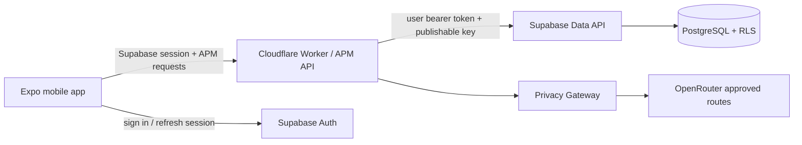

# ADR-0001 — Supabase + Cloudflare Hybrid Backend

**Status: ACCEPTED / LOCKED**  
**Decision date: 2026-10-06**

## Decision

A Player Mode will use a hybrid backend architecture:

- **Supabase Free plan** initially for PostgreSQL, Supabase Auth, Row Level Security, and later Storage / Realtime / pgvector where useful.
- **Cloudflare Workers** for the APM API, privacy gateway, policy enforcement, proactive engines, integrations, and OpenRouter/model routing.
- Upgrade Supabase only when product usage or operational requirements justify it.

## Why this decision

The decision optimizes for **total engineering efficiency and product capability**, not the smallest theoretical infrastructure bill.

Supabase provides mature PostgreSQL, Auth, RLS, Storage, Realtime, generated APIs, migrations, dashboard tooling, and future pgvector in one system. Cloudflare remains the controlled application/intelligence boundary and is where APM-specific policy and AI orchestration lives.

The expected early-stage cost difference versus a Cloudflare-only data stack is not meaningful relative to engineering time. APM will remain on Supabase Free until upgrade criteria are met.

## Security model

The Cloudflare Worker does **not** use a Supabase service-role key for normal user Life Graph operations.

Instead:

1. mobile authenticates through Supabase Auth;
2. mobile sends the Supabase access token to the APM Cloudflare API;
3. Cloudflare validates the session with Supabase Auth;
4. Cloudflare calls Supabase Data API / RPC using the same user token plus the publishable key;
5. PostgreSQL RLS enforces `auth.uid() = user_id`;
6. APM business logic additionally scopes all operations to the authenticated user.

This provides application-layer and database-layer user isolation.

## Transaction model

Multi-row user mutations that must be atomic are implemented as PostgreSQL functions exposed through authenticated Supabase RPC.

Initial RPCs:

- `apm_save_onboarding`
- `apm_complete_next_action`

Both run as `security invoker`, preserve RLS semantics, derive user identity from `auth.uid()`, and do not accept client-supplied ownership as authority.

## What Cloudflare owns

- APM public/private API
- privacy gateway
- model registry and routing
- permission/autonomy policy
- Today / Radar / planning engines
- external integrations
- OpenRouter server-only credential
- scheduled/background orchestration where useful

## What Supabase owns

- user identity and sessions
- PostgreSQL system of record
- database RLS
- Life Graph durable state
- transactional SQL/RPC primitives
- future Storage / Realtime / pgvector where justified

## Free-plan rule

**Locked commercial rule:** remain on Supabase Free while it safely and reliably supports beta/MVP usage. Upgrade only when a concrete limit, reliability need, backup/recovery need, operational requirement, or customer/security expectation justifies paid service.

We do not upgrade merely because a paid tier exists.

## Alternatives rejected

### Cloudflare-native data stack

Workers + D1 + Better Auth + R2 + Vectorize was considered. It can be cheaper in raw infrastructure terms, but it increases integration/engineering burden and gives up the convenience and relational maturity of PostgreSQL/RLS for the current product stage.

### Supabase-only backend

Rejected because APM needs a first-class, vendor-neutral intelligence/policy boundary. The model router, Privacy Gateway, permissions, external integrations, and proactive engines belong in the APM API rather than directly in the mobile client or database platform.

## Migration / portability

The domain layer remains platform-independent. Supabase is an implementation detail beneath repository/API boundaries. If future economics or scale require another database, Today, Radar, permissions, domain types, and mobile UX must not require a rewrite.

## Consequences

### Positive

- faster implementation;
- PostgreSQL + RLS immediately;
- integrated auth;
- future vector/search/storage/realtime options;
- fewer custom security primitives;
- Cloudflare still controls sensitive AI traffic.

### Negative

- two major infrastructure vendors;
- some cross-provider latency;
- Supabase Free has limits and may eventually require upgrade;
- we must keep Cloudflare/Supabase configuration synchronized.

## Anti-drift

A change to a Cloudflare-only data architecture, direct mobile ownership of consequential APM logic, removal of RLS, or normal use of a privileged Supabase service-role key requires a new ADR and explicit approval.
