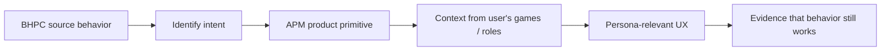

# BHPC v2.1 → A Player Mode Intent Mapping

**Status: REFERENCE TRANSLATION CONTRACT**  
**Purpose:** preserve the operating intent of BHPC while making APM work for every user's game.

> **You decide what game you're playing. A Player Mode helps you play it like an A-player.**

## Translation principle

The original BHPC manual often uses executive, billionaire, business, and three-chat language because it was written as a self-installed LLM operating system.

A Player Mode is software. It must preserve the behavior without requiring every user to identify as an executive or billionaire.



## Core mapping grid

| BHPC source intent | Why it matters | APM implementation primitive | Multi-game translation |
|---|---|---|---|
| Personal executive operating system | replace repeated self-management decisions with stable structure | Personal OS + Life Graph | “executive” becomes a functional operating layer for any user |
| Zero cognitive load | reduce morning decision fatigue and self-negotiation | Today Engine + ordered Run of Show | parent sees family/work priorities; athlete sees training/recovery; student sees study/deadlines |
| One question at a time | prevent intake/coaching overload and improve signal | conversational Intake Engine + coaching state machine | wording adapts to roles while pacing stays universal |
| Canonical OS / Rulebook | stable source of truth prevents drift | durable Personal OS tables + governed settings | every persona gets persistent rules, constraints, goals and preferences |
| Daily Runtime | make execution easy after setup | Today + APM Coach | same runtime shell, different Life Graph context |
| Drafting / Governance chat | prevent impulsive rule changes | Settings + explicit OS-edit/change-control flow | no persona difference; governance is universal |
| Never Miss Twice | stop one miss becoming abandonment | continuity policy + next-day recovery logic | applies to workouts, studying, parenting systems, business execution, etc. |
| Continuity > Intensity | reward sustainable execution over heroic plans | scoring + plan compression + completion evidence | intensity is contextual; continuity principle is universal |
| No Catch-Up | prevent guilt-driven overload | prior-day closure rule | missed study block, workout, admin task, or founder task does not create punishment debt |
| No Mid-Day Negotiation | reduce mood-based plan rewriting | day-plan authority + declared replan path | real external changes may trigger replanning; ordinary discomfort does not silently rewrite the day |
| Zeros Are Allowed | protect the user's relationship with the system after bad days | zero/miss state without reset/shame | universal |
| Minimum Viable Day | preserve continuity under low capacity | Recovery/MVD planner using critical-pillar minimum floors | floor may be one walk, one study task, one family obligation, one business follow-up, etc. |
| Critical vs flexible pillars | distinguish true minimum obligations from optional advancement | PillarSettings with critical flag + minimum floor | user-specific rather than founder-specific |
| Foreground vs Background | avoid equal-priority overload | one foreground goal/project + maintenance background | foreground can be race prep, newborn stabilization, exams, launch, health recovery, creative deadline |
| Arbitration Engine | choose among competing priorities using explicit criteria | deterministic arbitration service | criteria remain leverage, urgency, energy fit, compounding and downside; interpretation adapts to domain |
| 30/60/90 gates | turn ambition into bounded execution horizons | milestones / review gates / promote-maintain-park state | works for business, study, sport, health, family systems, creative projects |
| Tracks | persistent decision filters, not tasks | durable Track objects | optional/relevant tracks depend on user's games and goals |
| Billionaire Mindset | ownership/leverage/compounding filter | optional `billionaire_mindset` track | recommended only where business/investing/ownership context makes sense |
| Operator Discipline | reduce quiet renegotiation | `operator_discipline` track | universal when follow-through is a failure pattern |
| Strategic Patience | block premature pivots | `strategic_patience` track | applies to training plans, courses, health rebuilding, career development, ventures, creative growth |
| Resilience | normalize recovery and protect continuity | recovery policy / future resilience track | universal |
| High-Pressure Coaching | direct challenge during avoidance/high stakes | explicit temporary coaching mode | user-controlled; tone adapts but never shames/coerces |
| Executive Review | organize existing signal without novelty | review mode | can be called “review” in UX for non-executive personas while retaining no-new-ideas behavior |
| Sprint Mode | bounded temporary high-output period | time-limited operating mode | exams, launch week, competition prep, move, deadline, etc. |
| Recovery Mode | reduce scope without abandonment | explicit mode + MVD behavior | universal |
| Deep Work Mode | protect one uninterrupted task | time-boxed focus mode | study, writing, coding, analysis, creative work, admin |
| Morning Sequence | turn intention into physical initiation | Routine / Launch Sequence | can be water + movement, school prep, pre-training ritual, work launch, caregiving setup, etc. |
| Agenda First | execution before redesign | Today-first UX | universal |
| Ambiguity Stop | vague tasks create paralysis | executable-action validation | “work on X” is invalid in every persona; APM asks for a physical next action |
| Invalid Agenda clause | generic advice is a system failure | quality checks/evaluation suite | Today must be specific enough to execute |
| User Sovereignty | system supports rather than controls | Permission Engine + explicit autonomy | subscription tier never equals consent |
| Coaching is not therapy | keep scope behavioral/organizational | safety boundary in coaching policy | universal |
| End-of-day close | convert activity into evidence and continuity state | Evidence + day verdict + carry-forward logic | universal |
| Weekly debrief | detect friction without constant redesign | review workflow | universal |
| Drift / Return Reset | re-entry without guilt analysis | re-entry protocol | universal |

## Persona application examples

| Game | Foreground example | MVD example | Radar / coaching example |
|---|---|---|---|
| Parent / caregiver | stabilize school + pickup routine | complete the one critical family handoff | “Tomorrow's appointment conflicts with pickup; choose the handoff now.” |
| Athlete | complete current training block | 10-minute recovery walk / prescribed minimum | “Two required sessions remain and only one realistic opening exists.” |
| Entrepreneur | close the highest-value active deal / launch milestone | one decisive follow-up | “You promised the deck Friday and there is no completion evidence.” |
| Student | prepare for the highest-weight exam / assignment | 15-minute review of the next tested topic | “Your paper is due Friday and no work block exists before then.” |
| Professional / leader | ship the deliverable tied to promotion/role outcome | one concrete deliverable step | “Your stated career goal has had no supporting action this week.” |
| Creator | finish the active release / publication | open file and complete one defined section | “Publishing cadence is slipping; the next physical action is still undefined.” |
| Health / rebuilding | restore one sustainable health system | the user's safe minimum floor | “Normal scope is too high for the current Recovery state; APM reduced the day.” |
| Life transition | complete the next transition-critical milestone | one stabilizing administrative action | “Three tasks are urgent, but only one changes the transition outcome.” |

## Intake mapping

The original manual requires one-question-at-a-time initialization across identity/time/context, goals, tracks, values, constraints/failure patterns, Body, work/money, mind/spirit/learning, cadence, scoring, coaching style, accountability, morning sequence and scheduling/boundaries.

APM should retain those **information needs** while adapting wording and skipping irrelevant branches.

Examples:

```text
Training / competing
→ What are you training for, and by when?
→ What recovery or schedule boundaries must the system protect?
```

```text
Parenting / caregiving
→ What would make family life meaningfully better or more under control?
→ Which responsibilities are truly non-negotiable?
```

```text
Studying / learning
→ What academic outcome matters most right now?
→ What deadlines and study constraints shape the next 90 days?
```

```text
Building a business
→ What business outcome matters most in the next 90 days?
→ Which ownership/leverage/compounding filters should influence decisions?
```

The intake should never become a giant static form simply because software makes that easy.

## Product-level invariants inherited from BHPC

1. **The system carries structure so the human carries less mental load.**
2. **Continuity matters more than perfect execution.**
3. **A miss is data, not a reason to reset the system.**
4. **The user remains sovereign.**
5. **Plans become physical next actions, not vague aspirations.**
6. **Only one foreground priority receives aggressive advancement at a time.**
7. **Recovery is part of execution architecture, not a failure state.**
8. **Tracks shape decisions in the background; they do not become task lists.**
9. **Modes are explicit state changes, not hidden personality shifts.**
10. **Coaching is brief, sequential, behavioral, and closes back into execution.**
11. **The app must work after imperfect days.**
12. **The app must explain and preserve the user's rules rather than silently improvising a new system.**

## Review checklist for future contributors

Before merging a material methodology change, answer:

- Which BHPC intent does this touch?
- What APM primitive owns that intent now?
- Does this work for more than a founder/executive persona?
- What does it look like for a parent, athlete, student, professional/leader, creator, and transition/rebuilding user where relevant?
- Does it preserve user sovereignty and privacy?
- Does it reduce or increase cognitive load?
- Does it survive a missed day?
- Does it create an executable next action?
- Is the behavior deterministic where an LLM is unnecessary?
- What test or product evidence proves the intent survived the translation?

If those questions cannot be answered, the methodology change is not ready.
